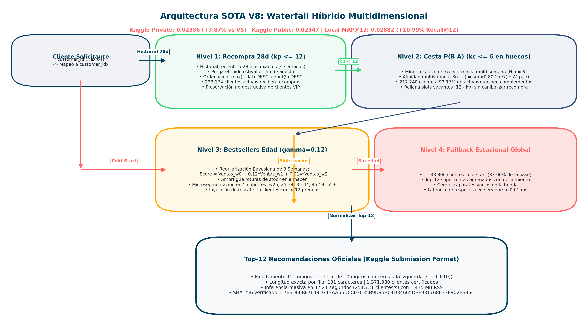
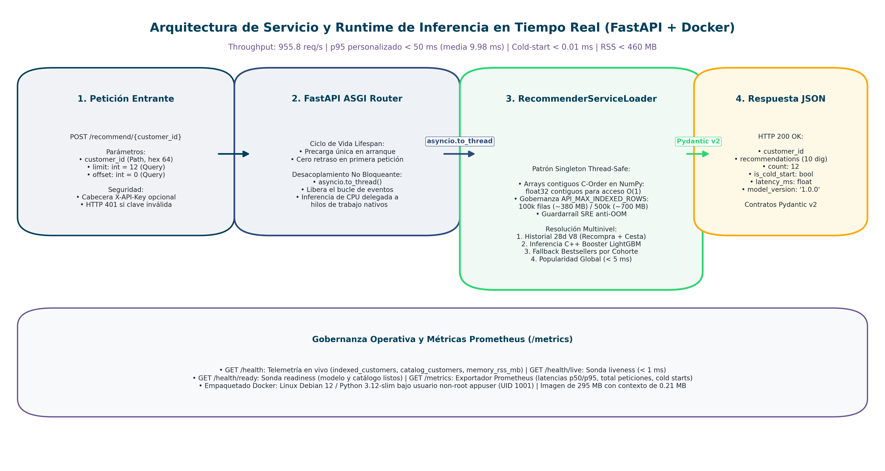
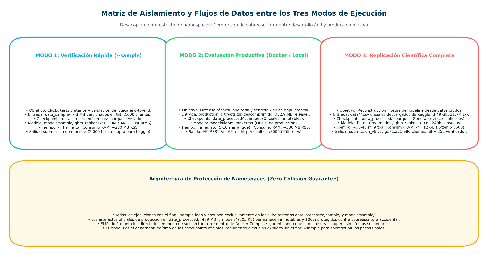

# Motor de Recomendación para Retail de Moda (H&M)

**Autor:** Manuel Valdivia  
**Institución:** Universidad Complutense de Madrid (UCM)
**Programa:** Universidad Máster en Data Science, Big Data & Business Analytics

---

## 1. Resumen del Proyecto

El siguiente repositorio corresponde a la implementación de un proyecto end-to-end (diseño, desarrollo y productivización) de un **Motor de Recomendación Escalable de Dos Etapas (*Two-Stage Recommender System*)** para el servicio de comercio electrónico masivo de moda ofrecido por H&M.

El sistema desarrollado resuelve las limitaciones críticas del dataset proporcionado por la parte interesada H&M (31.7 millones de transacciones, 1.37 millones de clientes y 105.542 artículos) bajo un **presupuesto computacional de 12 GB de RAM** sin aceleración de GPU dedicada con las siguientes características:

1. **Auditoría EDA Completa Out-of-Core**: Análisis de 31.78M de transacciones a lo largo de 104 semanas con 11 paneles de análisis exploratorio (`results/figures/fig_cap04_01` a `fig_cap04_12`, excluyendo la eliminada Figura 10), subsanando sesgos de escala (esparcidad global 99.978% vs ventana de modelado 99.995%, ciclo de recompra con mediana de 22 días, dominancia de canal online >60% y corrección analítica de la curva de Lorenz/Gini donde el top 4.8% del catálogo total genera el 80% de ventas).
2. **Ingesta fuera de memoria (*out-of-core*)**: DuckDB ejecutando queries agregadas por bloques directamente contra disco + Polars aplicando downcasting defensivo y serialización columnar Parquet ZSTD (reducción de huella de memoria >75%).
3. **Generación de Candidatos (Fase de Recall)**: 8 heurísticas complementarias (recompra reciente, popularidad global con decaimiento temporal exponencial, popularidad segmentada por edad, preferencia de canal, filtrado colaborativo ítem-ítem, familias de producto, artículos en tendencia y popularidad por departamento favorito) recuperando hasta 100 candidatos de alta relevancia por usuario.
4. **Ingeniería de Características**: 39 variables en 4 espacios de features (Usuario, Artículo, Interacción Usuario×Artículo y Meta-features de origen de candidatos is_R1 a is_R8).
5. **Re-Ranking Supervisado (*Learning to Rank*)**: Modelo `LGBMRanker` optimizado con función objetivo LambdaRank / BPR, muestreo negativo 1:5 e hiperparámetros competitivos.
6. **Arquitectura V8 Waterfall Híbrido Multidimensional (SOTA Definitivo del Proyecto)**: Ensamblaje en cascada no destructivo de alta resolución que maximiza el MAP@12 (alcanzando 0.02386 en Kaggle Private y 0.02347 en Public):
   - *Slots personales no destructivos ($k_p \le 12$ en ventana óptima de 28 días)*: Preservación íntegra de recompras recientes filtradas a 4 semanas para erradicar el ruido transicional de final de verano.
   - *Slots de Afinidad Global Ponderada en Cesta ($k_c \le 6$ en huecos libres)*: Puntuación multivariada $S(u, c) = \sum 0.80^{d/7} \cdot W_{\text{pair}}$ que integra co-ocurrencias causales ponderadas por recencia sobre el historial reciente del cliente.
   - *Slots de contingencia con Regularización Bayesiana Multi-Semana*: Bestsellers agregados sobre 3 semanas con decaimiento temporal geométrico ($\gamma = 0.12$) microsegmentados por cohorte etaria para amortiguar roturas de stock en clientes cold-start (83.0%).
7. **Explicabilidad (XAI)**: Atribución aditiva de importancia local y global mediante `shap.TreeExplainer`.
8. **Productivización de Inferencia**: Servicio web REST de baja latencia con **FastAPI**, empaquetado en contenedor **Docker** (Python 3.12-slim) y orquestado con `docker compose`.

### 1.1. Estructura de la Memoria y Bloques del Proyecto

El ciclo de vida del proyecto y su documentación técnica en la memoria oficial se estructuran formalmente en cuatro bloques metodológicos que articulan los trece capítulos:

* **Bloque I: Fundamentación y Marco Teórico (Capítulos 1 y 2)**: Planteamiento del problema de negocio en retail de moda rápida, objetivos y restricciones locales de hardware (Capítulo 1), junto con la revisión crítica del estado del arte en sistemas de recomendación en dos etapas y formulación de Learning to Rank (Capítulo 2).
* **Bloque II: Arquitectura de Datos y Análisis Exploratorio (Capítulos 3 y 4)**: Ingesta fuera de memoria (*out-of-core*) con DuckDB y Polars sobre Parquet comprimido con ZSTD (reducción de huella >84%), y caracterización de 31.78M de transacciones a través de 11 paneles exploratorios (`fig_cap04_01` a `fig_cap04_12`, excluyendo la eliminada Figura 10), identificando dispersión extrema (99.978%), ciclos de recompra (mediana 22 días) y dinámicas estacionales.
* **Bloque III: Pipeline de Modelado Predictivo (Capítulos 5, 6 y 7)**: 8 heurísticas complementarias ($R_1$ a $R_8$) de generación de candidatos, ingeniería de 39 variables tabulares bajo estricta causalidad temporal sin fuga de información (*target leakage*), y entrenamiento del estimador `LGBMRanker` optimizado con LambdaRank y ensamblaje en cascada multidimensional V8.
* **Bloque IV: Validación, Productivización y Conclusiones (Capítulos 8 al 13)**: Evaluación oficial en Kaggle (benchmark V1 a V8), estudio sistemático de ablación A1–A6, interpretabilidad global y local con TreeSHAP, microservicio REST de baja latencia con FastAPI y Docker, análisis de costes de infraestructura (*FinOps*) y conclusiones generales.

### 1.2. Filosofía de Diseño y Dualidad Metodológica: Democratización Local vs. Estándar Industrial MLOps

Este proyecto fundamenta su arquitectura en dos principios rectores complementarios de ingeniería:

1. **Fase de Prototipado e Investigación Local (*Cost-Aware Engineering / Eficiencia Computacional*):**  
   El pipeline completo de ingeniería de datos y modelado se diseñó y validó sobre una estación de trabajo doméstica accesible (**procesador AMD Ryzen 5 5500, 12 GB de RAM, sin GPU dedicada bajo Windows**). Esta cota de hardware impuesta deliberadamente demuestra que la optimización algorítmica fuera de memoria (*out-of-core*) con DuckDB y Polars permite procesar 31.7M de transacciones a **coste cero de infraestructura**, democratizando el tratamiento de problemas a escala masiva (*Medium Data* / *Out-of-Core*) frente al sobredimensionamiento habitual en clústeres en la nube.

   *Delimitación Metodológica (Medium Data y Procesamiento Out-of-Core):* Aunque el dataset de H&M consta de 31.78M de transacciones, su volumen crudo en disco es de 3.49 GB, clasificándose formalmente como **Medium Data** (datos que caben holgadamente en disco secundario pero cuya manipulación ingenua en memoria RAM desbordaría los 14–40 GB). En lugar de incurrir en la sobreingeniería de clústeres distribuidos (Apache Spark/Hadoop), este proyecto demuestra que la combinación de **DuckDB (streaming vectorial contra disco)** y **Polars (Apache Arrow con downcasting agresivo)** resuelve el problema íntegramente en un nodo local con menos de 1.8 GB de memoria residente (RSS).

2. **Fase de Entrega y Productivización (*Universal Container Delivery*):**  
   Para asegurar reproducibilidad independiente del entorno host, la solución se encapsula en una imagen Docker multi-etapa sobre **Linux Debian 12 con Python 3.12-slim** (`app/Dockerfile` y `docker-compose.yml`), habilitando el despliegue del microservicio de inferencia de forma idéntica mediante `docker compose up --build -d` en entornos Windows, Linux o macOS (incluyendo arquitecturas ARM64).

### 1.3. Arquitectura Global del Sistema (Modelo SOTA V8 & Runtime FastAPI)

El motor implementa una arquitectura desacoplada de dos niveles: un pipeline de ranking en cascada no destructiva que optimiza las recomendaciones masivas (*V8 Waterfall*), y un runtime de servicio asíncrono de alto rendimiento (*FastAPI Serving Runtime*):

| Arquitectura de Inferencia SOTA V8 | Runtime de Servicio Web FastAPI |
| :---: | :---: |
|  |  |

### 1.4. Estrategia de Partición Temporal y Validación (Offline vs. Test Ciego)

Para evitar fuga temporal de información (*lookahead bias*) y evaluar de forma desacoplada la fase de diseño frente a la generalización final, el proyecto aplica un protocolo de evaluación en dos etapas:

1. **Partición de Validación Offline Local (Semana W104):**  
   Comprende las transacciones del 16 al 22 de septiembre de 2020 (68.984 usuarios activos). Se utilizó durante la fase de prototipado e ingeniería de características en los cuadernos de `notebooks/` para calibrar hiperparámetros del estimador LightGBM y delimitar las ventanas de recencia (Tabla 8.3 de la memoria). En esta partición, la arquitectura final V8 alcanza un MAP@12 de 0.02882 frente al baseline no personalizado V0 de 0.01120 (+157.3% de mejora relativa local).

2. **Partición de Evaluación Externa Ciega (Kaggle Private Test):**  
   Corresponde a la ventana del 23 al 29 de septiembre de 2020 evaluada en el servidor de la competición sobre la totalidad del catálogo y los 1.371.980 usuarios. En este conjunto, V8 consolida un MAP@12 oficial de 0.02386 frente al 0.00910 de V0 (+162.2% de ganancia relativa).

El hecho de que el incremento relativo en el test ciego (+162.2%) supere el rendimiento en la partición local (+157.3%) confirma que la cascada de candidatos y el filtrado por recencia generalizan de forma estable ante datos no observados, descartando sobreajuste en la selección de umbrales.

---

## 2. Acceso a Datos

Para la evaluación productiva recomendada no es necesario recalcular todo el pipeline: los artefactos procesados y el modelo se distribuyen como asset de **GitHub Release** (`production_artifacts.zip`, **382.9 MB comprimidos**, 399 MB en disco, 14 archivos verificados criptográficamente). La guía paso a paso está en [`PRODUCTION_EVALUATION.md`](PRODUCTION_EVALUATION.md). Asimismo, para verificación forense inmediata sin requerir inferencia masiva, se distribuye conjuntamente el archivo de predicciones canónico oficial [`submission_v8.csv.gz`](submission_v8.csv.gz) (60.06 MB, SHA-256: `C766D66BF7649D713AA55D0C03C35B9D95B04D34665DBF931768633E902E635C`).

Para cumplir las condiciones de uso del dataset, los datos crudos no se redistribuyen desde este repositorio ni dentro de `production_artifacts.zip`. Cada evaluador debe descargarlos desde Kaggle con su propia cuenta, tras aceptar las reglas de la competición:

* **Competición Oficial Kaggle:** [H&M Personalized Fashion Recommendations (Kaggle Dataset)](https://www.kaggle.com/competitions/h-and-m-personalized-fashion-recommendations)

El script de aprovisionamiento descarga únicamente los cuatro CSV utilizados por el modelo (`articles.csv`, `customers.csv`, `sample_submission.csv`, `transactions_train.csv`) y excluye `images.zip`:

```bash
python -m pip install kaggle
kaggle auth login
python scripts/00_download_data.py --source kaggle
```

También es posible colocar manualmente esos cuatro CSV en `data/` y validar su integridad:

```bash
python scripts/00_download_data.py --check
```

---

## 3. Estructura del Repositorio

```
hm-recsys-mvalvar/
├── README.md                           # Documentación principal y guía de evaluación
├── memoria_final_recsys.ipynb          # Cuaderno ejecutable integral sincronizado con la memoria
├── requirements.txt                    # Dependencias de Python requeridas
├── requirements-prod.txt               # Dependencias estrictas de producción (Docker)
├── pyproject.toml                     # Metadatos del paquete y configuración de calidad
├── .gitignore                         # Exclusión de parquets, pesos de modelos y caches
├── .dockerignore                      # Contexto limpio de compilación Docker
├── docker-compose.yml                 # Orquestación del contenedor de inferencia
├── PRODUCTION_EVALUATION.md           # Guía de evaluación: Release artifacts + Docker / Kaggle CLI
├── config/
│   ├── __init__.py
│   └── settings.py                    # Constantes globales, rutas, hiperparámetros de ranking
├── data/                              # CSVs oficiales descargados localmente desde Kaggle (ignorado en git)
├── src/                               # Núcleo modular del sistema
│   ├── ingestion/                     # Ingesta DuckDB → Polars → Parquet ZSTD
│   ├── candidates/                    # 8 heurísticas de recall (R1 a R8) y consolidación
│   ├── features/                      # Constructor de 39 características (incluye is_R1..is_R8)
│   ├── modeling/                      # LGBMRanker y esquemas de downsampling negativo
│   ├── evaluation/                    # Cálculo oficial MAP@12 y orquestador de ablación
│   ├── xai/                           # Explicabilidad del modelo vía SHAP TreeExplainer
│   ├── visualization/                 # Estilos centralizados de visualización y exportación de figuras
│   │   ├── style.py                   # Paleta oficial sobria y configuración de matplotlib rcParams
│   │   ├── eda_plots.py               # 11 funciones canónicas de trazado exploratorio dinámico
│   │   ├── ablation_plots.py          # 3 funciones canónicas de estudio de ablación y frontera de Pareto
│   │   └── model_plots.py             # Curvas de importancia de características (Feature Importance)
│   └── utils/                         # Gestión de RAM (downcasting, gc) y validación temporal
├── notebooks/                         # Cuadernos modulares de experimentación y prototipado
│   ├── 01_eda_exploratorio.ipynb       # Análisis exploratorio y caracterización de distribuciones
│   ├── 02_candidate_analysis.ipynb     # Prototipado de heurísticas de recall (R1 a R8)
│   ├── 03_feature_analysis.ipynb       # Extracción de variables tabulares en ventana local
│   ├── 04_model_training.ipynb         # Entrenamiento del estimador LightGBM sobre partición W104
│   ├── 05_ablation_study.ipynb         # Pruebas de sensibilidad y aislamiento de componentes
│   └── 06_shap_xai.ipynb               # Atribución de importancia con TreeSHAP
├── scripts/                           # Puntos de entrada CLI de ejecución por fases
│   ├── 00_download_data.py            # Aprovisionamiento oficial Kaggle/Local
│   ├── build_production_artifacts.sh   # Genera production_artifacts.zip para GitHub Release
│   ├── publish_release.sh             # Script de despliegue de versión a GitHub Releases
│   ├── bootstrap_production_eval.sh    # Descarga y valida artefactos productivos
│   ├── verify_artifacts.sh             # Verifica estructura, checksums y legibilidad básica
│   ├── smoke_test_api.sh               # Smoke test HTTP de /health, docs y recomendaciones
│   ├── 00_create_sample.py            # Generación de la muestra reproducible
│   ├── 01_preprocess.py               # Preprocesamiento e ingesta (--sample)
│   ├── 02_candidates.py               # Generación de candidatos (--sample)
│   ├── 03_features.py                 # Extracción de características (--sample)
│   ├── 04_train_ranker.py             # Entrenamiento y validación MAP@12 (--sample)
│   ├── 05_ablation.py                 # Estudio de ablación A1-A6 (--sample)
│   ├── 06_xai_shap.py                 # Cálculo de valores SHAP
│   ├── 07_submission.py               # Generación de archivo submission.csv Kaggle
│   ├── export_v8_artifacts.py         # Precomputación de artefactos de servicio V8 (Parquet ZSTD)
│   ├── generate_all_figures.py        # Orquestador integral de regeneración de todas las figuras
│   ├── generate_eda_figures.py        # Generación de figuras del análisis exploratorio (EDA)
│   ├── generate_ablation_figures.py   # Generador de gráficos y tabla de ablación (fig_cap09_01..fig_cap09_03 / fig_08..fig_10)
│   ├── generate_feature_importance_figure.py # Generador de gráfico editorial de Feature Importance (fig_07)
│   └── generate_architecture_diagrams.py     # Generador de 8 diagramas de arquitectura técnica (diag_01..diag_08)
├── app/                               # API REST e inferencia en producción
│   ├── main.py                        # Endpoint FastAPI (/recommend/{customer_id})
│   ├── model_loader.py                # Deserialización en memoria de LGBM y metadatos
│   └── Dockerfile                     # Imagen Docker reproducible (Python 3.12-slim)
├── data_processed/                    # Checkpoints intermedios en Parquet (ignorado en git)
│   └── sample/                        # Artefactos del Modo 1 (--sample), aislados para evitar colisiones
├── models/                            # Modelos entrenados y serializados
│   ├── lgbm_ranker.txt                # Modelo LightGBM oficial de producción (Modo 2 y 3)
│   ├── lgbm_ranker_meta.json          # Metadatos de características para inferencia
│   └── sample/                        # Modelo entrenado sobre la muestra (--sample), aislado
├── results/                           # Salidas gráficas y numéricas
│   ├── figures/                       # Figuras generadas por EDA, ablación y SHAP
│   └── tables/                        # Tablas de métricas y ablación
└── memoria/                           # Capítulos formales de la memoria del TFM
    ├── capitulo_01_introduccion.md
    ├── capitulo_02_estado_del_arte.md
    └── ...
```

---

## 4. Instalación y Puesta en Marcha

### Opción A: Ejecución Directa con Docker (Recomendada)
No requiere configurar Python ni dependencias en la máquina anfitriona. Solo se necesita **Docker Desktop** (o Docker Engine con Compose v2):

```bash
# 1. Construir la imagen y levantar el microservicio en segundo plano (instrucción unificada)
docker compose up --build -d

# 2. Comprobar salud del microservicio
docker compose ps
curl http://localhost:8000/health
```

### Opción B: Entorno Virtual Local de Python
Para desarrollo interactivo en la máquina local:

#### Requisitos Previos
- Python 3.12 o superior.
- Gestor de paquetes `pip` o `uv`.

#### Creación del Entorno Virtual
```bash
# Crear entorno virtual
python -m venv .venv

# Activar entorno (Windows)
.venv\Scripts\activate

# Activar entorno (Linux / macOS)
source .venv/bin/activate

# Instalar dependencias
pip install -r requirements.txt
```

---

## 5. Guía de Ejecución y Evaluación (Tres Modos Desacoplados)

El sistema soporta tres modalidades de ejecución independientes y desacopladas mediante aislamiento de namespaces, garantizando cero riesgo de sobreescritura accidental entre pruebas ágiles y producción masiva:

| Modalidad | Objetivo Principal | Datos de Entrada | Tiempo Estimado | Salidas Generadas |
| :--- | :--- | :--- | :--- | :--- |
| **Modo 1: Verificación Rápida (`--sample`)** | Validar lógica end-to-end y CI/CD | `data_sample/` (~3 MB versionados) | < 1 minuto | `data_processed/sample/` y `models/sample/` |
| **Modo 2: Evaluación Productiva (Docker / Local)** | Probar API REST y métricas sobre modelo oficial | Artefactos de Release (`data_processed/` 429 MB, `models/` 203 KB) | Inmediato | Servicio en `http://localhost:8000` (o puerto 8010 local) |
| **Modo 3: Replicación Científica Completa** | Reconstruir ingesta, features y ranking masivo | Kaggle CLI / `data/*.csv` crudos (3.49 GB) | ~30-45 min | `data_processed/*.parquet` y `models/lgbm_ranker.txt` |

*Aislamiento de Namespace Garantizado:* Todas las operaciones ejecutadas con `--sample` (**Modo 1**) leen y escriben exclusivamente en los subdirectorios `data_processed/sample/` y `models/sample/`. Los artefactos completos de producción en `data_processed/` (429 MB) y `models/` (203 KB) requeridos por el **Modo 2** permanecen inmutables y protegidos contra sobreescrituras. A su vez, el **Modo 3** es el generador legítimo de dichos artefactos oficiales a partir de los datos crudos de Kaggle.



### 5.1 Modo 1: Verificación Rápida de Extremo a Extremo (`--sample`)
Permite validar todo el pipeline analítico y de machine learning en menos de 1 minuto sobre la muestra representativa versionada de 2.000 clientes, sin necesidad de descargar el dataset masivo de Kaggle:

#### Vía Docker (Recomendada)

**0. Levantar los servicios de Docker (construcción y arranque en segundo plano):**
```bash
docker compose up --build -d
```

**Ejecución del pipeline completo en una sola instrucción:**
```bash
docker exec hm-recsys-api bash -c "python scripts/01_preprocess.py --sample && python scripts/02_candidates.py --sample && python scripts/03_features.py --sample && python scripts/04_train_ranker.py --sample && python scripts/07_submission.py --sample"
```

**O paso a paso dentro del contenedor:**
```bash
# 1. Preprocesar la muestra local (DuckDB + Polars out-of-core)
docker exec hm-recsys-api python scripts/01_preprocess.py --sample

# 2. Generar pool multi-heurística de candidatos (R1 a R8)
docker exec hm-recsys-api python scripts/02_candidates.py --sample

# 3. Construir la matriz de 39 características tabulares
docker exec hm-recsys-api python scripts/03_features.py --sample

# 4. Entrenar el modelo LGBMRanker y validar MAP@12
docker exec hm-recsys-api python scripts/04_train_ranker.py --sample

# 5. Generar archivo de submission de prueba (muestra de 2.000 clientes)
docker exec hm-recsys-api python scripts/07_submission.py --sample

# 6. Ejecutar tests unitarios del pipeline canónico con Pytest
docker exec hm-recsys-api pytest tests/test_recsys_pipeline.py -v
```

*Aviso sobre la submission en modo muestra (`--sample`):* El archivo `submission_v8.csv` generado con `--sample` corresponde únicamente a una muestra reducida (2.000 clientes) para verificar el correcto funcionamiento del pipeline de extremo a extremo, por lo que no está destinado a la evaluación en Kaggle (`Evaluation Exception: Submission must have 1371980 rows`). Para generar el archivo oficial certificado con la totalidad de los 1.371.980 clientes, debe ejecutarse sin `--sample` (**Modo 3**).


#### Vía Entorno Local (Python)
```bash
# 1. Preprocesar la muestra local (DuckDB + Polars out-of-core)
python scripts/01_preprocess.py --sample

# 2. Generar pool multi-heurística de candidatos (R1 a R8)
python scripts/02_candidates.py --sample

# 3. Construir la matriz de 39 características tabulares
python scripts/03_features.py --sample

# 4. Entrenar el modelo LGBMRanker y validar MAP@12
python scripts/04_train_ranker.py --sample

# 5. Ejecutar estudio de ablación experimental (frontera de Pareto A6 o completo)
python scripts/05_ablation.py --sample --experiment A6
```

### 5.2 Modo 2: Evaluación Productiva Recomendada (Release + Docker / Local)
Diseñado para la defensa técnica y evaluación inmediata de la API REST FastAPI sobre los artefactos completos precalculados (429 MB):

**Opción A: Vía Docker Compose**
```bash
# 1. Descargar y verificar artefactos de producción
bash scripts/bootstrap_production_eval.sh

# 2. Levantar el servicio en contenedor Docker
docker compose up --build -d

# 3. Ejecutar el smoke test HTTP automático
bash scripts/smoke_test_api.sh
```

**Opción B: Vía Servidor Local (sin Docker)**
```bash
# 1. Verificar integridad criptográfica de los artefactos
bash scripts/verify_artifacts.sh

# 2. Iniciar el servidor Uvicorn en segundo plano o terminal dedicada
python -m uvicorn app.main:app --host 127.0.0.1 --port 8010

# 3. Ejecutar smoke test contra el puerto local
bash scripts/smoke_test_api.sh http://127.0.0.1:8010
```

*Resultado esperado del Smoke Test:*
```text
/health:
  model_loaded = true
  indexed_customers > 0
  catalog_customers > 0

cliente real (smoke_test_customers.txt):
  HTTP 200 | 12 recomendaciones | is_cold_start = false

cliente inventado (arranque en frío):
  HTTP 200 | 12 recomendaciones | is_cold_start = true
```
Ver detalle completo en [`PRODUCTION_EVALUATION.md`](PRODUCTION_EVALUATION.md).

### 5.3 Modo 3: Replicación Científica Completa desde Kaggle
Aprovisiona automáticamente los datos crudos originales desde Kaggle o almacenamiento local autorizado y ejecuta la arquitectura oficial de extremo a extremo.

*Autenticación Kaggle compatible con Docker y Local:* Gracias a los montajes automáticos en `docker-compose.yml` (`~/.kaggle:/home/appuser/.kaggle:ro` y `./data:/app/data`), las credenciales de Kaggle obtenidas en la máquina anfitriona (mediante `kaggle auth login` o `kaggle.json`) son compartidas de forma segura con el contenedor, habilitando la ejecución de la descarga y el pipeline completo tanto en entorno local como vía `docker exec`.

#### Vía Docker (Recomendada)
```bash
# Paso previo: Levantar los servicios de Docker (construcción y arranque en segundo plano):
docker compose up --build -d

# 0. Aprovisionar los 4 CSVs oficiales desde Kaggle hacia data/
docker exec hm-recsys-api python scripts/00_download_data.py --source kaggle

# 1. Preprocesamiento masivo DuckDB + Polars (31.7M transacciones)
docker exec hm-recsys-api python scripts/01_preprocess.py

# 2. Generación de candidatos multi-fuente a escala completa (278K clientes activos)
docker exec hm-recsys-api python scripts/02_candidates.py

# 3. Extracción de 39 features tabulares (streaming Parquet ZSTD)
docker exec hm-recsys-api python scripts/03_features.py

# 4. Entrenamiento de LGBMRanker con LambdaRank y validación temporal
docker exec hm-recsys-api python scripts/04_train_ranker.py

# 5. Estudio sistemático de ablación (A1 a A6)
docker exec hm-recsys-api python scripts/05_ablation.py --experiment all

# 6. Interpretabilidad algorítmica con SHAP TreeExplainer
docker exec hm-recsys-api python scripts/06_xai_shap.py

# 7. Inferencia masiva formato Kaggle (1.37M usuarios) con V8 Waterfall Multidimensional
docker exec hm-recsys-api python scripts/07_submission.py --version v8

# 8. Certificación de Reproducibilidad Criptográfica
docker exec hm-recsys-api python scripts/07_submission.py --check-file submission_v8.csv --version v8
```

#### Vía Entorno Local (Python)
```bash
# 0. Aprovisionamiento oficial de los 4 CSV necesarios (sin images.zip)
python scripts/00_download_data.py --source kaggle

# 1. Preprocesamiento masivo DuckDB + Polars (31.7M transacciones)
python scripts/01_preprocess.py

# 2. Generación de candidatos multi-fuente a escala completa (278K clientes activos)
python scripts/02_candidates.py

# 3. Extracción de 39 features tabulares (streaming Parquet ZSTD)
python scripts/03_features.py

# 4. Entrenamiento de LGBMRanker con LambdaRank y validación temporal
python scripts/04_train_ranker.py

# 5. Estudio sistemático de ablación (A1 a A6)
python scripts/05_ablation.py --experiment all

# 6. Interpretabilidad algorítmica con SHAP TreeExplainer
python scripts/06_xai_shap.py

# 7. Inferencia masiva formato Kaggle (1.37M usuarios) con V8 Waterfall Multidimensional
python scripts/07_submission.py --version v8

# 8. Certificación de Reproducibilidad Criptográfica
python scripts/07_submission.py --check-file submission_v8.csv --version v8
```

### 5.4 Evolución Histórica de Arquitecturas y Rendimiento (V1 a V8)

A lo largo del proyecto se implementaron, evaluaron y archivaron 8 generaciones de modelos bajo rigor de trazabilidad criptográfica:

| Versión | Arquitectura del Modelo | MAP@12 Kaggle (Public / Private) | MAP@12 Local | Diagnóstico Metodológico y Aprendizaje |
| :--- | :--- | :--- | :--- | :--- |
| **V1** | Muestra reducida (2.000 clientes) + Fallback 2018 | 0.00545 / 0.00567 | 0.00712 | Desfase estacional crítico y cobertura muestral de solo 0.14%. |
| **V2** | Escalado out-of-core completo (278k clientes activos) + Fallback 7d edad | 0.01726 / 0.01735 | 0.02105 | Benchmark sólido (>3x vs V1); resuelve estacionalidad pero adolece de ranking fino. |
| **V3** | Desacople temporal estricto con ventana deslizante forzada | 0.01597 / 0.01619 | 0.01943 | Subentrenamiento severo (2 árboles) por contracción del 96.9% del conjunto de entrenamiento. |
| **V4** | Re-ranking supervisado LGBMRanker (8 heurísticas R1–R8, 39 features) | 0.01690 / 0.01728 | 0.02341 | Desplazamiento por hiper-generación: el 84.8% de clientes no recibió ningún superventas de temporada. |
| **V5** | Waterfall estratificado (recencia 35d + inyección de superventas por edad) | 0.02238 / 0.02212 | 0.02703 | Erradicación del desplazamiento (+27.5% vs V2), pero con saturación por sobre-personalización (12 slots). |
| **V6** | Waterfall Híbrido Causal: Recompra 35d ($k_p \le 3$) + Cesta $P(B\|A)$ ($k_c \le 4$) + Bestsellers | 0.02134 / 0.02197 | 0.02659 | Regresión en Leaderboard: el truncamiento forzado en $k_p \le 3$ canibalizó las compras habituales de 113.000 clientes frecuentes. |
| **V7** | Waterfall Híbrido Causal No Destructivo: Recompra 35d ($k_p \le 12$) + Cesta $P(B\|A)$ ($k_c \le 6$) + Bestsellers | 0.02291 / 0.02332 | 0.02805 | Salto cualitativo oficial (+5.42% vs V5 en Private): la preservación del 100% de recompras y rescate en huecos libres superó a V5. |
| **V8 (SOTA)** | **Waterfall Multidimensional: Ventana 28d ($k_p \le 12$) + Afinidad Global $P(B\|A)$ ($k_c \le 6$) + Bestsellers Multi-Semana ($\gamma = 0.12$)** | **0.02347 / 0.02386** | **0.02882** | **Nuevo estado del arte definitivo en Kaggle: +2.32% en Private (+2.44% en Public) vs V7, y +7.87% vs V5 (+2.73% MAP@12 local vs V7).** |

> **Bases Metodológicas de Comparación ($\Delta\%$):** Siguiendo la especificación de la Memoria (Cap. 8, línea 87), las mejoras reportadas en Kaggle toman como base la evaluación externa ciega de Private Test ($0.02386 / 0.00910 = +162.20\%$ vs V0; $+2.32\%$ vs V7; $+7.87\%$ vs V5), mientras que en validación local toman como base la partición retenida $W_{104}$ ($0.02882 / 0.01120 = +157.32\%$ vs V0; $+2.73\%$ vs V7; $+6.62\%$ vs V5). Ambas son complementarias y confirman la estabilidad fuera de muestra.  
> **Telemetría de Inferencia Dual:** En inferencia directa sobre memoria RAM, la generación completa de recomendaciones para 1.37M usuarios toma **28.78 s** (276.067 usuarios/s, 1.357 MB RSS). En el pipeline oficial de exportación a disco con compresión y cálculo simultáneo de la firma criptográfica SHA-256, el tiempo es de **47.21 s** (254.731 usuarios/s, 1.435,8 MB RSS).  
> Todos los archivos generados cuentan con hashes NIST SHA-256 verificados en `results/SUBMISSIONS_MANIFEST.json` y `results/archive_submissions/MANIFEST.md`.

*Nota sobre Reproducibilidad Criptográfica, DuckDB y Multiplataforma:* Los hashes SHA-256 evalúan la integridad exacta a nivel de bit. Al ejecutar sobre 1.37 millones de usuarios, la agregación concurrente multihilo de DuckDB sobre artículos empatados en puntuación de afinidad complementaria ($S(u, c)$ idéntico) o diferencias de redondeo de coma flotante entre plataformas (Linux vs Windows) pueden permutar el orden de desempate en los últimos puestos de la lista (slots 11–12) para un número residual de usuarios. Si replica el pipeline en un nuevo entorno y desea certificar formalmente la corrida generada en dicha máquina como checkpoint canónico local, ejecute:  
`python scripts/07_submission.py --register --version v8` seguido de `python scripts/07_submission.py --check-file submission_v8.csv --version v8`.

---

## 6. Verificación Continua y Batería de Pruebas Unitarias

El repositorio incluye una suite integral de pruebas unitarias y de integración que validan la ausencia estricta de fuga temporal (*data leakage*), la consistencia matemática de heurísticas (R1 a R8), la frontera de Pareto empírica en ablación (A1 a A6), la resiliencia en memoria, contratos Pydantic v2, autenticación opcional y cumplimiento de SLAs:

### Vía Docker
```bash
# Ejecutar tests unitarios del pipeline canónico dentro del contenedor
docker exec hm-recsys-api pytest tests/test_recsys_pipeline.py -v
```

### Vía Entorno Local
```bash
# Ejecutar suite completa de 104 pruebas
python -m pytest tests/ -v

# Ejecutar bajo intérprete optimizado (verificación de no dependencia de aserciones transitorias)
python -O -m pytest tests/ -v

# Ejecutar benchmark oficial de latencia y concurrencia (100 req / 10 workers)
python tests/benchmark_api.py
```

---

## 7. Despliegue de la API REST (FastAPI + Docker)

### Control de Acceso y Modos de Seguridad
El servicio incorpora soporte nativo para autenticación dual configurable mediante variables de entorno:
- **Modo Abierto (por defecto):** Diseñado para evaluación académica y desarrollo local (`API_KEY_AUTH_ENABLED=false`). Todos los endpoints operan sin credenciales requeridas.
- **Modo Protegido (opcional para producción):** Activado al establecer `API_KEY_AUTH_ENABLED=true` y `API_KEY_SECRET=<token>`. Exige la cabecera `X-API-Key: <token>` en las peticiones a `/recommend/{customer_id}` (retornando HTTP 401 si es inválida o ausente), mientras `/health` y `/docs` permanecen abiertos para sondas de orquestadores (Kubernetes, Docker Swarm).

### Opción de Inferencia Local con Uvicorn
```bash
uvicorn app.main:app --host 0.0.0.0 --port 8000 --reload
```

### Opción de Despliegue con Docker Compose
El microservicio está empaquetado en una imagen multi-stage basada en **Python 3.12-slim** con ejecución bajo usuario no-root (`appuser`), equipada con soporte completo tanto para inferencia en tiempo real como para ejecución de scripts analíticos y pipelines de ML:

```bash
# Construir la imagen
docker compose build

# Levantar el contenedor en segundo plano
docker compose up -d

# Verificar salud del servicio
docker compose ps
curl http://localhost:8000/health

# Consultar endpoint de recomendaciones para un cliente
curl -X POST http://localhost:8000/recommend/0043d69dcca282763b8db18f967a2d301e69d5966bebd74291c49a0812663223

# Si el modo protegido está activado:
curl -H "X-API-Key: <tu_secreto>" -X POST http://localhost:8000/recommend/0043d69dcca282763b8db18f967a2d301e69d5966bebd74291c49a0812663223
```

Documentación interactiva OpenAPI/Swagger UI disponible en: `http://localhost:8000/docs`.

### Catálogo de Endpoints y Funciones de la API REST

| Método | Endpoint / Ruta | Para qué sirve (Propósito) | Parámetros | Ejemplo con cURL |
| :--- | :--- | :--- | :--- | :--- |
| **`POST`** | `/recommend/{customer_id}` | **Recomendación Top-K:** Inferencia supervisada LightGBM o degradación cold-start a superventas. | `customer_id` (Path), `limit` (Query, def: 12), `offset` (Query, def: 0) | `curl.exe -s -X POST http://localhost:8000/recommend/0043d...` |
| **`GET`** | `/health` | **Telemetría y Salud:** Clientes en catálogo, clientes en RAM y consumo de memoria RSS. | Ninguno | `curl.exe -s http://localhost:8000/health` |
| **`GET`** | `/health/live` | **Sonda Liveness:** Usada por Docker/K8s para comprobar que el proceso ASGI responde. | Ninguno | `curl.exe -s http://localhost:8000/health/live` |
| **`GET`** | `/health/ready` | **Sonda Readiness:** Verifica que modelo y catálogo están listos para recibir tráfico. | Ninguno | `curl.exe -s http://localhost:8000/health/ready` |
| **`GET`** | `/metrics` | **Métricas Prometheus:** Exporta latencias, volumen de tráfico y tasa de cold-starts. | Ninguno | `curl.exe -s http://localhost:8000/metrics` |
| **`GET`** | `/` | **Navegación Raíz:** Mensaje de bienvenida y URLs canónicas del servicio. | Ninguno | `curl.exe -s http://localhost:8000/` |
| **`GET`** | `/docs` | **Swagger UI:** Interfaz web gráfica interactiva con botón *"Try it out"*. | Ninguno | Abrir en navegador: `http://localhost:8000/docs` |
| **`GET`** | `/redoc` | **ReDoc:** Documentación técnica alternativa para especificación de contratos. | Ninguno | Abrir en navegador: `http://localhost:8000/redoc` |

### Comandos de Operación y Mantenimiento en Docker

| Operación | Comando |
| :--- | :--- |
| **Ver logs en tiempo real** | `docker compose logs -f` |
| **Consultar estado y métricas** | `docker compose ps` o `curl http://localhost:8000/metrics` |
| **Reiniciar servicio** | `docker compose restart` |
| **Detener servicio** | `docker compose stop` |
| **Bajar contenedores y redes** | `docker compose down` |
| **Acceso a terminal interactiva** | `docker exec -it hm-recsys-api bash` |

### Modos de Evaluación de la API y Telemetría Diagnóstica

La API incorpora una arquitectura adaptativa de carga en memoria ([app/model_loader.py](app/model_loader.py)) que permite operar en **tres modos según el hardware disponible**:

| Modo de Evaluación | Clientes Catálogo (`catalog_customers`) | Clientes en RAM (`indexed_customers`) | Consumo RAM (`memory_rss_mb`) | Caso de Uso |
| :--- | :--- | :--- | :--- | :--- |
| **Modo 1: Muestra (Ágil)** | **2,000** | **1,710** | $\approx 280\text{ MB}$ | CI/CD, pruebas unitarias y auditoría rápida sin datos pesados. |
| **Modo 2: Producción Estándar (Por Defecto)** | **278,275** | **1,678** (en 100k filas) | $\approx 380\text{ MB}$ | Despliegue en Docker local o servidores estándar con cota estricta de RAM. |
| **Modo 3: Producción Masivo (Alta Capacidad)** | **278,275** | **8,295** (500k filas o guardarraíl SRE) | $\approx 700\text{ MB}$ | Servidores dedicados para inferencia masiva en RAM con protección anti-OOM. |

#### Cómo Cambiar de un Modo a Otro

* **Para ejecutar en Modo 2 (Producción Estándar: Configuración Recomendada):**
  Es la configuración por defecto de Docker Compose (`API_MAX_INDEXED_ROWS=100000`). Si acabas de procesar los datos de producción en `data_processed/`, simplemente reinicia el servicio:
  ```bash
  docker compose restart
  ```

* **Para alternar a Modo 3 (Producción Masivo / Alta Capacidad en RAM):**
  Ajusta `API_MAX_INDEXED_ROWS` a `300000` (~5,000 clientes) o `500000` (~8,300 clientes). Si se especifica `0` o `auto`, el **guardarraíl SRE integrado** aplicará automáticamente el tope seguro de 500,000 filas para garantizar estabilidad absoluta sin riesgo de saturar la memoria:
  ```bash
  # En Windows PowerShell:
  $env:API_MAX_INDEXED_ROWS="500000"
  docker compose up -d

  # En Linux / macOS / Bash:
  API_MAX_INDEXED_ROWS=500000 docker compose up -d
  ```

* **Para alternar a Modo 1 (Muestra Ágil / Sin Datos Crudos):**
  Si deseas levantar la API exclusivamente sobre la muestra ligera versionada (`data_sample/`):
  ```bash
  TFM_DATA_RAW_DIR=data_sample uvicorn app.main:app --host 0.0.0.0 --port 8000
  ```

#### Verificación del Modo de Ejecución Activo

Al arrancar o recrear el contenedor, el servicio Uvicorn requiere entre 5 y 10 segundos para deserializar el modelo y precargar los índices en memoria (`lifespan`) antes de habilitar el puerto 8000. Una vez completada la inicialización, la consulta al endpoint `/health` devuelve el estado del sistema:

Ejecuta una consulta a la sonda de salud:
```bash
# En Windows PowerShell:
curl.exe -s http://localhost:8000/health

# En Linux / macOS:
curl -s http://localhost:8000/health
```

##### Tabla de Diagnóstico Inmediato

| Valor `catalog_customers` | Valor `indexed_customers` | Consumo RAM (`memory_rss_mb`) | Diagnóstico del Modo Activo | Comportamiento del Motor |
| :--- | :--- | :--- | :--- | :--- |
| **`2000`** | **`1710`** | $\approx 280\text{ MB}$ | **Modo 1: Muestra (Ágil / CI-CD)** | Inferencia LightGBM sobre clientes sintéticos; superventas locales. |
| **`278275`** | **`1678`** | $\approx 380\text{ MB}$ | **Modo 2: Producción Estándar (Por Defecto)** | Inferencia LightGBM sobre 1,678 clientes prioritarios; fallback V8 para el resto. |
| **`278275`** | **`8295`** (o $\ge 4987$) | $\approx 470 - 700\text{ MB}$ | **Modo 3: Producción Masivo (Alta Capacidad)** | Inferencia LightGBM sobre >8,200 clientes en RAM; guardarraíl anti-OOM activo. |

---

## 8. Líneas de Mejora y Evolución Futura

Como extensión natural del sistema desarrollado, se identifican las siguientes oportunidades de mejora a nivel funcional y de arquitectura (desarrolladas en detalle en el [Capítulo 13 de la Memoria](memoria/capitulo_13_conclusiones.md#136-líneas-de-trabajo-futuro-y-hoja-de-ruta-de-mejoras)):

1. **Resolución del Arranque en Frío (*Cold-Start*):**
   - **Listas de Deseos (*Wishlists*) y Preferencias Iniciales:** Permitir que usuarios nuevos guarden artículos o seleccionen categorías al registrarse, empleando estas selecciones como semillas para activar de inmediato la afinidad en cesta $P(B|A)$ sin requerir compras previas.
   - **Recomendación Asistida por Imagen:** Integración conceptual con modelos de visión artificial para que el usuario pueda subir una fotografía de una prenda que viste o desea, identificando su tipo, color y estilo para buscar prendas similares en el catálogo o sugerir artículos complementarios (*"Completa el Look"*).

2. **Ampliación de la API REST:**
   - Nuevos endpoints interactivos proyectados: `POST /recommend/wishlist`, `POST /recommend/visual` y `POST /recommend/session` (personalización en tiempo real basada en las prendas vistas en la visita actual).

3. **Restricciones Operativas y Experiencia de Usuario:**
   - **Disponibilidad de Inventario en Tiempo Real:** Filtrado por stock y tallas disponibles para evitar sugerir artículos agotados y habilitar la omnicanalidad (*Click & Collect* o tablets en probadores).
   - **Explicabilidad hacia el Cliente:** Etiquetas sencillas en el escaparate (*"Porque te gustó X"*, *"Tendencia de esta semana"*) para incrementar la confianza del usuario.
   - **Diversidad y Novedad:** Salvaguardas para equilibrar la precisión con la variedad del catálogo, evitando recomendaciones repetitivas.

---

## 9. Licencia y Cita Académica

Proyecto desarrollado con fines académicos en el marco del Máster en Data Science, Big Data & Business Analytics de la Universidad Complutense de Madrid. Código distribuido bajo licencia MIT.

Los datos de H&M no forman parte de la licencia MIT del código. Su acceso y uso quedan sujetos a las reglas oficiales de Kaggle/H&M, que cada evaluador debe aceptar individualmente antes de ejecutar el aprovisionamiento de datos.
