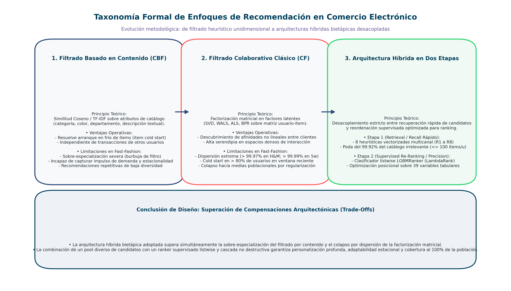
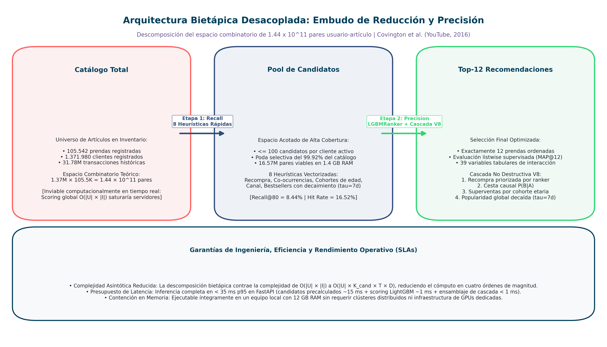
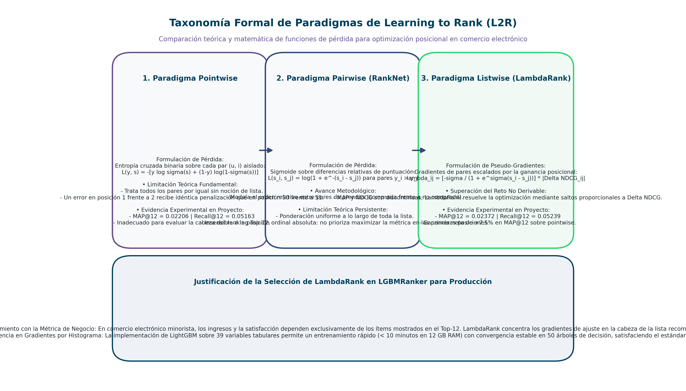

# Capítulo 2: Marco Teórico y Modelos de Recomendación

**Máster en Data Science, Big Data & Business Analytics: Universidad Complutense de Madrid**  
**Autor:** Manuel Valdivia  
**Proyecto:** Motor de Recomendación Escalable para Retail de Moda  

## 2.1. Evolución de los Enfoques de Recomendación

El desarrollo de sistemas de recomendación (*Recommender Systems*, RecSys) ha evolucionado a lo largo de los años desde heurísticas basadas en reglas y similitudes de texto hasta arquitecturas en dos etapas combinadas con algoritmos de ordenación supervisada (*Learning to Rank*).

*Figura 2.1: Taxonomía formal de enfoques de recomendación en comercio electrónico. Se contrasta el filtrado basado en contenido (limitado por sobre-especialización), el filtrado colaborativo clásico (afectado por la dispersión extrema de la matriz) y la arquitectura híbrida bietápica adoptada en este trabajo.*

### 2.1.1. Filtrado Basado en Contenido (*Content-Based Filtering - CBF*)
Los modelos basados en contenido recomiendan prendas calculando la afinidad entre los metadatos del catálogo (tipo de prenda, color, departamento, precio) y el historial de compras del usuario.
* **Ventajas:** Permite recomendar artículos recién introducidos sin historial de ventas previo (*item cold start*), ya que solo depende de los atributos del producto.
* **Limitaciones en moda:** Tiende a sobre-especializar las recomendaciones (sugiriendo prendas casi idénticas a las ya compradas), ignora las tendencias colectivas del mercado y pierde tracción ante la rápida rotación de colecciones.

### 2.1.2. Filtrado Colaborativo (*Collaborative Filtering - CF*)
El filtrado colaborativo tradicional (como SVD o WALS) busca patrones compartidos entre usuarios descomponiendo la matriz de compras en factores latentes de menor dimensión.
* **Limitaciones en entornos de moda rápida:** En catálogos como H&M, la matriz de transacciones presenta una dispersión (*sparsity*) del 99.9780% y más del 80% de los clientes en ventanas recientes no tienen compras previas (*cold start*). Bajo estas condiciones, los factores latentes no disponen de suficiente señal histórica para converger, colapsando hacia predicciones ruidosas o medias poblacionales.

#### Limitaciones en Entornos con Alta Dispersión
En catálogos de comercio electrónico masivo como H&M, la matriz de transacciones presenta una **dispersión del 99.9780%** en todo el histórico y del **99.9955%** en ventanas recientes de 5 semanas. Bajo estas condiciones:
1. Una parte sustancial de los usuarios (más del 70%) apenas registra 1 o 2 compras en la ventana reciente, lo que dificulta que los factores latentes converjan hacia representaciones informativas.
2. La regularización tiende a colapsar las estimaciones hacia valores medios, perdiendo precisión frente a heurísticas directas de recencia y popularidad estacional.

## 2.2. Arquitecturas en Dos Etapas (*Two-Stage Recommenders*)

Para combinar la velocidad necesaria al consultar catálogos grandes con la precisión de modelos supervisados complejos, la industria (Covington et al., 2016 en YouTube; Pinterest) recurre habitualmente a **arquitecturas desacopladas en dos etapas**:

*Figura 2.2: Descomposición del espacio combinatorio en dos etapas desacopladas. La etapa 1 recupera hasta 100 candidatos por cliente mediante 8 heurísticas vectorizadas podando el 99.92% del catálogo irrelevante. La etapa 2 reordena dicho subconjunto mediante LGBMRanker optimizando MAP@12 con latencia p95 < 35 ms.*

### 2.2.1. Descomposición del Problema
Evaluar un modelo de clasificación o ranking sobre todas las combinaciones posibles de clientes y artículos exigiría calcular:

$$N_{\text{combinaciones}} = |\mathcal{U}| \times |\mathcal{I}| = 1.371.980 \times 105.542 \approx 1.44 \times 10^{11} \text{ pares}$$

Esta carga resulta inviable computacionalmente en un entorno de producción o en un equipo local. Dividir el sistema en dos etapas simplifica el flujo de trabajo:

1. **Etapa 1: Recuperación de Candidatos (*Retrieval / Recall*):**  
   Busca **alta cobertura (*recall*)** con algoritmos de baja complejidad. Emplea heurísticas rápidas (recompras pasadas, superventas recientes, co-ocurrencias de compra y tendencias demográficas) para filtrar más del 99.9% del catálogo irrelevante y seleccionar un subconjunto de hasta 100 candidatos por usuario.

2. **Etapa 2: Re-ordenamiento Supervisado (*Re-Ranking / Precision*):**  
   Busca **alta precisión en las primeras posiciones (*precision Top-K*)**. Se evalúa únicamente sobre el conjunto acotado de candidatos de cada cliente, permitiendo usar modelos de gradient boosting con funciones de pérdida de ranking (*LambdaRank*), incorporando variables de interacción, precios y estacionalidad.

## 2.3. Criterio de Selección de Modelo: Redes Neuronales Bi-Torre vs. Gradient Boosted Trees

En el diseño de sistemas de recomendación modernos, la etapa de reordenación (*re-ranking*) suele abordarse mediante dos paradigmas principales: redes neuronales de dos torres (*Two-Tower Neural Networks*, Huang et al., 2013; Covington et al., 2016) y modelos de árboles de decisión con potenciación de gradiente (*Gradient Boosted Decision Trees*, GBDT), como LightGBM o CatBoost. La elección entre ambas arquitecturas responde a un análisis de compromiso entre la naturaleza de los datos, el coste computacional y las restricciones de hardware del entorno:

1. **Naturaleza del espacio de características:** Las arquitecturas bi-torre están optimizadas para aprender representaciones latentes densas a partir de texto libre, secuencias o identificadores de alta cardinalidad. Sin embargo, el conjunto de 39 variables formulado para este proyecto consta predominantemente de datos tabulares heterogéneos: señales booleanas de consenso heurístico ($is\_R1 \dots is\_R8$), diferencias relativas de precio, recencias de compra en días y ratios de afinidad por departamento. Los modelos de árboles procesan de forma nativa estas discontinuidades y distribuciones asimétricas sin requerir transformaciones monótonas ni escalado numérico previo, mientras que las redes neuronales demandan una normalización minuciosa para evitar la saturación de gradientes.

2. **Viabilidad computacional y restricciones de cómputo:** El entrenamiento de una red bi-torre con 1.37 millones de usuarios y 105.542 artículos exige mantener matrices masivas de parámetros en memoria de vídeo (VRAM). En un entorno local basado exclusivamente en CPU (AMD Ryzen 5, 12 GB de RAM), el cálculo de gradientes para millones de combinaciones usuario-artículo resulta prohibitivo en tiempo y vulnerable a desbordamientos de memoria. Por contra, el estimador `LGBMRanker` utiliza cuantización de histogramas en 8 bits, lo que permite entrenar modelos sobre decenas de millones de filas en memoria RAM ordinaria en tiempos inferiores a diez minutos por ciclo.

3. **Latencia de servicio y ciclo de experimentación:** Aunque las redes neuronales permiten búsquedas de vecinos próximos por producto escalar en inferencia ($k$-NN vectorial), su entrenamiento lento restringe severamente la capacidad de iterar y ejecutar estudios de ablación sistemáticos. `LGBMRanker` proporciona una velocidad de ajuste que facilitó el contraste de ocho configuraciones experimentales completas, garantizando al mismo tiempo una latencia de inferencia compilada en microsegundos por cliente durante la fase de servicio.

## 2.4. Fundamentos de Learning to Rank (L2R)

En un recomendador de comercio electrónico no es prioritario predecir la probabilidad exacta de que un usuario compre una prenda concreta, sino asegurar que **las 12 prendas mostradas al usuario estén ordenadas de mayor a menor relevancia**. Este planteamiento corresponde al área de *Learning to Rank* (Liu, 2009).

*Figura 2.3: Comparación teórica de funciones de pérdida en Learning to Rank. El paradigma Pointwise evalúa instancias aisladas; Pairwise modela preferencias relativas; y Listwise (LambdaRank) modula los gradientes posicionales en función directa de la variación de la métrica de ranking (|ΔNDCG|).*

### 2.4.1. Enfoque Pointwise
Modela cada par usuario-artículo de forma aislada como un problema de clasificación binaria.
* **Limitación:** Trata todos los errores por igual: clasificar erróneamente un artículo en la posición 2 frente a la 1 recibe la misma penalización que equivocarse entre la posición 50 y la 51. Esto resulta subóptimo cuando el objetivo es mostrar únicamente un Top-12.

### 2.4.2. Enfoque Pairwise
Modela el orden relativo entre pares de prendas (un artículo comprado frente a uno no comprado por el mismo usuario). Aunque mejora respecto al enfoque puntual, evalúa los pares de manera uniforme sin priorizar la cabeza del ranking.

### 2.4.3. Enfoque Listwise: LambdaRank y LambdaMART
El enfoque listwise busca optimizar directamente la lista completa de recomendaciones. Dado que métricas como MAP o NDCG son funciones no derivables respecto a las puntuaciones del modelo, **LambdaRank** (Burges et al., 2006, 2010) define pseudo-gradientes pairwise escalados por la ganancia o pérdida en la métrica al intercambiar las posiciones de dos artículos:

$$\lambda_{ij} = \frac{-\sigma}{1 + e^{\sigma(s_i - s_j)}} |\Delta\text{NDCG}_{ij}|$$

De este modo, cuando un artículo relevante queda situado en posiciones retrasadas del ranking, el optimizador aplica una corrección de mayor magnitud que si el error se produce en las últimas posiciones de la lista. Esta formulación es la base del estimador `LGBMRanker` utilizado en este proyecto.

## 2.5. Métricas de Evaluación en Ranking

Para medir el rendimiento de los modelos se emplean métricas orientadas a listas ordenadas (*Top-K*):

### 2.5.1. Mean Average Precision en 12 Posiciones ($MAP@12$)
Métrica oficial de la competición de Kaggle. Valora tanto acertar en las compras del usuario como situarlas en las posiciones más altas de la lista de 12 recomendaciones:

$$\text{AP}@12(u) = \frac{1}{\min(m_u, 12)} \sum_{k=1}^{12} P@k(u) \cdot \text{rel}_u(k)$$

donde:
- $m_u$ es el número de artículos reales adquiridos por el usuario en la semana de prueba.
- $P@k(u)$ es la precisión acumulada hasta el corte $k$.
- $\text{rel}_u(k)$ indica si la recomendación en la posición $k$ fue comprada ($1$) o no ($0$).

El $MAP@12$ global es la media de los valores de $\text{AP}@12(u)$ calculada sobre todos los clientes activos evaluados:

$$MAP@12 = \frac{1}{|\mathcal{U}_{\text{test}}|} \sum_{u \in \mathcal{U}_{\text{test}}} \text{AP}@12(u)$$

Un acierto en la posición 1 suma $1.0$ al promedio, mientras que en la posición 12 suma únicamente $1/12 \approx 0.083$.

### 2.5.2. Hit Rate ($HR@12$) y Recall@K
- **Hit Rate ($HR@12$):** Proporción de clientes para los que el recomendador acertó al menos un artículo dentro de las 12 recomendaciones.
- **Recall@80 (Etapa de Recuperación):** Mide la proporción de compras reales que fueron capturadas dentro del pool de 80 o 100 candidatos antes de aplicar el re-ranking. Sirve como techo máximo del rendimiento posible para la segunda etapa.

## 2.6. Interpretabilidad Post-Hoc mediante Teoría de Juegos y Valores SHAP

Para analizar la contribución de los atributos en las decisiones del estimador `LGBMRanker`, se recurre al marco de interpretabilidad post-hoc basado en valores SHAP (*SHapley Additive exPlanations*, Lundberg & Lee, 2017). Fundamentados en la teoría axiomática de juegos cooperativos (Shapley, 1953), los valores SHAP calculan la contribución marginal ponderada de cada variable respecto al valor esperado base del modelo.

Frente a las métricas clásicas de importancia en árboles de decisión basadas en recuento de divisiones (*split count*) o ganancia de impureza (*gain*), las cuales presentan sesgos sistemáticos hacia variables continuas o categorías de alta cardinalidad, la formulación de Shapley garantiza de manera matemática propiedades fundamentales de eficiencia, simetría, monotonía y aditividad local:

$$f(x) = \phi_0 + \sum_{i=1}^{M} \phi_i(x)$$

donde $\phi_0$ representa la predicción media poblacional y $\phi_i(x)$ denota la atribución asignada a la característica $i$ para una instancia concreta $x$. Mediante el algoritmo `TreeExplainer` (Lundberg et al., 2020), que explora de manera exacta las hojas y nodos de los árboles de decisión optimizando la complejidad de cálculo a tiempo lineal respecto al número de particiones, resulta factible auditar la coherencia global del recomendador sobre decenas de miles de inferencias en CPU sin incurrir en aproximaciones muestrales.
