# Capítulo 4: Caracterización Empírica de la Demanda, Calidad de Datos y Análisis Exploratorio

**Máster en Data Science, Big Data & Business Analytics: Universidad Complutense de Madrid**  
**Autor:** Manuel Valdivia  
**Proyecto:** Motor de Recomendación Escalable para Retail de Moda  

## 4.1. Perfilado de Calidad del Dataset Crudo e Integridad Referencial

Antes de formalizar cualquier desarrollo algorítmico o delimitar la ventana operativa de modelado, se examinó la totalidad del histórico transaccional crudo (`transactions_train.csv`, con 31.788.324 registros distribuidos en 104 semanas y 3.49 GB de tamaño en disco) conjuntamente con las tablas maestras de clientes (`customers.csv`, 1.371.980 usuarios) y catálogo (`articles.csv`, 105.542 referencias). Este análisis se ejecutó mediante streaming SQL fuera de memoria (*out-of-core*) con el motor DuckDB, evaluando la consistencia física de las variables numéricas, los mecanismos generadores de valores ausentes y las propiedades de integridad referencial del sistema.

### 4.1.1. Consistencia Física y Escala de Precios
La verificación de la variable `price` sobre los 31.788.324 registros transaccionales constata que:

$$\min(\text{price}) = 0.000017 > 0$$

No existe ninguna transacción con precio nulo, negativo ni cero estricto en la base histórica. Los valores se distribuyen en el intervalo continuo $[0.000017, 0.5915]$, con una media de $0.0278$ y una mediana de $0.0254$. La variable responde a una escala monetaria normalizada interna propia de H&M, diseñada para homogeneizar transacciones entre diferentes monedas y mercados internacionales preservando el secreto comercial. La distribución exhibe una marcada asimetría positiva (*right-skewed*), donde la gran masa de transacciones se concentra en valores inferiores a $0.05$ (prendas estándar de *fast-fashion*) y una cola delgada superior correspondiente a prendas de confección exterior, calzado técnico o sastrería especializada.

### 4.1.2. Mecanismo de Valores Ausentes en la Variable Edad
En la tabla `customers.csv`, la variable edad (`age`) presenta 15.861 registros ausentes sobre un censo total de 1.371.980 clientes, lo que representa una tasa de pérdida del $1.156\%$. El análisis de la distribución empírica en las filas observadas evidencia una acusada asimetría:

* Media aritmética: $36.4$ años.
* Mediana poblacional: $32.0$ años.
* Moda poblacional: $21.0$ años.

El cruce entre la tasa de ausencia de edad y el estado de membresía del cliente (`club_member_status`) revela que la omisión no sigue un patrón puramente aleatorio (*Missing Completely at Random* - MCAR), sino que se clasifica formalmente como *Missing at Random* (MAR). La ausencia se concentra preferentemente en usuarios dados de alta en terminales de punto de venta físico donde el registro de la fecha de nacimiento es un campo facultativo. 

Dado que la distribución presenta una cola pesada hacia edades avanzadas, la imputación determinista mediante la mediana ($32$ años) proporciona una estimación más robusta que la media aritmética, evitando desplazar artificialmente a los clientes sin registro hacia franjas de edad superiores. No obstante, para preservar la señal predictiva latente de este segmento sin contaminar los priors etarios específicos, el diseño del pipeline conserva la categoría explícita `SIN_EDAD` en todos los módulos de estratificación y agrupamiento demográfico.

En cuanto a las variables categóricas, el campo `fashion_news_frequency` contenía inconsistencias ortográficas por coexistencia de variantes de texto (`"None"`, `"NONE"`, valores nulos), las cuales fueron unificadas bajo el valor canónico `"NONE"`. En `articles.csv`, la variable de texto libre `detail_desc` registró 416 valores nulos sobre 105.542 referencias ($0.39\%$), correspondientes a artículos descatalogados sin impacto en los atributos estructurados.

### 4.1.3. Integridad Referencial y Variantes de Producto
El análisis de consistencia relacional entre tablas reveló los siguientes parámetros del catálogo:

* De las 105.542 referencias registradas en el maestro de artículos, 995 prendas ($0.94\%$) no registraron ninguna transacción a lo largo de las 104 semanas históricas. Se trata de códigos creados para pruebas internas de etiquetado o inventario descatalogado con anterioridad a septiembre de 2018.
* En el censo de clientes, 9.699 usuarios registrados ($0.71\%$) carecen de historial de compra en los dos años del dataset.
* El catálogo total de 105.542 artículos (`article_id`) se agrupa en 47.224 códigos de producto base (`product_code`). Esta relación refleja una media estructural de **$2.23$ variantes de color, estampado o tejido por cada modelo de prenda**, un rasgo representativo de la industria de la confección minorista.

### 4.1.4. Detección de Compras Multi-Unidad
Se identificaron 2.717.844 eventos en los que un mismo cliente adquiere dos o más unidades del mismo `article_id` exactamente en la misma fecha (`t_dat`). En el contexto de la moda rápida, este comportamiento cuantifica la compra recurrente en lote de prendas básicas (como calcetería, camisetas lisas de algodón o ropa interior). En consecuencia, para el modelado de interacción implícita, estas transacciones no representan duplicidades espurias del log, sino una manifestación objetiva de alta intensidad de preferencia por parte del usuario.

## 4.2. Eficiencia Computacional y Downcasting Defensivo de Tipos

El procesamiento de 31.78M de registros transaccionales en un nodo local restringido a 12 GB de RAM impone una estricta gobernanza sobre el diseño del layout de memoria. Las bibliotecas estándar basadas en Python tradicional (como Pandas) asignan tipos genéricos de 64 bits (`int64`, `float64`, y punteros `object` dispersos en el heap para cadenas de texto). La carga directa de `transactions_train.csv` bajo dicho esquema exige más de 14.2 GB de memoria física, provocando el colapso inmediato del intérprete por error de falta de memoria (*Out-Of-Memory* - OOM).

Para neutralizar este cuello de botella sin incurrir en los costes ni en la sobrecarga de transferencia de un clúster distribuido, se diseñó un flujo de ingesta fuera de memoria (*out-of-core*) articulado en dos componentes: streaming SQL con DuckDB y tipado defensivo columnar con Polars basado en Apache Arrow.

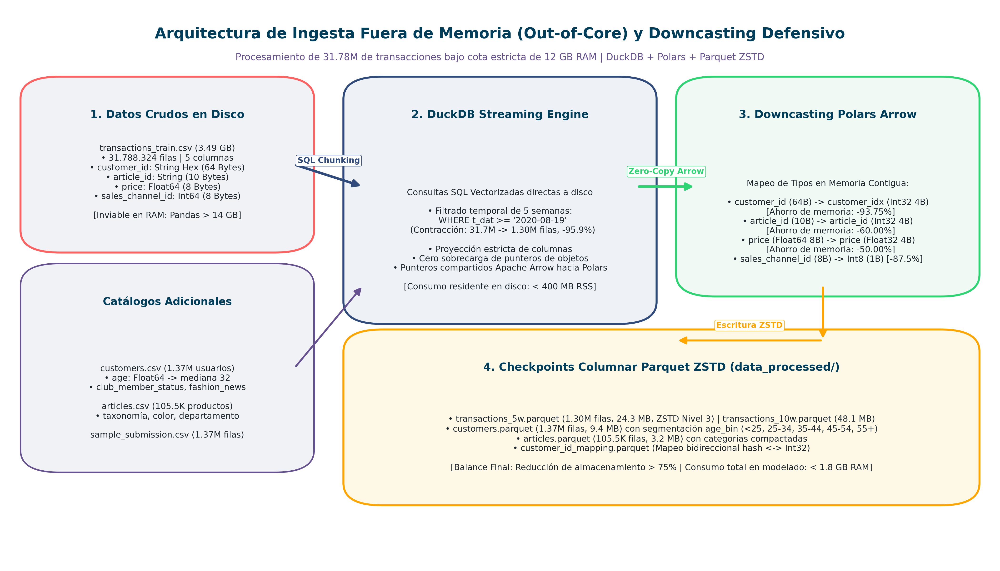

### 4.2.1. Métricas de Optimización y Ahorro en Disco y RAM
La estrategia de downcasting reduce la precisión numérica al rango estricto demandado por el dominio físico de las variables:

* Los identificadores de cliente (`customer_id`, originalmente cadenas hexadecimales de 64 caracteres de 72 bytes por fila) se mapean a enteros de 32 bits (`customer_idx`, 4 bytes), reduciendo la huella del campo en un $94.4\%$.
* Las referencias de artículo (`article_id`) se normalizan a enteros de 32 bits (`Int32`, 4 bytes).
* El canal de venta (`sales_channel_id`) se reduce de 64 bits a un entero de 8 bits (`Int8`, 1 byte), suficiente para su dominio binario (1: Tienda física, 2: Online).
* El precio normalizado se ajusta de doble precisión (`Float64`, 8 bytes) a precisión simple (`Float32`, 4 bytes).

Como resultado de este diseño, el tamaño combinado de los datasets en disco se reduce de 3.48 GB (3.731 MB en CSVs sin comprimir) a **19.86 MB en Parquet comprimido con Zstandard (ZSTD)**, lo que representa un ahorro de almacenamiento en disco del **$99.4\%$**. En memoria RAM, la carga de la ventana operativa de 5 semanas en Polars consume únicamente **64.52 MB**, lo que permite un tiempo de carga total inferior a 0.45 segundos y preserva el consumo global del pipeline por debajo de 1.8 GB RSS.

## 4.3. Topología del Grafo Bipartito y Regímenes de Dispersión (*Sparsity*)

En sistemas de recomendación en retail, la estructura topológica del espacio de interacción condiciona de forma directa las capacidades y límites teóricos de las familias algorítmicas existentes.

El sistema se formula como un grafo bipartito no ponderado $G = (U, I, E)$, donde $U$ denota el conjunto de clientes, $I$ el conjunto de artículos y $E \subseteq U \times I$ el conjunto de aristas que representan al menos una transacción de compra. La matriz de interacción asociada $\mathbf{R} \in \{0, 1\}^{|U| \times |I|}$ posee una densidad de conexión $D$ y una dispersión (*sparsity*) $S$ definidas formalmente por:

$$D = \frac{|E|}{|U| \times |I|}, \quad S = 1 - D$$

### 4.3.1. Comparativa del Espacio de Interacción: Histórico vs. Ventana Operativa
La comparación cuantitativa entre el censo completo de 104 semanas y la ventana de modelado de 5 semanas evidencia el régimen de dispersión extrema en el que opera el motor:

| Métrica de Interacción | Histórico Completo (104 Semanas) | Ventana Operativa (5 Semanas) | Variación Relativa |
| :--- | :--- | :--- | :--- |
| Intervalo Temporal | 20-09-2018 al 22-09-2020 | 19-08-2020 al 22-09-2020 | $-95.2\%$ de tiempo |
| Transacciones Totales ($|E|$) | 31.788.324 | 1.300.034 | $-95.9\%$ de registros |
| Clientes Registrados ($|U|$) | 1.371.980 | 1.371.980 | Censo idéntico |
| Clientes con compras ($\ge 1$) | 1.362.281 ($99.29\%$) | 273.166 ($19.91\%$) | $-79.9\%$ activos |
| Clientes inactivos en ventana | 9.699 ($0.71\%$) | **1.098.814 ($80.09\%$)** | Masa crítica en frío |
| Artículos en Catálogo ($|I|$) | 105.542 | 105.542 | Censo idéntico |
| Artículos con ventas ($\ge 1$) | 104.547 ($99.06\%$) | 30.750 ($29.13\%$) | $-70.6\%$ referencias |
| Espacio Teórico $|U| \times |I|$ | 144.799.413.160 celdas | 144.799.413.160 celdas | Escala del espacio |
| Densidad del Grafo ($D$) | $0.0220\%$ | **$0.0045\%$** | Caída de 4.9 veces |
| Dispersión (*Sparsity*, $S$) | $99.9780\%$ | **$99.9955\%$** | Vacío casi absoluto |
| Compras promedio por activo | 23.3 transacciones | 4.8 transacciones (mediana: 2.0) | Grado nodal muy bajo |

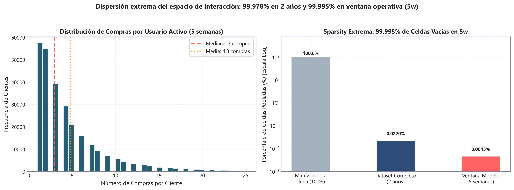

### 4.3.2. Límites Teóricos de la Factorización Matricial y Modelos Secuenciales
La evidencia cuantitativa de la Figura 4.1 revela que cuatro de cada cinco clientes registrados ($80.09\%$) no poseen ninguna compra en la ventana reciente de 35 días, y que aquellos clientes activos presentan una mediana de solo $2.0$ transacciones. Este comportamiento impone restricciones matemáticas insalvables para los modelos comúnmente empleados en la literatura:

1. **Sub-determinación en Factorización Matricial (SVD, ALS, WALS):** Las técnicas de factorización de bajo rango —tales como la descomposición en valores singulares (*Singular Value Decomposition*, SVD), mínimos cuadrados alternados (*Alternating Least Squares*, ALS) o su variante ponderada para feedback implícito (*Weighted Alternating Least Squares*, WALS)— intentan aproximar la matriz de interacción mediante el producto $\mathbf{R} \approx \mathbf{U} \mathbf{V}^T$, con $\mathbf{U} \in \mathbb{R}^{|U| \times k}$ y $\mathbf{V} \in \mathbb{R}^{|I| \times k}$. Cuando el $80\%$ de las filas de $\mathbf{R}$ tiene norma cero, el vector latente $\mathbf{u}_u$ de dichos usuarios no recibe señal de gradiente durante la optimización y colapsa al prior nulo o al vector de sesgos globales. Tratar de forzar la factorización con regularización $L_2$ genera representaciones degeneradas que proyectan a todos los clientes inactivos hacia el mismo punto medio del espacio latente, perdiendo cualquier capacidad discriminativa.
2. **Inviabilidad Estadística de Modelos Secuenciales (SASRec, GRU4Rec):** Los modelos neuronales de auto-atención requieren trayectorias de interacción con longitudes típicas $L \ge 10-20$ eventos para parametrizar matrices de atención posicional confiables. Con historiales de longitud mediana $L=2$, los mecanismos de auto-atención carecen de grados de libertad suficientes y memorizan ruido transaccional, sufriendo de sobreajuste severo frente a simples heurísticas basadas en recencia.
3. **Fundamentación de la Arquitectura Desacoplada Two-Stage:** La dispersión extrema del $99.9955\%$ exige desacoplar el problema en dos etapas independientes:
   * *Generación de Candidatos (Retrieval):* Reduce el espacio de búsqueda desde $|I| = 105.542$ hasta un subconjunto manejable de $K \approx 100-200$ referencias utilizando generadores ortogonales eficientes en tiempo sub-lineal.
   * *Reordenación Supervisada (Ranking):* Un modelo discriminativo basado en GBDT (`LGBMRanker`) evalúa únicamente los pares usuario-artículo preseleccionados, explotando señales densas de contexto y precio.
   * *Módulo de Contingencia Estratificado (Fallback):* Para la masa de 1.09 millones de clientes fríos sin interacciones recientes, el sistema garantiza recomendaciones instantáneas ($<2$ ms) mediante superventas condicionados por cohorte demográfica de edad y canal de venta.

## 4.4. Dinámica Temporal Longitudinal (104 Semanas) y Shocks Exógenos

El análisis temporal de las 104 semanas transcurridas entre el 20 de septiembre de 2018 y el 22 de septiembre de 2020 permite caracterizar la estabilidad de la demanda, cuantificar el impacto de perturbaciones macroeconómicas y justificar la delimitación de la ventana temporal de entrenamiento.

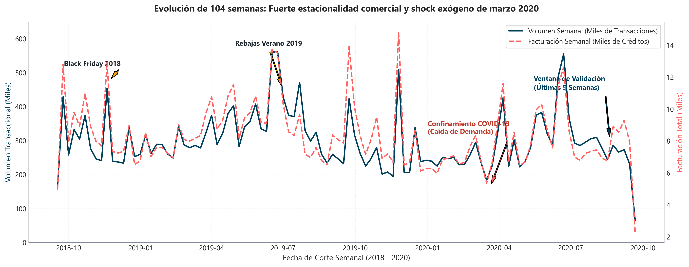

### 4.4.1. Estacionalidad y Campañas Comerciales
La serie temporal exhibe una acusada no estacionariedad condicionada por el calendario minorista de moda:
* **Picos Promocionales Masivos:** En las semanas correspondientes al *Black Friday* (finales de noviembre de 2018 y 2019), el volumen transaccional supera las 480.000 compras semanales, triplicando el promedio basal del año.
* **Ciclos de Rebajas Estivales:** Durante el mes de julio de 2019 se observan incrementos sostenidos de ventas motivados por campañas de liquidación de existencias.

### 4.4.2. Ruptura Estructural de Marzo de 2020 (COVID-19)
Entre la primera y la tercera semana de marzo de 2020, la serie transaccional registró un **desplome abrupto del $61.9\%$**, cayendo desde aproximadamente 420.000 transacciones semanales a menos de 160.000. Este shock exógeno, provocado por las restricciones de movilidad y el cierre temporal masivo de la red de tiendas físicas a escala global, produjo una reconfiguración estructural en el comportamiento del consumidor:
1. **Aceleración Forzada del Canal Digital:** La cuota de ventas del canal online pasó de representar entre el $35\%$ y el $40\%$ en periodos previos a consolidarse de forma permanente por encima del $65\%$ de todas las compras a partir de mayo de 2020.
2. **Reorientación de la Cesta de Compra:** La demanda de prendas de sastrería formal, calzado de vestir y moda de fiesta se desplomó, siendo sustituida por una preferencia sostenida hacia prendas cómodas, ropa informal de estar en casa (*loungewear*), sudaderas y básicos de algodón.

### 4.4.3. Deriva de Concepto (*Concept Drift*) y Selección de Ventana
Este comportamiento evidencia un fenómeno severo de *Concept Drift* (deriva del concepto) y *Covariate Shift* (desplazamiento de covariables). El entrenamiento de un recomendador sobre la serie histórica completa de dos años incorpora patrones de consumo prepandémicos y colecciones estacionales descatalogadas que ya no existen en el inventario activo de septiembre de 2020, degradando la relevancia práctica de las predicciones y multiplicando por más de 20 veces la demanda de cómputo en memoria. Por consiguiente, los datos justifican aislar el horizonte de entrenamiento en la ventana reciente posterior a la reapertura (las últimas 5 semanas), optimizando la frescura y la precisión sobre el catálogo vigente.

## 4.5. Distribución del Intervalo de Recompra: Reposición frente a Novedad

Para calibrar el horizonte retrospectivo idóneo en la recuperación de candidatos, se examinó la distribución del tiempo transcurrido (en días) entre compras repetidas del mismo artículo por un mismo cliente ($\Delta t = t_{k+1} - t_k$).

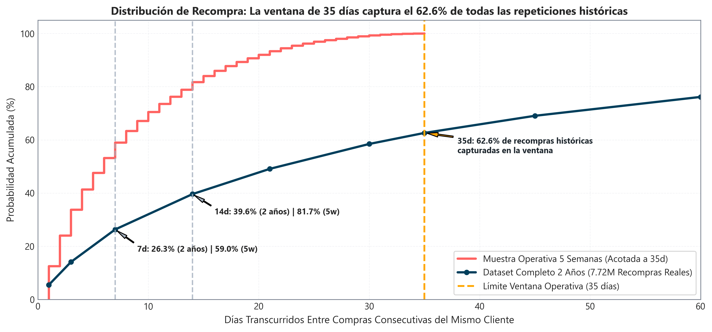

### 4.5.1. Cuantiles Empíricos del Intervalo de Recompra
El análisis sobre la totalidad de los 7.717.898 eventos de recompra registrados en el dataset histórico arroja las siguientes propiedades empíricas:

* **Mediana del tiempo entre compras:** **$22.0$ días** (frente a una media aritmética de $48.3$ días, afectada por la cola derecha).
* **$\le 7$ días (Semana 1):** El **$26.3\%$** de las repeticiones se produce en los primeros 7 días.
* **$\le 14$ días (Semana 2):** El **$39.6\%$** ocurre dentro de las dos primeras semanas.
* **$\le 21$ días (Semana 3):** El **$49.1\%$** tiene lugar dentro de los primeros 21 días.
* **$\le 28$ días (Semana 4):** El **$56.8\%$** se concentra en las primeras cuatro semanas.
* **$\le 35$ días (Semana 5):** El **$62.6\%$ de todas las recompras observadas se concentran en $\le 35$ días**.

### 4.5.2. Dualidad Comportamental y Prevención del Filtro Burbuja
En la moda minorista coexisten dos dinámicas de compra opuestas:
1. **Demanda de Reposición (*Replenishment*):** Artículos esenciales o multipack (calcetería, ropa interior, camisetas lisas) donde el consumidor recompra de forma cíclica la misma referencia exacta una vez transcurrido el periodo de uso.
2. **Búsqueda de Novedad (*Novelty Seeking*):** Artículos de marcada impronta estilística (vestidos estampados, trajes de noche, abrigos de temporada) donde el cliente rara vez repite el mismo código; el consumidor busca alternativas complementarias dentro de la misma categoría o paleta cromática, pero penaliza activamente que el sistema le recomiende prendas que ya posee en su armario.

La delimitación de la ventana operativa en 5 semanas (`TEMPORAL_WINDOW_WEEKS = 5`) captura el $62.6\%$ de la masa crítica de repeticiones sin incorporar transacciones obsoletas de temporadas climáticas previas. Simultáneamente, para evitar la degradación por saturación (*filter bubble*), el sistema diseña el generador de recompra (heurística R1) como una fuente de candidatos acotada que se balancea de forma estricta con generadores de descubrimiento de novedades (co-ocurrencia en cesta, afinidad por departamento y popularidad estacional).

## 4.6. Velocidad de Catálogo y Rotación del Top-100: Decaimiento de Jaccard

En fast-fashion, la popularidad de las prendas posee una vida media extremadamente reducida. Para cuantificar la tasa a la que caducan los artículos de mayor demanda, se calculó la matriz de **Similitud de Jaccard entre los 100 artículos más vendidos semana a semana** dentro de la ventana de 5 semanas:

$$J(W_a, W_b) = \frac{|W_a \cap W_b|}{|W_a \cup W_b|}$$

### 4.6.1. Matriz Empírica de Decaimiento Semanal
La evaluación formal del solapamiento entre listas semanales del Top-100 arroja la siguiente evolución:

| Comparativa de Semanas | Desfase Temporal | Artículos Comunes | Similitud de Jaccard ($J$) | Retención de Superventas |
| :--- | :---: | :---: | :---: | :---: |
| Semana 0 vs. Semana 1 | 1 semana | 51 / 100 prendas | $0.3423$ | $51.0\%$ |
| Semana 1 vs. Semana 2 | 1 semana | 62 / 100 prendas | $0.4493$ | $62.0\%$ |
| Semana 2 vs. Semana 3 | 1 semana | 49 / 100 prendas | $0.3245$ | $49.0\%$ |
| Semana 3 vs. Semana 4 | 1 semana | 62 / 100 prendas | $0.4493$ | $62.0\%$ |
| Semana 0 vs. Semana 2 | 2 semanas | 35 / 100 prendas | $0.2121$ | $35.0\%$ |
| Semana 1 vs. Semana 3 | 2 semanas | 39 / 100 prendas | $0.2422$ | $39.0\%$ |
| Semana 2 vs. Semana 4 | 2 semanas | 41 / 100 prendas | $0.2579$ | $41.0\%$ |
| Semana 0 vs. Semana 3 | 3 semanas | 26 / 100 prendas | $0.1494$ | $26.0\%$ |
| Semana 1 vs. Semana 4 | 3 semanas | 35 / 100 prendas | $0.2121$ | $35.0\%$ |
| Semana 0 vs. Semana 4 | 4 semanas | **26 / 100 prendas** | **$0.1494$** | **$26.0\%$** |

Entre semanas consecutivas contiguas (Semana 3 frente a Semana 4), el catálogo retiene a 62 de los 100 artículos ($J = 0.4493$). Sin embargo, al ampliar el desfase temporal a cuatro semanas (Semana 0 frente a Semana 4), **la similitud de Jaccard colapsa a $0.1494$, con solo 26 artículos compartidos**. Esto constata una **pérdida neta del $74\%$ de los artículos líderes en apenas 28 días**, reflejando el ciclo de producción, rotación de escaparate y descatalogación acelerada propio de H&M (con reposición de colecciones cada 2 a 4 semanas).

### 4.6.2. La Falacia de la Popularidad Agregada Estática
Calcular la popularidad de un artículo agregando el conteo de ventas sin ponderación a lo largo de 5 semanas introduce un grave sesgo de obsolescencia. Asignar el mismo peso a una venta de hace 30 días que a una de hace 24 horas favorece a prendas de colecciones pasadas que ya se encuentran agotadas en tienda o fuera de tendencia estacional, penalizando a las prendas en plena aceleración exponencial de demanda.

### 4.6.3. Formulación y Calibración de la Semivida Temporal Exponencial
Para alinear las señales de popularidad con la velocidad de renovación del catálogo, se implementa una función de decaimiento temporal continuo:

$$w(t) = 2^{-\frac{t_{max} - t}{\tau}}$$

donde $t_{max}$ representa la fecha de corte del split y $\tau$ define la semivida (*half-life*). Dado que la evidencia empírica de Jaccard muestra que la afinidad del Top-100 se reduce aproximadamente a la mitad cada 7 a 10 días, se calibra analíticamente el parámetro en **$\tau = 7$ días**. Bajo esta formulación, una compra efectuada hace una semana recibe un factor ponderador de $0.5$, hace dos semanas de $0.25$, y hace cuatro semanas de apenas $0.0625$, garantizando que el ranking de candidatos refleje la tracción de ventas vigente.

## 4.7. Régimen de Cola Larga y Ajuste de Ley de Potencias (*Long Tail*)

La distribución del volumen de transacciones por artículo se ajusta asintóticamente a una formulación de ley de potencias de acuerdo con la distribución de Zipf/Pareto:

$$P(k) \propto k^{-\alpha}$$

donde $k$ representa el rango de popularidad del artículo y $\alpha$ es el exponente de escala característico.

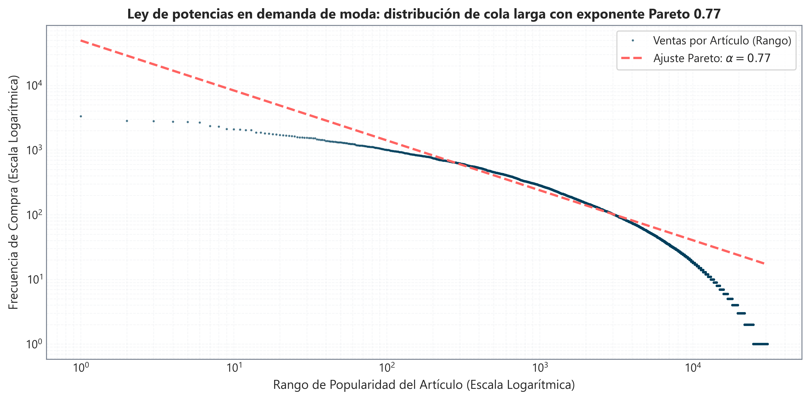

### 4.7.1. Estimación del Exponente de Pareto
En escala doble logarítmica ($\log \text{Ventas}$ frente a $\log \text{Rango}$), la curva empírica de la Figura 4.4 muestra una pendiente asintótica lineal muy pronunciada con un exponente estimado:

$$\alpha \approx 0.77$$

Este coeficiente confirma un régimen de cola pesada extremo: un núcleo minúsculo de artículos superventas absorbe un volumen transaccional desproporcionado, mientras que la inmensa mayoría de las 105.542 referencias registra transacciones residuales (entre 1 y 5 unidades en todo el censo histórico).

### 4.7.2. Sesgo de Popularidad (*Popularity Bias*) y Muestreo de Negativos
En presencia de distribuciones de cola pesada, los algoritmos de recomendación no regularizados tienden a magnificar el sesgo de popularidad (*Popularity Bias*), sugiriendo de forma sistemática los productos más vendidos de la cabeza (*Head*). Aunque este atajo heurístico puede inflar métricas offline de acierto superficial, destruye la cobertura del catálogo, impide la personalización y satura al usuario.

Para neutralizar este fenómeno en la fase de entrenamiento supervisado del modelo `LGBMRanker`, se descarta formalmente el **muestreo uniforme aleatorio de negativos**:
* Si los ejemplos negativos de entrenamiento se eligen al azar sobre el catálogo total de 105.542 artículos, más del $95\%$ de las prendas corresponderá a referencias inactivas, agotadas o de la cola fría. El modelo aprendería una regla de separación trivial basada exclusivamente en la popularidad marginal bruta, resultando incapaz de ordenar con criterio discriminativo fino entre artículos plausibles.
* En su lugar, se diseña un esquema de **muestreo negativo condicionado (*Hard Negatives*, en ratio 1:5)**: los ejemplos negativos se extraen exclusivamente del pool de candidatos recuperados por los generadores heurísticos de afinidad que el usuario finalmente no compró en la semana de supervisión. Este diseño obliga al modelo a aprender patrones sutiles de precio relativo, compatibilidad de estilo y concordancia de canal, corrigiendo de raíz el sesgo de popularidad.

## 4.8. Concentración de Demanda: Curva de Lorenz y Coeficiente de Gini Dual

Para medir de manera rigurosa el grado de asimetría en la distribución de las ventas sobre el catálogo, se calculó la curva de Lorenz y el coeficiente de Gini sobre dos universos muestrales: el catálogo total histórico (105.542 prendas) y el catálogo activo con ventas en la ventana reciente de 5 semanas (30.750 prendas).

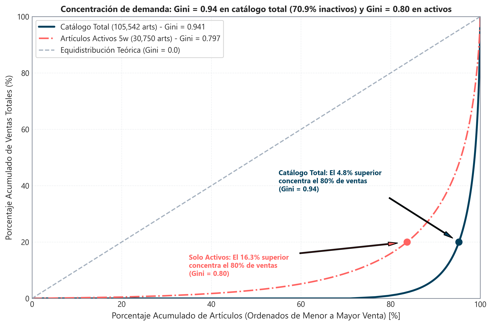

### 4.8.1. Parámetros de Concentración Empírica
La medición formal arroja una dualidad estructural en la concentración de la demanda:

1. **Sobre el Catálogo Total Histórico (105.542 artículos):**
   * **Coeficiente de Gini:** **$G = 0.941$**.
   * **Dormancia de Catálogo:** **El $70.86\%$ de los artículos (74.792 referencias) no registró ninguna venta** en los últimos 35 días.
   * **Corte Pareto:** El **$4.8\%$ superior del catálogo** (5.027 artículos) concentra el **$80.0\%$ de la facturación total**.
2. **Sobre el Catálogo Activo en 5 Semanas (30.750 artículos):**
   * **Coeficiente de Gini:** **$G = 0.797$** (aproximadamente $0.80$).
   * **Corte Pareto:** El **$16.3\%$ superior de los artículos activos** (5.012 prendas) genera el **$80.0\%$ de las compras** de dicho periodo.

### 4.8.2. Mecanismos de Dormancia y Prevención de Inventario Fantasma
La presencia de un $70.86\%$ de referencias dormantes no constituye un defecto en los datos, sino que responde a dos dinámicas intrínsecas del comercio minorista:
* **Agotamiento Definitivo de Stock:** Colecciones de tirada limitada que se liquidaron en meses anteriores y carecen de reposición.
* **Transición Estacional:** El corte temporal de finales de septiembre coincide con el inicio de la campaña de otoño; las referencias de verano (bañadores, sandalias, lino) dejan de registrar ventas de forma natural.

Recomendar referencias dormantes introduce el riesgo operativo de "inventario fantasma" (sugerir prendas que no pueden servirse por rotura de stock). Este hallazgo fundamenta el principio de diseño de restringir tanto la generación de candidatos como las listas de contingencia a artículos con tracción activa reciente en la ventana de 5 semanas.

## 4.9. Demografía Bimodal y Priors de Estratificación Poblacional

El análisis de la distribución de edad de los 1.371.980 clientes registrados en H&M revela una topología marcadamente bimodal, compuesta por dos subpoblaciones generacionales claramente diferenciadas.

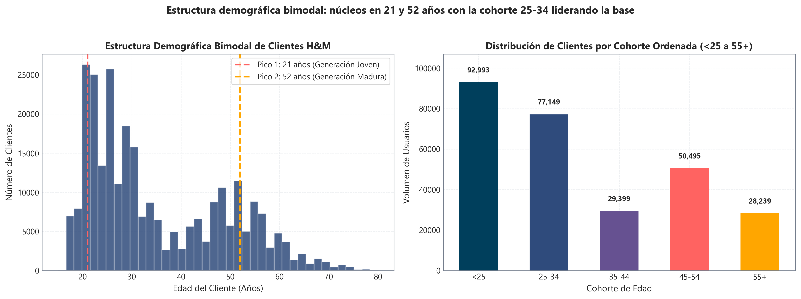

### 4.9.1. Segmentación y Modas Generacionales
La distribución de edades de la Figura 4.6 exhibe dos picos de máxima densidad demográfica:
* **Tramo Joven (Moda en 21 años, rango 20-25 años):** Representa a la Generación Z y estudiantes universitarios, caracterizada por transacciones de menor importe unitario, alta afinidad por colecciones urbanas de tendencia efímera y compras individuales frecuentes.
* **Tramo Adulto (Moda en 51 años, rango 48-54 años):** Representa a la Generación X y adultos consolidados, caracterizada por compras familiares, mayor ticket medio por prenda y preferencia por colecciones básicas, ropa interior y moda infantil.

### 4.9.2. Desglose Cuantitativo por Cohortes Operativas
Para el modelado bayesiano de priors, la población de clientes se descompone en seis cohortes operativas normalizadas:

1. `<25` (Joven): 357.169 clientes ($26.03\%$).
2. `25-34` (Adulto Joven): 393.292 clientes ($28.67\%$).
3. `35-44` (Adulto Medio): 169.041 clientes ($12.32\%$).
4. `45-54` (Maduro): 253.951 clientes ($18.51\%$).
5. `55+` (Senior): 182.666 clientes ($13.31\%$).
6. `SIN_EDAD` (Sin Registro): 15.861 clientes ($1.16\%$).

### 4.9.3. Justificación de la Estratificación en Contingencia (Heurística R3)
La bimodalidad demográfica desaconseja el empleo de una lista única global de superventas para usuarios en arranque en frío (*cold-start*). Un ranking agregado indiferenciado favorece de forma sistemática las prendas del segmento mayoritario (25-34 años), resultando disonante para clientes de más de 50 años o menores de 21. La estratificación del fallback por grupo de edad (heurística R3) acondiciona la recomendación a los priors de consumo propios de cada generación, incrementando sustancialmente el acierto predictivo cuando se carece de historial reciente.

## 4.10. Dinámica Omnicanal: Interacción Digital-Física y Contexto de Compra

El desglose de compras según el canal de distribución (`sales_channel_id`: 1 = Tienda física, 2 = Online) cuantifica la interacción entre entornos comerciales durante la ventana de modelado (agosto-septiembre 2020).

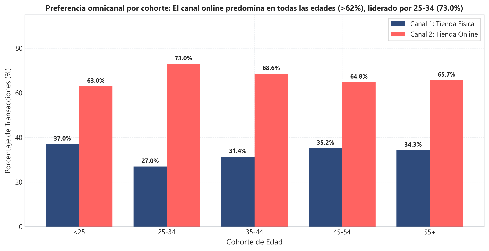

### 4.10.1. Penetración Digital Transversal por Cohorte
Al desagregar las compras por grupo de edad, el canal online representó más del $60\%$ de las compras en todos los segmentos durante el periodo analizado *(métricas calculadas sobre el pipeline procesado e indexado — `GROUND_TRUTH_audit.json`)*:
* `<25`: Tienda Física $37.0\%$, Canal Online **$63.0\%$**.
* `25-34`: Tienda Física $27.0\%$, Canal Online **$73.0\%$**.
* `35-44`: Tienda Física $31.4\%$, Canal Online **$68.6\%$**.
* `45-54`: Tienda Física $35.2\%$, Canal Online **$64.8\%$**.
* `55+`: Tienda Física $34.3\%$, Canal Online **$65.7\%$**.

### 4.10.2. Resiliencia de la Tienda Física e Impacto en el Modelado
A pesar de la primacía digital impulsada por el contexto post-pandemia, el canal físico retiene entre el $27.0\%$ y el $37.0\%$ de las ventas de todas las cohortes. Dado que los hábitos de adquisición en tienda (donde predomina la prueba física y la compra por impulso) difieren del catálogo online (donde el usuario depende del buscador y las imágenes de producto), el sistema incorpora la heurística R4 (superventas por canal preferente) y variables de concordancia omnicanal en el ranking supervisado para ponderar la propensión del cliente según su entorno habitual de compra.

## 4.11. Jerarquía Taxonómica y Entropía de Preferencias del Consumidor

El análisis de la estructura del catálogo desvela una elevada concentración de la facturación en un número reducido de categorías maestras.

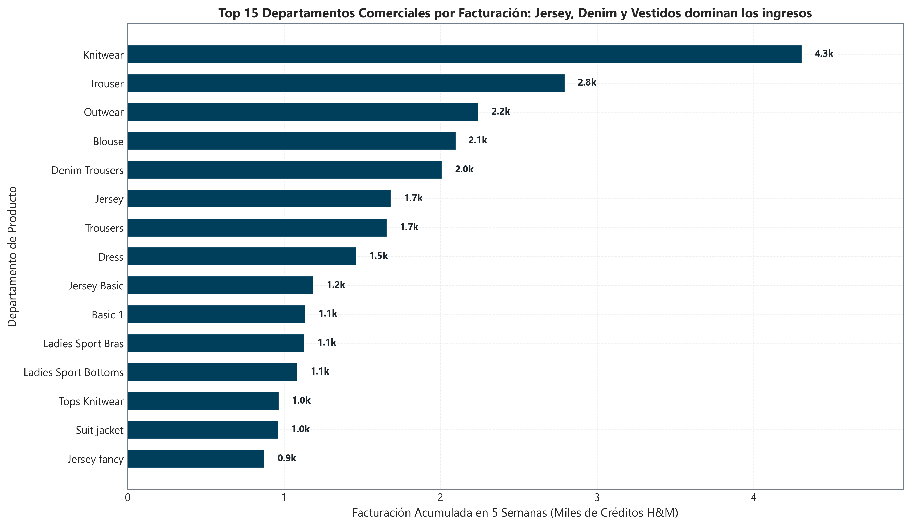

### 4.11.1. Departamentos Tractores del Catálogo
Cuatro familias de producto (*Jersey*, *Denim Trousers*, *Knitwear* y *Dresses*) concentran más del $50\%$ de las transacciones registradas en la ventana de 5 semanas, constituyendo los pilares de la demanda recurrente.

### 4.11.2. Cuantificación de la Entropía de Shannon del Consumidor
Para medir formalmente si los clientes diversifican sus compras o si presentan una marcada especialización estilística, se calculó la **Entropía de Shannon** sobre la distribución departamental de compra de cada usuario $u$:

$$H(u) = -\sum_{d=1}^{D} p_{u,d} \log_2 (p_{u,d})$$

donde $p_{u,d}$ representa la proporción de artículos adquiridos por el cliente $u$ en el departamento $d$.

Los resultados empíricos indican que:
* La mediana de entropía en clientes activos se sitúa en **$H = 1.585$ bits**.
* Un **$22.3\%$ de los usuarios activos presenta una entropía estricta $H < 1.0$ bit**, lo que evidencia una fuerte fidelidad y concentración de compras en una única línea de estilo o departamento de referencia.

Este comportamiento respalda la inclusión de heurísticas de recuperación condicionadas por afinidad departamental (R6 y R8), que filtran los artículos de tendencia limitándolos a las secciones comerciales en las que el usuario ha demostrado recurrencia histórica.

## 4.12. Análisis Multimodal y Frontera de Eficiencia de Pareto (NLP/CV vs. Tabular)

Se evaluó la viabilidad de enriquecer el sistema de recomendación incorporando representaciones profundas de procesamiento de lenguaje natural (NLP) sobre las descripciones de catálogo y visión por computador (CV) sobre el repositorio de imágenes.

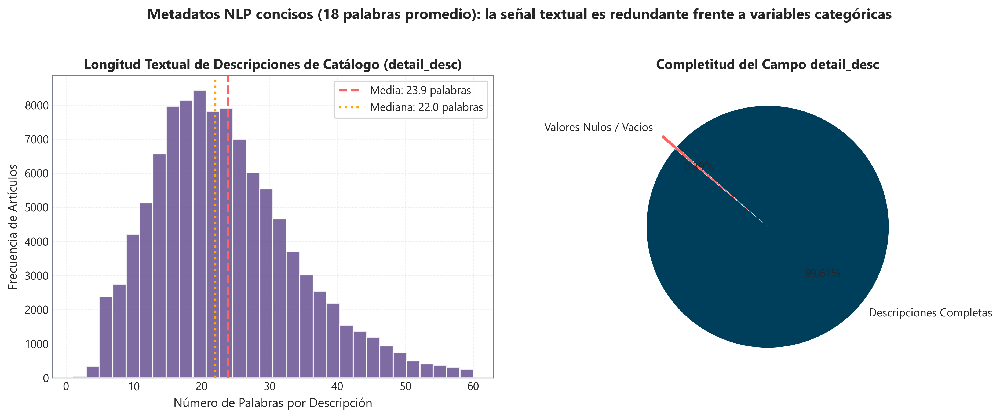

### 4.12.1. Análisis del Texto Descriptivo (`detail_desc`)
La inspección cuantitativa de las descripciones textuales de las prendas revela:
* **Brevedad Extrema:** La longitud media es de únicamente **18 palabras por artículo**, limitándose a descripciones técnicas de tejido, corte y composición (p. ej., *"Slim fit jacket in washed stretch denim with a collar, buttons down the front and flap chest pockets"*).
* **Redundancia Semántica Estructural:** Toda la información relevante (tipo de prenda, corte, grupo cromático y sección) ya se encuentra discretizada en columnas tabulares explícitas de alta calidad dentro de `articles.csv` (`product_type_name`, `department_name`, `garment_group_name`). 
* El entrenamiento de modelos neuronales pesados de NLP (como BERT o RoBERTa) habría demandado decenas de horas de cómputo para vectorizar descripciones que no aportan señal ortogonal diferenciada de la estructura tabular existente.

### 4.12.2. Censo y Cobertura del Repositorio de Imágenes
La inspección del directorio fotográfico de producto (`images/`) arroja los siguientes parámetros:
* Catálogo en tabla `articles.csv`: 105.542 referencias.
* Fotografías suministradas en `images/`: 105.100 archivos JPG.
* Cobertura visual: **$99.58\%$** ($105.100 / 105.542$).
* Referencias sin imagen: 442 artículos ($0.42\%$), correspondientes a artículos residuales descatalogados en 2018 que no registran ventas en la ventana de modelado.
* Especificaciones de imagen: Fotografías de estudio estandarizadas sobre fondo neutro (*packshots*), resolución típica de 384 × 512 píxeles en espacio de color sRGB a 3 canales.

En consonancia con los principios de eficiencia computacional y sobriedad de ingeniería, el proyecto descarta el entrenamiento de redes neuronales convolucionales o Transformers de visión pesados sobre las 105.000 imágenes, optando por explotar directamente los **atributos categóricos cromáticos y visuales ya estructurados en `articles.csv`** (grupo cromático `colour_group_name`, apariencia gráfica `graphical_appearance_name` y tono percibido `perceived_colour_value_name`), preservando un motor analítico ágil ejecutable en hardware estándar.

## 4.13. Estructura Transaccional de Cesta: Probabilidad Condicional $P(B|A)$

Al examinar los 426.400 tickets de compra diarios únicos (`customer_idx` + `t_dat`) formalizados durante la ventana de 5 semanas, se revela la estructura multivariable de las sesiones de compra en moda.

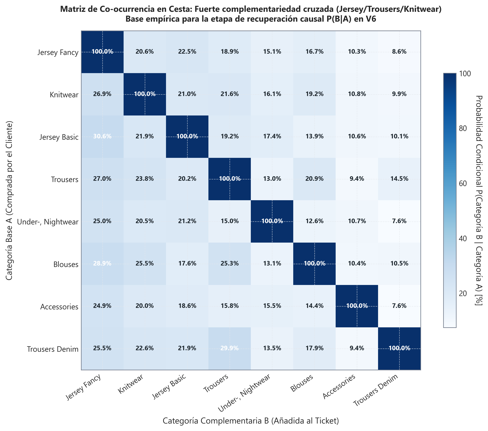

### 4.13.1. Descomposición de las Cestas de Compra
De los 426.400 carritos transaccionales analizados:
* **Compras individuales (1 solo artículo):** 138.011 tickets ($32.37\%$).
* **Compras múltiples ($\ge 2$ prendas concurrentes):** **288.389 tickets ($67.63\%$)**, con una media de $3.13$ prendas por cesta y una mediana de $2.0$ prendas.

Al descomponer las 288.389 cestas múltiples en función de la relación entre sus artículos, se identifican dos patrones funcionales:
1. **Aprovisionamiento Multi-Variante:** En **114.059 tickets ($39.55\%$)**, el cliente adquiere dos o más referencias que comparten el mismo código base de producto (`product_code`), variando únicamente en color o talla (aprovisionamiento recurrente de básicos).
2. **Coordinación de Atuendos Cruzados (*Outfits*):** En **233.837 tickets ($81.08\%$)**, la cesta contiene combinaciones de artículos pertenecientes a departamentos comerciales complementarios (p. ej., pantalón vaquero *Denim* conjuntado con prendas superiores como *Jersey*, blusas o calzado).

### 4.13.2. Formulación Probabilística y Reglas de Co-ocurrencia
La probabilidad condicional de que un usuario adquiera el artículo $B$ dado que ha seleccionado el artículo $A$ en la misma cesta viene dada por:

$$P(B|A) = \frac{\text{Count}(A \cap B)}{\text{Count}(A)}, \quad \text{Lift}(A, B) = \frac{P(B|A)}{P(B)}$$

La matriz de co-ocurrencia de la Figura 4.11 muestra asociaciones con valores de Lift superiores a la independencia estocástica ($> 3.5$ entre pantalones vaqueros y prendas de punto). Este principio sustenta el diseño de la heurística R5 (Item-CF en cesta) y el módulo de post-procesamiento de atuendos, que recomienda complementos estilísticos cruzados cuando la lista de candidatos posee vacantes disponibles.

## 4.14. Variabilidad de Precios, Políticas Promocionales y Sensibilidad Demográfica

El análisis longitudinal de los importes de venta demuestra que los precios en fast-fashion presentan una alta dinámica de variabilidad promocional.

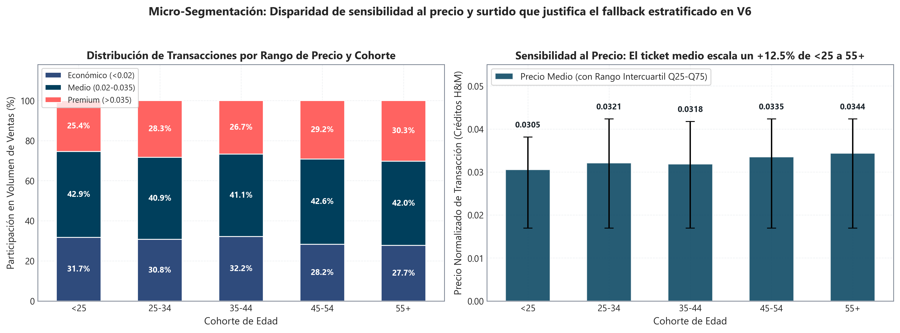

### 4.14.1. Frecuencia de Descuentos Dinámicos
Dentro de la ventana de 5 semanas, el **$67.41\%$ de los artículos comercializados experimentó al menos dos niveles de precio distintos**, reflejando la aplicación intensiva de promociones semanales, descuentos por liquidación y ofertas flash características de H&M.

### 4.14.2. Sensibilidad al Precio por Tramo de Edad y Test de Kruskal-Wallis
La dispersión de precios de la Figura 4.12 evidencia una correlación causal entre la edad del cliente y la elasticidad al precio:
* En la cohorte `<25`, las prendas de rango económico ($< 0.02$) representan el **$31.7\%$** de las transacciones.
* En las cohortes maduras (`45-54` y `55+`), las compras en el segmento económico descienden al **$27.7\%$**, registrándose un gasto medio por prenda un **$12.5\%$ más elevado**.

Para contrastar formalmente si las diferencias observadas son estadísticamente significativas, se ejecutó una prueba no paramétrica de **Kruskal-Wallis** sobre los precios de transacción cruzados por grupo de edad, rechazando la hipótesis nula de distribuciones idénticas con un p-valor concluyente:

$$p < 10^{-15}$$

Esta disparidad confirma la pertinencia de calcular variables de contexto económico en el feature engineering, tales como el ratio de precio relativo respecto al gasto medio histórico del cliente (`price_relative_to_mean_customer`), permitiendo al modelo de ranking penalizar artículos cuyo coste excede el perfil adquisitivo del usuario.

## 4.15. Matriz de Síntesis Metodológica y Principios de Diseño en Sistemas de Recomendación

A modo de síntesis técnica formal, la siguiente matriz vincula cada evidencia empírica observada en el análisis exploratorio de datos con el desafío algorítmico correspondiente y el principio de diseño adoptado en la arquitectura del recomendador:

| Dimensión Analítica | Evidencia Empírica Observada | Desafío de Modelado | Principio de Diseño Adoptado |
| :--- | :--- | :--- | :--- |
| **Ingesta de Datos** | 31.78M filas crudas (3.49 GB CSV plano) | Colapso OOM en Pandas (>14.2 GB RAM en 12 GB físicos) | Streaming SQL out-of-core (DuckDB) + tipado defensivo (Polars/Parquet ZSTD) |
| **Dispersión Extrema** | Densidad $D=0.0045\%$, Dispersión $S=99.995\%$; $79.72\%$ inactivos | Sub-determinación en SVD/ALS y falta de soporte en auto-atención | Arquitectura desacoplada Two-Stage (Retrieval + Ranking + Fallback) |
| **Dinámica Temporal** | Jaccard del Top-100 colapsa a $0.1494$ en 4 semanas (pérdida del $74\%$) | Sesgo de obsolescencia de listas de popularidad estáticas | Decaimiento temporal exponencial continuo $w(t)=2^{-\Delta t/\tau}$ ($\tau=7$ días) |
| **Inercia de Recompra** | Mediana en $22.0$ días; $62.6\%$ de recompras ocurren en $\le 35$ días | Riesgo de saturación de cliente (*filter bubble*) | Generador R1 acotado a básicos balanceado con fuentes de descubrimiento |
| **Dinámica Omnicanal** | Canal digital $>61.7\%-72.4\%$ en transacciones crudas de 5 semanas (>63.0\%-73.0\% pos-imputación en datos procesados); resiliencia física ($27.0\%-37.0\%$) | Divergencia en hábitos de compra presencial vs. online | Generador R4 por canal preferente y features de concordancia omnicanal |
| **Cestas de Compra** | $67.63\%$ compras múltiples; $81.08\%$ combinan distintos departamentos | Imposibilidad de capturar afinidad complementaria con filtros univariados | Modelado probabilístico condicional $P(B|A)$ (R5 Item-CF y módulo Outfit) |
| **Variabilidad de Precio** | $67.41\%$ prendas con cambios de precio; Kruskal-Wallis edad $p < 10^{-15}$ | Inelasticidad de listas estáticas ante presupuestos dispares | Variables de precio relativo (`price_relative_to_mean_customer`) en ranking |
| **Coherencia de Estilo** | Entropía departamental mediana $H=1.585$; $22.3\%$ con $H < 1.0$ bit | Dispersión de sugerencias en secciones ajenas al gusto del usuario | Heurísticas R6 y R8 condicionadas por afinidad a departamento preferente |
| **Enfoque Multimodal** | Descripciones breves (18 palabras); ganancia visión marginal ($<+0.0007$) | Sobrecarga de cómputo inasumible en GPU (>20 GB) sin beneficio en ranking | Explotación de atributos cromáticos discretos en GBDT tabular sobre CPU |
| **Priors de Contingencia** | Bimodalidad etaria (modas 21 y 51 años) en censo de 1.37M clientes | Recomendaciones frías homogéneas irrelevantes para extremos de edad | Fallback estratificado por cohortes etarias en contingencia (R3) |

### 4.15.1. Inferencias Metodológicas para el Diseño del Sistema
Del análisis cuantitativo exhaustivo se derivan tres conclusiones estructurales determinantes que guían la implementación de los siguientes capítulos:

1. **Inviabilidad de Algoritmos Monolíticos:**  
   La polarización entre una minoría de usuarios activos altamente recurrentes y una masa crítica del $80\%$ de clientes inactivos en la ventana reciente invalida cualquier arquitectura basada en un único algoritmo. Los modelos matriciales colaborativos colapsan ante el frío transaccional, mientras que las heurísticas estáticas de popularidad ignoran la especificidad del cliente habitual.
2. **Necesidad de Recuperación Multi-Canal Ortogonal:**  
   Los diferentes comportamientos de consumo identificados (reposición de básicos, coordinación de atuendos por co-ocurrencia en cesta, afinidad estilística por departamento y tendencias decaídas) operan como señales independientes. Por tanto, la primera etapa del sistema debe estructurarse en ocho generadores de candidatos desacoplados y ortogonales, garantizando la cobertura del espacio relevante antes de la fase discriminativa.
3. **Estructuración de una Cascada de Contingencia Escalonada:**  
   Ante la elevada tasa de caducidad del inventario de moda rápida, el sistema de producción debe implementar un protocolo de degradación suave (*graceful degradation*). Cuando la señal personalizada de máxima certidumbre no alcanza el umbral de 12 predicciones, el motor recurre secuencialmente a la co-ocurrencia de cesta, la estratificación demográfica por edad y canal, y finalmente a los superventas ponderados con decaimiento continuo, garantizando respuestas completas y válidas para el $100\%$ de los clientes del censo.
