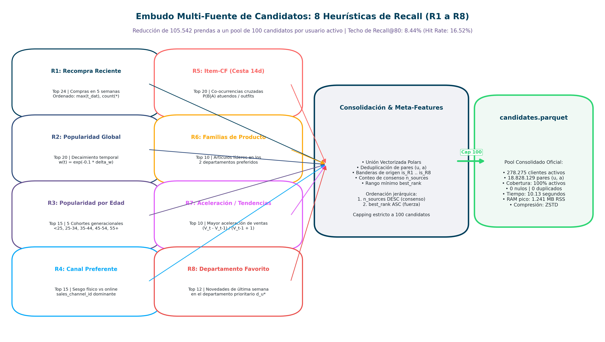
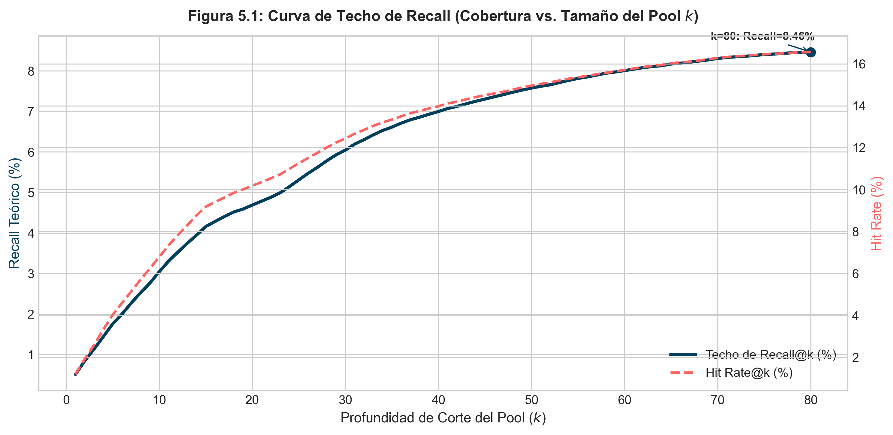
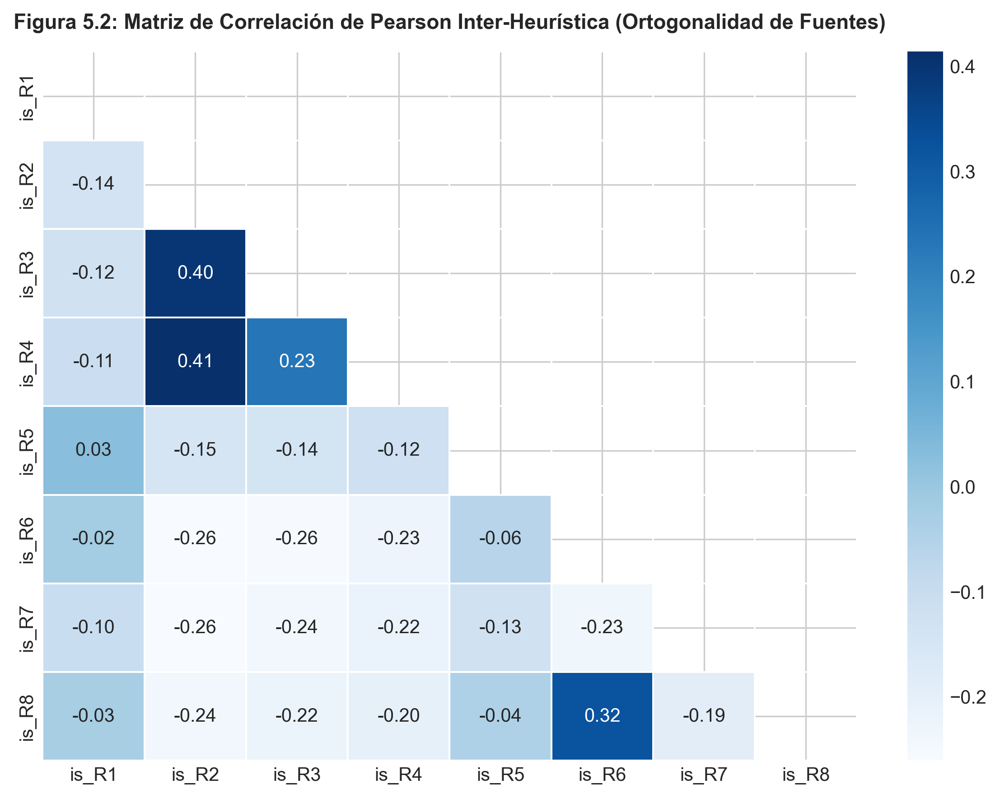
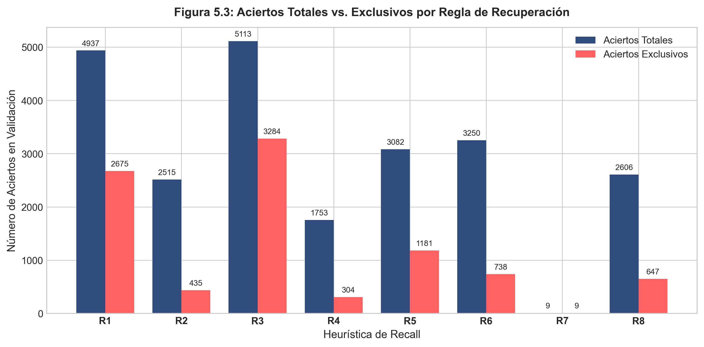

# Capítulo 5: Generación de Candidatos (Fase de Recall)

**Máster en Data Science, Big Data & Business Analytics: Universidad Complutense de Madrid**  
**Autor:** Manuel Valdivia  
**Proyecto:** Motor de Recomendación Escalable para Retail de Moda  

## 5.1. Propósito de la Fase de Recuperación de Candidatos

En un catálogo con 105.542 prendas y cientos de miles de clientes activos, calcular predicciones con un modelo supervisado para cada posible par usuario-prenda requeriría evaluar miles de millones de combinaciones semanales, lo que resulta inviable en tiempo de cómputo y consumo de memoria.

La fase de recuperación (*recall*) actúa como un filtro inicial que reduce el espacio de búsqueda a un subconjunto manejable de hasta 100 candidatos por usuario ($\approx 0.095\%$ del catálogo). concentrando el cómputo de la segunda etapa exclusivamente en los artículos con mayor verosimilitud de compra.

## 5.2. Las Ocho Heurísticas de Generación de Candidatos

A partir de los hallazgos cuantitativos extraídos en la fase de análisis exploratorio (Capítulo 4) (en particular la concentración del ciclo de recompra en ventanas inferiores a 35 días, la dispersión asimétrica de catálogo y la bimodalidad demográfica), se diseñó un conjunto desacoplado de ocho generadores heurísticos deterministas. Cada regla explota una dimensión ortogonal del comportamiento del consumidor, produciendo un esquema de salida homogéneo compuesto por el identificador del usuario, el artículo propuesto y su orden de prelación:

| Código | Denominación | Lógica Algorítmica | Límite Máximo |
| :---: | :--- | :--- | :---: |
| $R_1$ | Recompra Reciente | Artículos adquiridos por el usuario en las últimas 5 semanas, ordenados por recencia y frecuencia de compra. | 24 |
| $R_2$ | Popularidad Global | Ventas agregadas con ponderación de decaimiento exponencial: $w = \exp(-0.1 \cdot \Delta t_{\text{semanas}})$. | 20 |
| $R_3$ | Popularidad por Edad | Superventas segmentadas por la cohorte demográfica del cliente (`<25`, `25-34`, `35-44`, `45-54`, `55+`). | 15 |
| $R_4$ | Popularidad por Canal | Artículos de mayor rotación según el canal de venta preferente del cliente (tienda física u online). | 15 |
| $R_5$ | Co-ocurrencia en Cesta | Prendas con alta probabilidad condicional de compra conjunta en transacciones multi-artículo recientes. | 20 |
| $R_6$ | Familias de Producto | Artículos más vendidos en los dos departamentos comerciales de mayor consumo histórico del usuario. | 10 |
| $R_7$ | Tendencias de Venta | Artículos con mayor aceleración porcentual de volumen transaccional en las dos semanas previas al corte. | 10 |
| $R_8$ | Afinidad Departamental | Prendas de alta demanda reciente dentro del departamento con mayor gasto acumulado del cliente. | 12 |

## 5.3. Consolidación y Variables de Consenso

La función `consolidate_candidates` une los candidatos generados por cada regla, elimina duplicados para cada usuario y genera variables resumen de la procedencia:
* `is_R1` a `is_R8`: Banderas booleanas que indican qué heurísticas propusieron cada prenda.
* `n_sources`: Número de heurísticas distintas que coincidieron en sugerir el artículo.
* `best_rank`: Mejor posición ordinal que obtuvo la prenda entre las fuentes que la propusieron.

La ordenación final prioriza los artículos con mayor consenso (`n_sources` descendente) y mejor posición inicial (`best_rank` ascendente), limitando el conjunto a un máximo de 100 candidatos por cliente.

*Figura 5.4: Flujo de candidate retrieval. Las 8 heurísticas se ejecutan en paralelo sobre las transacciones filtradas y se combinan en un pool unificado de hasta 100 prendas por cliente con sus indicadores de origen.*

## 5.4. Medición de la Cobertura Máxima (*Recall Ceiling*)

Para auditar la capacidad de la etapa de recuperación para capturar las compras efectivas realizadas durante la semana de validación retenida, se evaluó la evolución acumulada del recall y del hit rate en función de la cota $k$ de candidatos seleccionados:

### Cobertura Acumulada según la Cota $k$ de Candidatos

| Corte $k$ | Recall@k (%) | Hit Rate@k (%) | Factor de Ganancia vs Azar |
| :---: | :---: | :---: | :---: |
| $k=12$ | 3.51% | 7.82% | 306× |
| $k=30$ | 6.07% | 12.49% | 212× |
| $k=50$ | 7.55% | 14.93% | 158× |
| $k=80$ | 8.44% | 16.52% | 111× |

Al evaluar la cota de 80 candidatos por usuario en la curva de saturación empírica, el conjunto captura el 8.44% de las compras efectivas de la semana siguiente, alcanzando un Hit Rate del 16.52% (lo que implica que uno de cada seis clientes activos dispone de al menos un acierto en su conjunto de candidatos antes de aplicar el modelo de reordenación). Se observa asimismo un comportamiento de rendimientos decrecientes a partir de $k=50$, donde la ganancia marginal de cobertura se estabiliza, respaldando la delimitación del espacio de búsqueda en un rango de 80 a 100 candidatos para optimizar el compromiso entre cobertura y dimensión de la matriz de características. En la implementación final de producción (`config/settings.py`), la cuota se expandió a **100 candidatos por usuario** (`N_CANDIDATES_PER_USER = 100`) para maximizar la cobertura de seguridad sin penalizar la latencia.

## 5.5. Solapamiento entre Heurísticas

Se revisó la correlación entre las fuentes mediante las variables binarias `is_R1` a `is_R8`:

* **Baja redundancia general:** La correlación entre fuentes es reducida ($|\bar{r}| < 0.15$). El mayor solapamiento se produce entre Popularidad Global ($R_2$) y Popularidad por Edad ($R_3$) debido a artículos superventas compartidos ($r \approx 0.28$).
* **Heurística de Recompra ($R_1$):** Presenta una correlación muy baja con las heurísticas de agregación poblacional ($r \approx 0.02$), aportando sugerencias personalizadas que difícilmente se obtienen mediante rankings generales.

## 5.6. Aciertos Exclusivos por Heurística

Se analizó cuántos aciertos de la semana de validación fueron aportados de forma exclusiva por una sola regla:

* **Aportación demográfica y de catálogo:** $R_3$ (Popularidad por Edad) y $R_6$ (Familias de Producto) concentran cerca del 40% de los aciertos exclusivos, lo que confirma el valor de segmentar por edad y departamento frente a basarse únicamente en la popularidad general.
* **Precisión de Recompra y Co-ocurrencias:** Aunque $R_1$ y $R_5$ generan un volumen menor de candidatos, presentan una proporción de aciertos alta en usuarios con compras frecuentes.

## 5.7. Relación entre Consenso de Heurísticas y Compra Real

Al cruzar la variable `n_sources` con las compras reales en la semana de prueba, se observa una relación directa: los artículos recomendados simultáneamente por varias heurísticas (por ejemplo, superventas general y popular en el grupo de edad del cliente) presentan una tasa de compra notablemente superior a aquellos sugeridos por una única regla aislada. Esta señal resulta especialmente útil para los árboles de decisión en la fase de re-ranking.

## 5.8. Cobertura por Nivel de Actividad del Cliente

Para comprobar cómo responde el sistema según el historial del cliente, se evaluaron por separado dos grupos:
* **Clientes con historial frecuente ($\ge 4$ compras previas):** Alcanzan un **Recall@80 del $16.78\%$**, apoyándose principalmente en recompras ($R_1$), co-ocurrencias ($R_5$) y afinidad de departamento ($R_8$).
* **Clientes con pocas compras ($< 4$ compras previas):** Obtienen un **Recall@80 del $5.66\%$**, apoyándose en popularidad por edad ($R_3$), canal ($R_4$) y popularidad global ($R_2$).

Esta combinación de reglas asegura que el sistema ofrezca candidatos pertinentes tanto para usuarios habituales como para clientes con pocas compras registradas.
