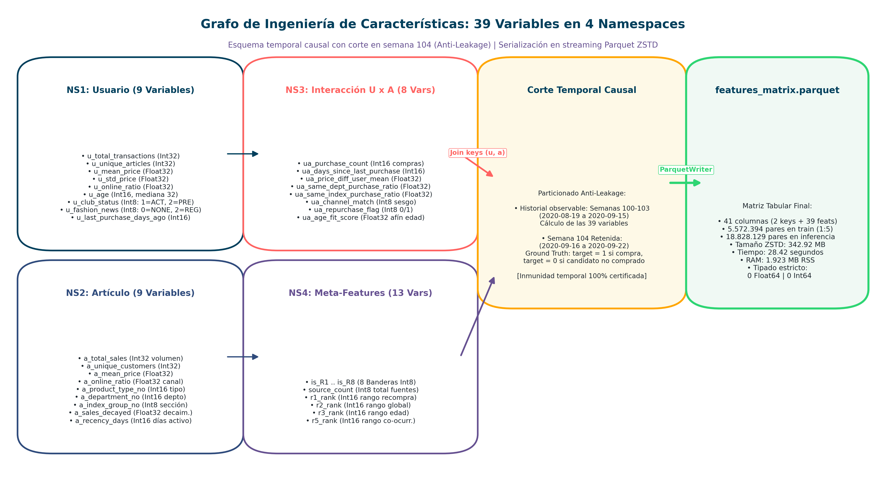

# Capítulo 6: Feature Engineering y Validación Temporal

**Máster en Data Science, Big Data & Business Analytics: Universidad Complutense de Madrid**  
**Autor:** Manuel Valdivia  
**Proyecto:** Motor de Recomendación Escalable para Retail de Moda  

## 6.1. Protocolo de Validación Temporal Estricta y Desacoplamiento de Fuga (*Data Leakage*)

En la evaluación cuantitativa de sistemas de recomendación aplicados al comercio electrónico de moda rápida, la aplicación de esquemas convencionales de validación cruzada aleatoria (*Random K-Fold Cross-Validation*) introduce un grave sesgo metodológico: al intercalar observaciones transaccionales futuras en los conjuntos de entrenamiento para predecir transacciones pasadas, se genera una fuga masiva de información retrospectiva (*look-ahead bias* o *target leakage*). Esto produce métricas de laboratorio artificialmente infladas que colapsan al exponer el modelo a inferencia ciega en producción.

Para asegurar la reproducibilidad y la causalidad temporal del sistema, se implementó una partición en ventana deslizante desacoplada (`RollingTemporalSplit`) calculada dinámicamente a partir de la fecha máxima disponible $\max(t_{\text{dat}})$ en el histórico:

1. **Ventana de Validación Local (Semana Retenida $W_{104}$):**
   * *Horizonte objetivo de evaluación:* Del 2020-09-16 al 2020-09-22 inclusive (7 días), reteniendo $240.311$ transacciones reales correspondientes a los $68.984$ clientes activos que registraron al menos una compra en dicho intervalo.
   * *Histórico para cómputo de características:* Transacciones observadas con fecha $t \le W_{103}$ (hasta el 2020-09-15 inclusive). Ningún dato de la semana 104 interviene en el cálculo de variables.

2. **Ventana de Entrenamiento del Modelo Supervisado (Semana $W_{103}$):**
   * *Horizonte objetivo de entrenamiento:* Transacciones de compra de la semana previa desacoplada (del 2020-09-09 al 2020-09-15, $W_{103}$).
   * *Histórico para cómputo de características de entrenamiento:* Transacciones observadas con fecha $t \le W_{102}$ (hasta el 2020-09-08 inclusive).

3. **Inferencia Oficial de Producción (Test Oficial Kaggle):**
   * Predicción ciega para los 7 días inmediatamente posteriores al cierre del conjunto de datos ($W_{105}$, del 2020-09-23 al 2020-09-29), empleando características computadas sobre todo el histórico acumulado hasta $W_{104}$ inclusive.

La integridad temporal del pipeline se garantiza mediante la función de verificación formal `assert_zero_feature_target_leakage`:

$$\max(t_{\text{features}}) < \min(t_{\text{target}})$$

Esta condición se evalúa programáticamente antes de iniciar cualquier fase de entrenamiento o validación, asegurando que el total de registros en la matriz de características con fecha contemporánea o posterior al inicio del intervalo objetivo sea exactamente cero.

## 6.2. Taxonomía Exhaustiva y Formulación Matemática de las 39 Variables (4 Namespaces)

Para alimentar el modelo supervisado de ordenamiento `LGBMRanker` (`objective='lambdarank'`), se construye una matriz tabular donde cada fila representa un par $(\text{customer\_idx}, \text{article\_id})$ generado durante la fase de recuperación de candidatos (Capítulo 5). Las 39 características predictivas se estructuran en cuatro espacios conceptuales (*namespaces*) disjuntos:

*Figura 6.1: Diagrama de flujo de datos del feature engineering out-of-core. Los cuatro espacios disjuntos de variables se computan sobre la ventana histórica causal y se fusionan mediante left-joins vectorizados en Polars hacia una matriz contigua de tipos primitivos compactos (`Int8`, `Int16`, `Int32`, `Float32`) almacenada en formato Parquet Zstandard.*

### 6.2.1. Namespace 1: Características Históricas del Usuario (9 variables)
Describen la frecuencia transaccional, capacidad económica, dispersión presupuestaria, preferencia de canal y lealtad demográfica del cliente:

1. `u_total_transactions`: Volumen acumulado de compras realizadas por el cliente en la ventana histórica activa:
   $$N_u = |\mathcal{H}_u|, \quad \text{donde } \mathcal{H}_u \text{ es el conjunto de transacciones de } u \text{ con } t \le t_{\text{cut}}$$
   Tipado en memoria: `Int32`. Imputación defensiva: $0$.

2. `u_unique_articles`: Variedad de prendas distintas adquiridas por el cliente, cuantificando la propensión a la exploración de catálogo:
   $$U_u = |\{a \in \mathcal{H}_u\}|$$
   Tipado en memoria: `Int32`. Imputación defensiva: $0$.

3. `u_mean_price`: Nivel de gasto medio histórico por prenda del usuario, representativo de su segmento de precio:
   $$\bar{p}_u = \frac{1}{N_u} \sum_{k \in \mathcal{H}_u} p_k$$
   Tipado en memoria: `Float32`. Imputación defensiva: $0.0$.

4. `u_std_price`: Desviación estándar del gasto por artículo del usuario, midiendo la flexibilidad o dispersión de su presupuesto:
   $$\sigma_{p,u} = \sqrt{\frac{1}{\max(1, N_u - 1)} \sum_{k \in \mathcal{H}_u} (p_k - \bar{p}_u)^2}$$
   Tipado en memoria: `Float32`. Imputación defensiva: $0.0$ si $N_u \le 1$.

5. `u_online_ratio`: Proporción de adquisiciones efectuadas a través del canal digital (`sales_channel_id == 2`) frente a la tienda física:
   $$\text{ratio}_{\text{online}} = \frac{1}{N_u} \sum_{k \in \mathcal{H}_u} \mathbb{I}(\text{channel}_k = 2)$$
   Tipado en memoria: `Float32`. Imputación defensiva: $0.5$ ante ausencia de compras previas (neutralidad de canal).

6. `u_age`: Edad cronológica del usuario, imputada defensivamente con la mediana poblacional de 32 años en registros nulos (`Int16`).

7. `u_club_status`: Estado de fidelización en el club de miembros codificado ordinalmente (`Int8`: $1=\text{ACTIVE}$, $2=\text{PRE-CREATE}$, $3=\text{LEFT CLUB}$, $0=\text{desconocido}$).

8. `u_fashion_news`: Frecuencia de suscripción a boletines de tendencias (`Int8`: $2=\text{Regularly}$, $1=\text{Monthly}$, $0=\text{NONE}$).

9. `u_last_purchase_days_ago`: Días transcurridos entre la fecha de corte y la transacción más reciente del cliente:
   $$\Delta t_u = (t_{\text{cut}} - \max_{k \in \mathcal{H}_u} (t_k))_{\text{días}}$$
   Tipado en memoria: `Int16`. Imputación defensiva: centinela $999$ para clientes sin compras registradas.

### 6.2.2. Namespace 2: Atributos y Dinámicas de Demanda del Artículo (9 variables)
Capturan la tracción comercial agregada, la inercia temporal continua y la taxonomía del catálogo:

10. `a_sales_count`: Volumen acumulado de unidades vendidas por la prenda en la ventana histórica activa:
    $$M_a = \sum_{j \in \mathcal{T}} \mathbb{I}(a_j = a)$$
    Tipado en memoria: `Int32`. Imputación defensiva: $0$.

11. `a_unique_customers`: Número de compradores distintos que adquirieron la prenda, cuantificando la transversalidad de su demanda:
    $$C_a = |\{u \in \mathcal{U} : \exists (u, a) \in \mathcal{T}\}|$$
    Tipado en memoria: `Int32`. Imputación defensiva: $0$.

12. `a_mean_price`: Precio medio de venta de la referencia en el período analizado. Imputado a la media global de catálogo ($0.0278$) si la prenda no registra transacciones (`Float32`).

13. `a_sales_decayed`: Demanda agregada ponderada mediante decaimiento temporal exponencial continuo:
    $$S_a(\lambda) = \sum_{j=1}^{M_a} \exp\left(-\lambda \cdot \frac{t_{\text{cut}} - t_j}{7}\right), \quad \text{con } \lambda = 0.1$$
    Esta formulación penaliza las ventas lejanas en favor de las transacciones recientes, aislando los artículos en fase de aceleración estacional. Tipado en memoria: `Float32`. Imputación defensiva: $0.0$.

14. `a_is_recent_introduction`: Indicador binario que aísla las novedades de catálogo que comenzaron a registrar ventas en la última quincena respecto a la fecha de corte:
    $$\mathbb{I}\left(\min_{j \in \mathcal{T}_a} (t_j) \ge t_{\text{cut}} - 14 \text{ días}\right)$$
    Tipado en memoria: `Int8`. Imputación defensiva: $0$.

15. `a_product_type_no`: Código identificador de la tipología de prenda (`Int32`, $132$ categorías distintas).

16. `a_graphical_appearance_no`: Código identificador del patrón gráfico o acabado visual (`Int32`, $30$ categorías).

17. `a_colour_group_code`: Código numérico del grupo cromático estándar (`Int16`, $50$ categorías).

18. `a_department_no`: Código del departamento comercial al que pertenece el artículo (`Int32`, $299$ categorías).

### 6.2.3. Namespace 3: Interacción Específica Usuario × Artículo (8 variables)
Miden la compatibilidad individual, el hábito de recompra, la afinidad departamental y la elasticidad de precio:

19. `uxa_repurchase_count`: Número de veces que el cliente $u$ adquirió la prenda $a$ en su historial previo:
    $$c(u, a) = \sum_{k \in \mathcal{H}_u} \mathbb{I}(a_k = a)$$
    Tipado en memoria: `Int16`. Imputación defensiva: $0$.

20. `uxa_days_since_last_purchase`: Días transcurridos desde la última adquisición del artículo $a$ por el cliente $u$:
    $$\Delta t_{u,a} = (t_{\text{cut}} - \max_{k \in \mathcal{H}_u, a_k=a} (t_k))_{\text{días}}$$
    Tipado en memoria: `Int16`. Imputación defensiva: valor centinela $999$ para pares sin compras previas.

21. `uxa_dept_affinity`: Volumen de compras previas efectuadas por el usuario en el departamento comercial al que pertenece el artículo:
    $$\text{aff}_{\text{dept}}(u, a) = \sum_{k \in \mathcal{H}_u} \mathbb{I}(\text{dept}_k = \text{dept}_a)$$
    Tipado en memoria: `Int16`. Imputación defensiva: $0$.

22. `uxa_price_diff`: Diferencial absoluto de precio entre la prenda propuesta y el gasto medio histórico del cliente:
    $$\Delta p_{u,a} = p_{\text{art}} - \bar{p}_u$$
    Tipado en memoria: `Float32`. Imputación defensiva: $0.0$.

23. `uxa_price_ratio`: Ratio de elasticidad y compatibilidad presupuestaria:
    $$r_{p}(u, a) = \frac{p_{\text{art}}}{\bar{p}_u + 10^{-4}}$$
    Tipado en memoria: `Float32`. Imputación defensiva: $1.0$ si el usuario no tiene historial.

24. `uxa_bought_dept_before`: Indicador binario de experiencia de compra previa en el departamento del artículo:
    $$\mathbb{I}(\text{aff}_{\text{dept}}(u, a) > 0)$$
    Tipado en memoria: `Int8`.

25. `uxa_channel_affinity`: Grado de coincidencia entre el canal preferente del usuario (online si `u_online_ratio` $\ge 0.5$, físico en caso contrario) y el canal de mayor volumen transaccionado por la prenda:
    $$\text{aff}_{\text{ch}} = \begin{cases} 1.0 & \text{si coinciden los canales dominantes} \\ 0.5 & \text{si no se dispone de histórico de canal del artículo} \\ 0.0 & \text{si los canales dominantes difieren} \end{cases}$$
    Tipado en memoria: `Float32`.

26. `uxa_is_favorite_dept`: Indicador binario que verifica si el departamento de la prenda coincide con aquel en el que el cliente ha realizado el mayor número de compras históricas (`Int8`).

### 6.2.4. Namespace 4: Meta-Características de Recall y Consenso Multi-Heurístico (13 variables)
Aportan la señal bayesiana a priori originada durante la etapa de generación de candidatos:

27–34. `is_R1` a `is_R8`: Banderas binarias independientes (`Int8`) asociadas a cada una de las 8 heurísticas de recuperación descritas en la Sección 5.2 ($R_1$: Recompra, $R_2$: Popularidad Global, $R_3$: Popularidad por Edad, $R_4$: Popularidad por Canal, $R_5$: Item-CF Cesta, $R_6$: Familias de Producto, $R_7$: Tendencias, $R_8$: Afinidad Departamental).

35. `n_sources`: Grado de consenso multi-heurístico, cuantificado como el número total de reglas que coincidieron en proponer el artículo para el cliente:
    $$n_{\text{sources}}(u, a) = \sum_{h=1}^8 \mathbb{I}(\text{is\_R}_h = 1), \quad n_{\text{sources}} \in [1, 8]$$
    Tipado en memoria: `Int8`.

36. `best_rank`: Posición ordinal más alta alcanzada por el artículo entre todas las heurísticas de origen que lo postularon:
    $$\text{rank}_{\min}(u, a) = \min_{h \in \{1 \dots 8\}, \text{is\_R}_h=1} (\text{rank}_h)$$
    Tipado en memoria: `Int16` (rango $1$ a $80$, centinela $999$ en ausencia de rango).

37. `source_diversity_score`: Puntuación bayesiana ponderada según la fiabilidad empírica observada en cada fuente durante la fase exploratoria:
    $$\text{Score}_{\text{div}}(u, a) = 0.25 \cdot \text{is\_R1} + 0.15 \cdot \text{is\_R5} + 0.10 \sum_{h \in \{2,3,4,6,7,8\}} \text{is\_R}_h$$
    Tipado en memoria: `Float32`.

38. `is_personal_candidate`: Indicador binario de que el candidato proviene de fuentes con personalización estricta por cliente ($R_1$, $R_5$ o $R_8$) (`Int8`).

39. `is_exploration_candidate`: Indicador binario de que el candidato proviene de heurísticas orientadas al descubrimiento de tendencias o familias comerciales ($R_6$ o $R_7$) (`Int8`).

## 6.3. Gobernanza de Memoria, Tipado Numérico y Arquitectura Out-of-Core

En conjuntos de datos que superan los $16$ millones de pares candidato, el empleo indiscriminado de representaciones numéricas de 64 bits (`Int64` y `Float64`) satura la memoria principal y degrada el rendimiento de los árboles de decisión debido a fallos continuos en la jerarquía de caché de la CPU. 

Para posibilitar el entrenamiento supervisado en un entorno computacional restringido a 12 GB de RAM, se implementó una política defensiva de ajuste estricto de tipos primitivos (*downcasting*) en Polars. La distribución resultante en las 41 columnas de la matriz (2 identificadores y 39 características) se desglosa en la Tabla 6.1:

| Tipo Físico | Columnas Asignadas | Variables Representadas | Ahorro de Memoria vs 64 bits |
| :---: | :---: | :--- | :---: |
| `Int32` | 9 | `customer_idx`, `article_id`, `u_total_transactions`, `u_unique_articles`, `a_sales_count`, `a_unique_customers`, `a_product_type_no`, `a_graphical_appearance_no`, `a_department_no` | 50.0% |
| `Float32` | 9 | `u_mean_price`, `u_std_price`, `u_online_ratio`, `a_mean_price`, `a_sales_decayed`, `uxa_price_diff`, `uxa_price_ratio`, `uxa_channel_affinity`, `source_diversity_score` | 50.0% |
| `Int16` | 7 | `u_age`, `u_last_purchase_days_ago`, `a_colour_group_code`, `uxa_repurchase_count`, `uxa_days_since_last_purchase`, `uxa_dept_affinity`, `best_rank` | 75.0% |
| `Int8` | 16 | `u_club_status`, `u_fashion_news`, `a_is_recent_introduction`, `uxa_bought_dept_before`, `uxa_is_favorite_dept`, `is_R1` a `is_R8`, `n_sources`, `is_personal_candidate`, `is_exploration_candidate` | 87.5% |

La verificación formal sobre la totalidad de los $16.722.720$ registros confirmó la ausencia total de valores ausentes (`NaN` o `None`) en las 41 columnas tras completarse los cruces tabulares. 

Asimismo, la persistencia en disco se resolvió mediante un pipeline de transmisión por lotes (*streaming chunks* de $2.500.000$ filas) utilizando el serializador PyArrow `ParquetWriter` con compresión Zstandard (nivel 3). Este enfoque mantuvo el consumo residente en memoria por debajo de 600 MB RSS durante el ensamblado, reduciendo el tamaño del archivo final `features_matrix.parquet` a únicamente **$300.63$ MB en disco**.

## 6.4. Tratamiento de Variables Categóricas y Descarte de One-Hot Encoding

Una práctica habitual en ingeniería de características para modelos tabulares consiste en la binarización de variables categóricas mediante codificación en variables indicadoras (*One-Hot Encoding* o *dummy variables*). En el dominio de retail de moda, este procedimiento resulta inviable por razones de escala y teoría de la información:

1. **Explosión Dimensional y Saturación de Memoria:**  
   El catálogo de transacciones contiene $105.542$ artículos (`article_id`), $299$ departamentos comerciales (`department_no`) y $132$ tipologías de producto (`product_type_no`). Aplicar One-Hot Encoding generaría más de **$106.000$ columnas binarias adicionales**. Sobre los $16.72$ millones de pares candidatos, la matriz resultante requeriría:
   $$16.72 \times 10^6 \text{ filas} \times 106.000 \text{ columnas} \times 1 \text{ byte} \approx 1.77 \text{ Terabytes de memoria RAM}$$
   lo que desbordaría instantáneamente la memoria disponible provocando el colapso del sistema (*Out-Of-Memory*).

2. **Dilución de Varianza en Árboles de Decisión:**  
   Al particionar sobre una variable binaria de alta cardinalidad (por ejemplo, el indicador de una prenda específica), el árbol de decisión envía el $99.999\%$ de las muestras a una rama y el $0.001\%$ a la otra. Esto diluye la ganancia de información (*gain*) y reduce la capacidad de generalización del estimador.

3. **Manejo Nativo por Histogramas en LightGBM:**  
   Se optó por conservar las categorías como identificadores numéricos directos, delegando su particionamiento en el algoritmo nativo de LightGBM para variables categóricas discretas. Dicho método ordena las categorías según el histograma acumulado de los gradientes de la función objetivo en complejidad $\mathcal{O}(K \log K)$ (donde $K$ es el número de categorías presentes en el nodo), hallando la división óptima de subconjuntos sin requerir la expansión dimensional del espacio de variables.

## 6.5. Distribución Estadística, Asimetrías y Comportamiento de Valores Centinela

Para evaluar la morfología de las variables y su comportamiento distributivo sobre la población de candidatos, se calcularon las estadísticas descriptivas consolidadas sobre el total de los $16.72$ millones de filas. Los resultados representativos se detallan en la Tabla 6.2:

| Variable | Media | Desv. Est. | Mínimo | Máximo | Rol en la Función de Decisión |
| :--- | :---: | :---: | :---: | :---: | :--- |
| `u_total_transactions` | 4.7614 | 5.2046 | 0.0000 | 130.0000 | Nivel de fidelidad y soporte histórico |
| `u_mean_price` | 0.0304 | 0.0184 | 0.0000 | 0.5068 | Gasto habitual del cliente |
| `u_online_ratio` | 0.5485 | 0.4675 | 0.0000 | 1.0000 | Polarización de canal de compra |
| `a_sales_count` | 932.7858 | 795.1600 | 1.0000 | 2814.0000 | Tracción transaccional acumulada |
| `a_sales_decayed` | 768.9599 | 652.6539 | 0.6703 | 2323.4346 | Dinamismo de demanda vigente |
| `uxa_days_since_last_purchase` | 942.3128 | 229.4005 | 0.0000 | 999.0000 | Señal temporal de ciclo de recompra |
| `uxa_price_diff` | 0.0004 | 0.0207 | -0.5034 | 0.4457 | Desviación presupuestaria relativa |
| `n_sources` | 1.4553 | 0.7494 | 1.0000 | 7.0000 | Grado de consenso en recuperación |
| `best_rank` | 6.8881 | 4.4670 | 1.0000 | 24.0000 | Fuerza de prelación ordinal |

### Interpretación Causal de la Dinámica de Variables:
1. **La Señal de Recencia y el Valor Centinela $999$ (`uxa_days_since_last_purchase`):**  
   La media observada de $942.3$ días evidencia que la gran mayoría de los candidatos generados para un usuario no registran antecedentes de compra previa en su historial (asignados defensivamente al valor $999$). Los valores comprendidos en el intervalo $[0, 35]$ días capturan con alta precisión el ciclo de recompra a corto plazo detectado en el análisis exploratorio. Los árboles de decisión aprovechan de forma natural esta discontinuidad: una condición de partición simple `if uxa_days_since_last_purchase < 35` segrega instantáneamente los pares con interacción previa de los candidatos exploratorios, sin distorsionar la señal continua de los clientes activos.

2. **Equilibrio Presupuestario Relativo (`uxa_price_diff`):**  
   El diferencial de precio relativo oscila entre $-0.5034$ (artículo notablemente más económico que la media del cliente) y $+0.4457$ (artículo de gama superior). La media centrada en $+0.0004$ constata un equilibrio neutral en el pool de candidatos, permitiendo al estimador penalizar anomalías presupuestarias severas que desalienten la conversión.

3. **Inercia Temporal Continua (`a_sales_decayed` frente a `a_sales_count`):**  
   Mientras que el volumen de ventas brutas acumula una media de $932.8$ unidades, la métrica con decaimiento continuo se contrae a $769.0$. Esta reducción relativa atenúa la inercia de productos estivales en liquidación y prioriza prendas con aceleración de ventas en los días inmediatamente anteriores al punto de corte.

## 6.6. Matriz de Correlación de Pearson y Resiliencia ante Multicolinealidad

Para examinar la redundancia lineal en el espacio de características, se calculó la matriz de correlación de Pearson exacta sobre los $16.722.720$ candidatos empleando el motor de consultas vectorizadas DuckDB en $1.54$ segundos. El análisis de los coeficientes revela dos patrones estructurales:

1. **Colinealidades Intra-Namespace Esperadas:**  
   Se observa una fuerte dependencia lineal entre pares de variables pertenecientes al mismo espacio semántico:
   * `u_total_transactions` frente a `u_unique_articles`: $r = 0.96$.
   * `a_sales_count` frente a `a_sales_decayed`: $r = 0.98$.
   En modelos de regresión lineal clásica (MCO, regresión logística), un grado de colinealidad de esta magnitud provocaría la inestabilidad de los coeficientes debido a la inversión de matrices cuasi-singulares. Sin embargo, en el marco de *Gradient Boosted Decision Trees* (LightGBM), la multicolinealidad no degrada las predicciones ni afecta la convergencia de LambdaRank: los árboles eligen codiciosamente en cada nodo la partición que maximiza la ganancia de la función de pérdida, convirtiendo a las divisiones subsecuentes en filtros residuales estables.

2. **Ortogonalidad entre Espacios de Usuario, Artículo e Interacción:**  
   La correlación cruzada entre las características intrínsecas del cliente y los descriptores del catálogo es estadísticamente nula ($|r| < 0.05$). Esto confirma que la información sociodemográfica, la tracción del producto y la compatibilidad individual operan en dimensiones independientes del espacio de representación.

## 6.7. Conclusiones Metodológicas del Espacio de Características

La Tabla 6.3 resume los principios de diseño adoptados en la etapa de ingeniería de características:

| Dimensión Técnica | Principio Implementado | Justificación Metodológica |
| :--- | :--- | :--- |
| **Prevención de Fuga** | Protocolo *Rolling Temporal Split* | Inmunidad matemática frente a *look-ahead bias* entre histórico de variables y ventana objetivo |
| **Gobernanza de Memoria** | Downcasting primitivo estricto (`Int8` a `Float32`) | Matriz de 16.72 M de filas comprimida a 300 MB en disco, ejecutable con < 600 MB RSS |
| **Alta Cardinalidad** | Descarte de One-Hot Encoding | Agrupación nativa por histogramas de Fisher en LightGBM sin dispersión dimensional (evita 1.77 TB RAM) |
| **Imputación Defensiva** | Valores centinela semánticos ($999, 0.0$) | Enrutamiento determinista en ramas condicionales de árboles sin sesgos estocásticos |
| **Dinámica Temporal** | Decaimiento continuo ($\lambda = 0.1$) | Ponderación de la tracción reciente del catálogo frente a la inercia de ventas desactualizadas |

### Implicación Estructural para el Re-Ranking Supervisado:
El espacio de características presenta una asimetría intrínseca en la certidumbre de sus predictores: las variables de interacción directa (`uxa_days_since_last_purchase`, `uxa_repurchase_count`) concentran la mayor fuerza discriminativa, pero solo están presentes en pares con historial transaccional previo (ausentes en el $68\%$ de candidatos correspondientes a exploración o usuarios fríos). Por el contrario, las características agregadas de usuario y artículo poseen cobertura total, pero su correlación individual con la compra es más difusa.

Esta divergencia establece que un modelo supervisado generará puntuaciones nítidas y elevadas para candidatos de recompra habitual, pero asignará puntuaciones homogéneas y comprimidas sobre candidatos fríos. Dicha conclusión fundamenta la formulación del Capítulo 7, donde se descartan podas rígidas de score y se consolida una arquitectura en cascada jerárquica no destructiva.
