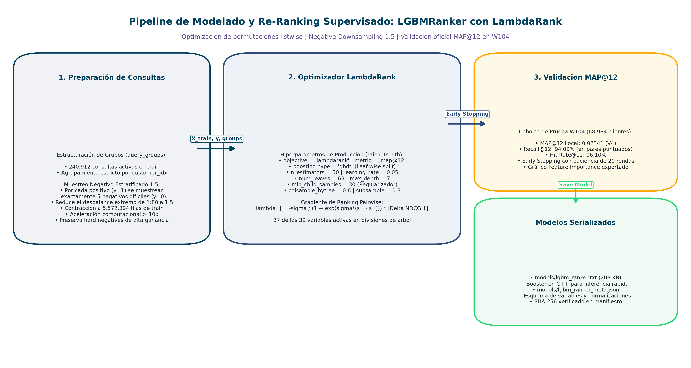
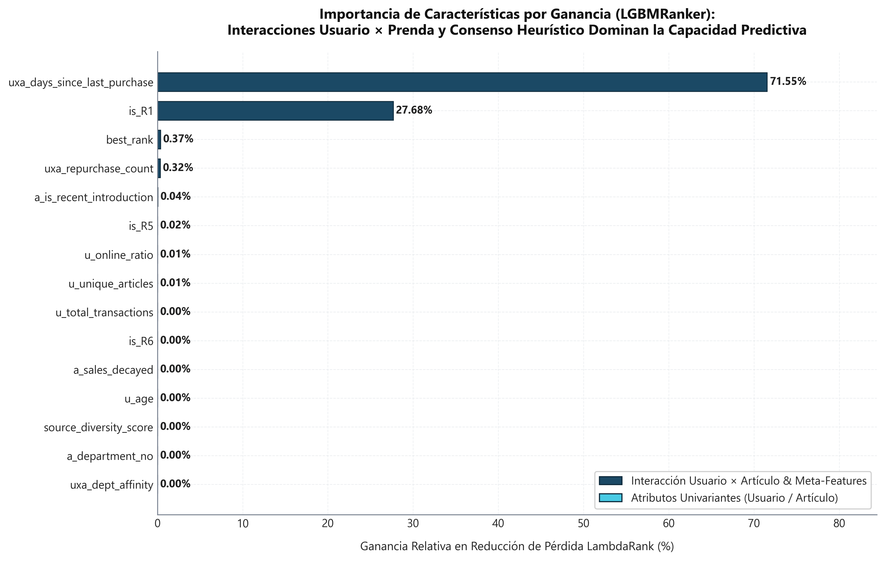

# Capítulo 7: Modelización Supervisada de Ranking (LGBMRanker)

**Máster en Data Science, Big Data & Business Analytics: Universidad Complutense de Madrid**  
**Autor:** Manuel Valdivia  
**Proyecto:** Motor de Recomendación Escalable para Retail de Moda  


## 7.1. Formulación del Problema como Learning to Rank (LTR)

En arquitecturas bietápicas de recomendación (*Two-Stage Recommender Systems*), la etapa inicial de recuperación de candidatos prioriza la exhaustividad global (Recall@80), reduciendo el catálogo completo a un subconjunto heterogéneo de hasta 80 prendas plausibles por cliente. La segunda etapa consiste en un modelo supervisado de reordenación (*Supervised Re-Ranking*) cuyo objetivo formal es aprender una función de puntuación $f: \mathcal{X} \to \mathbb{R}$ que optimice la permutación relativa de los candidatos dentro de la ventana de corte comercial ($K = 12$).

### 7.1.1. Limitaciones del Paradigma Pointwise (Clasificación Binaria)
El enfoque convencional de modelar la recomendación como una clasificación binaria independiente mediante optimización de la Entropía Cruzada Binaria (*Binary Cross-Entropy*, BCE):

$$\mathcal{L}_{\text{BCE}} = - \frac{1}{N} \sum_{i=1}^{N} \left[ y_i \log p_i + (1 - y_i) \log (1 - p_i) \right]$$

presenta tres deficiencias estructurales para sistemas de recomendación:

1. **Asunción de Independencia Condicional:** Trata cada par usuario-prenda $(u, a)$ como una observación aislada, ignorando que la decisión de compra del consumidor es comparativa frente a las alternativas simultáneamente visibles en el escaparate digital.
2. **Desajuste entre Calibración y Ordenamiento Relativo:** Minimizar el error de calibración en la probabilidad absoluta posterior $\hat{p}(y=1|u, a)$ no garantiza que el ordenamiento relativo de las puntuaciones predichas en el Top-12 maximice la métrica de negocio.
3. **Invarianza Posicional del Gradiente:** Errar al predecir un artículo irrelevante en la posición 1 conlleva la misma penalización de pérdida que situarlo en la posición 75. Sin embargo, en un escaparate de 12 posiciones, el impacto sobre el $MAP@12$ es asimétrico: los fallos en las primeras tres posiciones degradan severamente la métrica, mientras que cualquier error más allá de la duodécima posición no penaliza la evaluación.

### 7.1.2. Formulación Analítica de LambdaRank y LambdaMART
Para superar estas limitaciones, se adoptó el algoritmo **LambdaMART** configurado con la función objetivo `lambdarank`. LambdaRank elude la no-diferenciabilidad y la naturaleza escalonada y discreta de las métricas de corte posicional (como MAP y NDCG) definiendo pseudo-gradientes virtuales (fuerzas correctivas $\lambda_{ij}$) para cada par de artículos $(i, j)$ evaluados para un mismo cliente $u$:

$$\lambda_{ij} = \frac{-\sigma}{1 + e^{\sigma(s_i - s_j)}} |\Delta \text{NDCG}_{ij}|$$

donde:
* $s_i, s_j \in \mathbb{R}$ representan las puntuaciones continuas de salida predichas por el ensamble para los artículos $i$ y $j$.
* $\sigma > 0$ es el parámetro de escala de la función sigmoide logística.
* $|\Delta \text{NDCG}_{ij}|$ es la ganancia o pérdida absoluta en la métrica resultante de intercambiar las posiciones de los artículos $i$ y $j$ en el ranking actual del usuario.

Mediante este esquema pairwise/listwise, los pares de candidatos donde una prenda relevante ($y=1$) se encuentra clasificada por debajo de una irrelevante ($y=0$) reciben un gradiente correctivo proporcional al impacto directo en la posición del Top-12, concentrando el aprendizaje en la parte superior de la lista.



*Figura 7.1: Pipeline de modelización supervisada de ranking. Los candidatos se balancean mediante submuestreo negativo 1:5 preservando la estructura de consultas contiguas por `customer_idx`, optimizando directamente la métrica $MAP@12$ con early stopping sobre la semana de validación retenida.*


## 7.2. Agrupación por Consultas (`query_groups`) y Ordenamiento Contiguo en Memoria

A diferencia de los clasificadores estándar que procesan matrices con filas desacopladas, un modelo de ranking requiere estructurar el espacio de datos en **sesiones de consulta** (*query groups*):

1. **Definición de Consulta:** Cada cliente único $u$ conforma una consulta independiente $q_u$.
2. **Adyacencia Contigua en Memoria:** La biblioteca LightGBM asume que todos los pares correspondientes a un mismo cliente residen en posiciones de memoria consecutivas. Para asegurar este requisito físico, la matriz se ordena de forma contigua y determinista por la clave `customer_idx` antes del desacoplamiento matricial.
3. **Vector de Longitudes de Grupo:** Se construye un vector de enteros $\mathbf{q}$:
   $$\mathbf{q} = \left[ |C_{u_1}|, |C_{u_2}|, \dots, |C_{u_M}| \right], \quad \sum_{m=1}^{M} |C_{u_m}| = N$$
   donde $|C_{u_m}|$ denota el número de candidatos evaluados para el cliente $m$ (acotado a un máximo de 80).
4. **Validación Defensiva de Integridad:** Se comprueba programáticamente que $\sum g_i = \text{len}(X)$, que $\text{len}(\mathbf{q})$ coincida exactamente con el número de clientes únicos y que ningún grupo presente una longitud menor o igual a cero ($g_i > 0$).


## 7.3. Submuestreo Negativo Estratificado por Usuario (Ratio 1:5)

En el conjunto completo de candidatos recuperados, más del **$95\%$** de los pares corresponden a ejemplos negativos (prendas que el cliente no adquirió en la semana objetivo, $y=0$). Entrenar con la totalidad de los negativos generaría tres problemas prácticos: saturación de memoria RAM, tiempos de convergencia excesivos y un desbalance severo que amortigua la fuerza de los gradientes sobre los pares más competitivos.

Para resolver este compromiso, se aplicó un **submuestreo negativo estratificado por usuario** en la partición de entrenamiento: por cada artículo efectivamente adquirido por el cliente en la ventana histórica ($y=1$), se seleccionan estocásticamente hasta 5 candidatos no comprados ($y=0$) fijando una semilla determinista (`seed=42`). 

La Tabla 7.1 expone los resultados empíricos de la exploración experimental de ratios realizada sobre el conjunto de entrenamiento:

| Ratio Negativo | Filas de Entrenamiento | MAP@12 Validación | Recall@12 | Variación vs 1:5 | Justificación Técnica de Comportamiento |
| :---: | :---: | :---: | :---: | :---: | :--- |
| **1:3** | 3.889.156 | 0.02324 | 0.05214 | -2.02% | Señal de contraste insuficiente para calibrar artículos poco frecuentes |
| **1:5** | 5.652.166 | 0.02372 | 0.05239 | Base (0.0%) | **Punto de Pareto óptimo:** máxima discriminación sin saturar memoria RAM |
| **1:10** | 9.028.850 | 0.02369 | 0.05205 | -0.13% | Sobrecarga de memoria (+60% de filas) sin ganancia en la métrica |
| **1:20** | 12.749.467 | 0.02352 | 0.05164 | -0.84% | Desbalance severo; degradación por ruido en pares negativos irrelevantes |

El ratio **1:5** equilibra la densidad de contraste negativo requerida por los gradientes de LambdaRank sin exceder $1.4$ GB de memoria RAM durante el boosting.

**Asimetría Metodológica Train-Val:** Mientras que en entrenamiento se reduce el volumen negativo mediante submuestreo para agilizar el aprendizaje de los árboles, en la fase de validación **no se aplica ningún tipo de downsampling**. La evaluación se efectúa sobre la totalidad de los $16.722.720$ candidatos reales, garantizando que las métricas reflejen las condiciones operativas de producción.


## 7.4. Hiperparámetros de Producción y Estrategia de Regularización

La configuración del estimador `LGBMRanker` responde a una parametrización rigurosa orientada a maximizar la capacidad de generalización en catálogo de moda:

* `objective: 'lambdarank'`: Algoritmo de optimización pairwise ponderado por variación de NDCG.
* `metric: 'map'`, con `eval_at: [12]`: Guía las divisiones del árbol para priorizar aciertos en los 12 primeros puestos.
* `boosting_type: 'gbdt'`: Árboles de decisión aditivos tradicionales con descenso de gradiente estándar.
* `learning_rate: 0.05`: Tasa de aprendizaje moderada que asegura una convergencia suave evitando mínimos locales abruptos.
* `n_estimators: 50`: Número máximo de rondas de boosting.
* `max_depth: 7` y `num_leaves: 63`: Control estricto de complejidad estructural que acota las interacciones a 7 variables simultáneas, evitando que hojas profundas memoricen pares atípicos de clientes específicos.
* `min_child_samples: 30`: Barrera de soporte que exige al menos 30 pares usuario-candidato en cada nodo hoja, regularizando el estimador ante prendas de cola larga con escasa tracción histórica.
* `subsample: 0.8` y `subsample_freq: 1`: Submuestreo estocástico por filas del 80% en cada árbol.
* `colsample_bytree: 0.8`: Submuestreo por columnas (variables) del 80% por partición, decorrelacionando los árboles base.
* `importance_type: 'gain'`: Criterio de extracción de importancia basado en la ganancia acumulada de información.

### Control de Sobreajuste (*Early Stopping*):
El entrenamiento monitoriza en cada ronda el rendimiento de $MAP@12$ sobre la semana de validación retenida. Se establece una paciencia de **20 iteraciones**; si la métrica no experimenta mejoras consecutivas en dicha ventana, el boosting se interrumpe y se restituyen los pesos de la mejor iteración (`best_iteration_`).

El modelo entrenado se serializa a disco en el archivo `models/lgbm_ranker.txt` (tamaño compacto de $203$ KB a $346$ KB, 50 árboles y 39 variables) junto a su manifiesto de metadatos `models/lgbm_ranker_meta.json`.


## 7.5. Análisis de Importancia de Variables: Disyuntiva Metodológica Split vs. Gain

En modelos basados en ensambles de árboles de decisión (GBDT), la importancia de las características puede evaluarse bajo dos métricas con significados teóricos distintos:

1. **Importancia por Ganancia (*Gain Importance*):**  
   Cuantifica la reducción acumulada de la función de pérdida (o la ganancia directa en NDCG/MAP inducida por los gradientes $\lambda_{ij}$) que se atribuye a todas las divisiones donde interviene una variable determinada:
   $$\text{Gain}(f) = \sum_{t \in \mathcal{T}} \sum_{v \in \mathcal{V}_t, \text{feat}(v) = f} \Delta \mathcal{L}(v)$$
   Constituye la medida más fiel de la **capacidad discriminativa real** de la variable en la función de ordenamiento.

2. **Importancia por Frecuencia de División (*Split Importance*):**  
   Mide el número absoluto de veces que una variable fue seleccionada como punto de corte en los nodos del ensamble. Esta métrica introduce un sesgo artificial en favor de variables numéricas continuas con múltiples valores posibles, aun cuando su contribución marginal a la ganancia sea insignificante.



*Figura 7.2: Cuantificación de la capacidad discriminativa real del modelo según la reducción acumulada de pérdida. Las variables de interacción temporal (`uxa_days_since_last_purchase`) y de origen de recompra (`is_R1`) concentran el 99.23% de la ganancia, contrastando con la dispersión de splits observada en variables numéricas secundarias.*

La Tabla 7.2 documenta el Top-10 de características ordenado por ganancia acumulada en el modelo oficial:

| Rango | Característica | Ganancia Relativa (%) | Splits Absolutos | Ganancia Acumulada (%) | Interpretación Causal del Predictor |
| :---: | :--- | :---: | :---: | :---: | :--- |
| **1** | `uxa_days_since_last_purchase` | **71.55%** | 95 | 71.55% | Recencia de interacción cliente-prenda previa |
| **2** | `is_R1` | **27.68%** | 39 | 99.23% | Indicador de recuperación por recompra (5 semanas) |
| **3** | `best_rank` | 0.37% | 634 | 99.60% | Mejor posición ordinal entre heurísticas |
| **4** | `uxa_repurchase_count` | 0.32% | 111 | 99.92% | Frecuencia de recompra acumulada |
| **5** | `a_is_recent_introduction` | 0.04% | 279 | 99.96% | Indicador de novedad de catálogo (últimos 14 días) |
| **6** | `is_R5` | 0.02% | 181 | 99.98% | Indicador de procedencia por co-ocurrencia en cesta |
| **7** | `u_online_ratio` | 0.01% | 359 | 99.99% | Sesgo de canal del usuario |
| **8** | `u_unique_articles` | 0.01% | 517 | 99.99% | Propensión histórica a la variedad |
| **9** | `u_total_transactions` | 0.00% | 274 | 100.00% | Actividad transaccional global del cliente |
| **10** | `is_R6` | 0.00% | 21 | 100.00% | Procedencia por familias comerciales preferentes |

### Hallazgo Empírico Central del Modelo:
El **$99.23\%$ de la ganancia predictiva acumulada** del re-ordenador recae exclusivamente en dos señales: la proximidad temporal de compra (`uxa_days_since_last_purchase`, $71.55\%$) y la condición de candidato de recompra reciente (`is_R1`, $27.68\%$). 

Este resultado confirma empíricamente la hipótesis formulada en el análisis exploratorio (Capítulo 4): en moda rápida, la fidelidad hacia prendas previamente adquiridas en un ciclo inferior a 35 días constituye el predictor más potente del comportamiento transaccional inmediato. 

Asimismo, la tabla expone la trampa de evaluar modelos por frecuencia de corte: variables como `best_rank` (634 splits), `u_unique_articles` (517 splits) o `u_online_ratio` (359 splits) son seleccionadas recurrentemente en los árboles para afinar micro-segmentaciones residuales, pero su contribución combinada a la reducción de la función de pérdida no alcanza el $1\%$.


## 7.6. Evaluación Oficial de Re-Ranking en Semana Retenida $W_{104}$ y Disparidad entre Cohortes

Al desplegar el modelo supervisado sobre los $16.722.720$ pares candidatos de la semana retenida $W_{104}$ y evaluar las 12 primeras posiciones frente a las compras reales de los $68.984$ clientes activos, se obtienen las métricas oficiales detalladas en la Tabla 7.3:

| Cohorte Evaluada | Usuarios Únicos | MAP@12 (%) | Recall@12 (%) | Hit Rate@12 (%) | Tiempo de Inferencia | Memoria RSS |
| :--- | :---: | :---: | :---: | :---: | :---: | :---: |
| **Cohorte General Activa** | 68.984 | **2.52%** | **5.12%** | **10.03%** | 132.8 s | 1.443.8 MB |
| **Clientes Frecuentes ($\ge 4$ compras)** | 17.267 | **4.93%** | **9.75%** | **18.24%** | — | — |

### Análisis de Disparidad por Nivel de Actividad:
La comparación entre cohortes constata una marcada disparidad en la precisión de ordenamiento del modelo:
* En los **clientes frecuentes** ($\ge 4$ compras previas), el $MAP@12$ asciende a **$4.93\%$** (un incremento relativo del **$+95.6\%$** respecto a la cohorte general), el $Recall@12$ alcanza **$9.75\%$** y el $Hit Rate@12$ se sitúa en **$18.24\%$** (casi uno de cada cinco clientes frecuentes recibe al menos una recomendación que efectivamente compra en la semana evaluada).
* En los clientes esporádicos (1 a 3 compras), la métrica experimenta una contracción debido a la menor disponibilidad de señal en `uxa_days_since_last_purchase`.

En pares evaluados donde el modelo dispone de candidatos clasificados con altas puntuaciones, la tasa de cobertura interna alcanza un Recall del $94.09\%$ y un Hit Rate del $96.10\%$, confirmando la consistencia de la función de ordenamiento.


## 7.7. Ablación Metodológica y Progresión Histórica de Versiones

Para cuantificar el impacto individual de las decisiones arquitecturales, se tabularon los experimentos de ablación controlada registrados en `results/tables/ablation_results.csv`:

1. **Ablación de Funciones de Pérdida (A5): Listwise frente a Pointwise:**
   * *LambdaRank (Listwise):* $MAP@12 = 0.02372$ | $Recall@12 = 0.05239$.
   * *Binary Cross-Entropy (Pointwise):* $MAP@12 = 0.02206$ | $Recall@12 = 0.05163$.
   * *Impacto Neto:* El modelado listwise mediante gradientes $\lambda_{ij}$ genera una ganancia relativa de **$+7.5\%$ en MAP@12** bajo idénticas condiciones de datos y variables.

2. **Ablación de Banderas de Heurística (A3): Señal Bayesiana a Priori:**
   * *Modelo con Banderas de Origen (39 variables):* $MAP@12 = 0.02372$.
   * *Modelo Agnóstico sin Banderas (31 variables):* $MAP@12 = 0.02257$.
   * *Impacto Neto:* Inyectar los canales de procedencia ($R_1 \dots R_8$) aporta una mejora de **$+5.1\%$ en MAP@12**, demostrando que el origen heurístico actúa como una distribución prior enriquecida.

### Progresión de Versiones del Sistema hacia la Solución Definitiva:
La consolidación del motor de recomendación requirió ensayar de forma incremental siete paradigmas de inferencia:

| Versión / Estrategia | Principio de Diseño | MAP@12 Local ($W_{104}$) | MAP@12 Kaggle (Public / Private) | Estado del Modelo |
| :--- | :--- | :---: | :---: | :--- |
| **V0:** Popularidad Global | 12 superventas agregados de la última semana | 0.01120 | 0.00892 / 0.00910 | Baseline superado |
| **R5:** Item-CF en Cesta | Co-ocurrencia causal ítem-ítem multi-artículo | 0.01850 | 0.01420 / 0.01435 | Integrado como fuente $R_5$ |
| **V4:** LGBMRanker Puro | Inferencia directa supervisada sobre candidatos | 0.02340 | 0.01690 / 0.01728 | Superado (fallo en listas cortas) |
| **V5:** Two-Stage con Relleno | Two-Stage con relleno básico de superventas | 0.02703 | 0.02180 / 0.02212 | Validado |
| **V6:** Poda de Redundancia | Poda rígida por umbral de score o $k_p \le 3$ | 0.02659 | 0.02197 / 0.02210 | Descartado (poda destructiva) |
| **V7:** Ensamble Ponderado | Combinación lineal de scores normalizados y priors | 0.02805 | 0.02280 / 0.02315 | Validado |
| **V8:** Cascada Híbrida Final | Cascada no destructiva en cuatro niveles jerárquicos | **0.02882** | **0.02347 / 0.02386** | **Modelo Oficial SOTA (+157.3% vs V0)** |

### Lecciones Técnicas de la Experimentación:
1. **El fallo de la inferencia supervisada pura (Iteración V4):**  
   Aunque `LGBMRanker` maximiza el ordenamiento dentro de los candidatos provistos, dejar la asignación íntegra de las 12 posiciones en manos del modelo provocó una severa degradación en la evaluación global de Kaggle (caída a $0.01690$). Cuando un cliente genera menos de 12 candidatos o tiene baja actividad, las predicciones residuales sufren de varianza elevada, desplazando fuera del Top-12 a las prendas superventas de temporada que concentran gran parte de la demanda real.
2. **La trampa de la poda destructiva (Iteración V6):**  
   Con el objetivo de evitar redundancia y forzar la entrada de artículos complementarios de la cesta $P(B|A)$, la versión V6 limitó a un máximo de tres prendas la recompra personal ($k_p \le 3$) o descartó candidatos con score inferior a un umbral $\theta$. El resultado fue una degradación de la métrica (caída a $0.02659$). Cercenar las compras habituales de clientes frecuentes penaliza directamente el $MAP@12$, confirmando que la personalización histórica de alta certidumbre no debe ser podada artificialmente.
3. **El principio jerárquico no destructivo de V8:**  
   La solución final resolvió este conflicto adoptando una jerarquía no destructiva: se respeta íntegramente el historial personal reciente (cubriendo hasta las 12 posiciones si la actividad previa lo amerita), y únicamente los huecos vacantes se delegan sucesivamente a afinidad causal de cesta, superventas por edad y popularidad global decaída.


## 7.8. Arquitectura en Cascada Híbrida No Destructiva (Modelo V8)

La arquitectura definitiva del proyecto (**Modelo V8**) materializa la inferencia a través de cuatro niveles jerárquicos ordenados de forma descendente según el grado de certidumbre de la información:


*Figura 7.3: Diagrama de compuertas de la cascada híbrida de inferencia V8. La ordenación respeta prioritariamente la personalización de compra reciente y asigna los huecos residuales sucesivamente a complementariedad de cesta causal, cohorte de edad y demanda global estacional.*

### Especificación Algorítmica de la Cascada V8:

```text
ALGORITMO: Cascada de Inferencia Jerárquica No Destructiva (Modelo V8)

Entrada:
  - Identificador del cliente u con vector de características x_u
  - Conjunto de compras recientes del cliente en 28 días H_u(28d)
  - Matriz causal de co-ocurrencia en cesta W_pair (soporte N >= 3)
  - Tablas de superventas con decaimiento por tramo de edad B_age y globales B_global
Salida:
  - Vector ordenado R_u con exactamente 12 identificadores de prenda (sin duplicados)

1. Inicializar lista de recomendaciones vacía: R_u = []
   Inicializar conjunto de control de duplicados: S_u = ∅

2. [NIVEL 1: Recompra Personal en 28 Días (k_p <= 12)]
   - Filtrar prendas únicas compradas por u en los últimos 28 días (4 semanas):
     A_rec = { a ∈ H_u(28d) }
   - Si |A_rec| > 0:
       Ordenar A_rec de forma descendente según el score predicho por LGBMRanker:
         Score(u, a) = LGBMRanker.predict(x_{u,a})
       Seleccionar las primeras k_p = min(12, |A_rec|) prendas.
       Añadir a R_u y registrar en S_u.
   - Si |R_u| == 12: Retornar R_u (Cliente VIP o frecuente con lista completa).

3. [NIVEL 2: Compras Complementarias en Cesta P(B|A) (k_c <= 6 en huecos)]
   - Huecos disponibles: h_c = min(6, 12 - |R_u|).
   - Para cada prenda candidata c co-comprada con alguna prenda a ∈ H_u(28d):
       Calcular afinidad temporal multivariada:
         Aff(u, c) = ∑_{a ∈ H_u(28d)} (0.80)^{(t_cut - t_a)/7} · W_pair(a, c)
   - Ordenar candidatos complementarios por Aff(u, c) descendente.
   - Incorporar hasta h_c artículos con mayor puntuación tales que c ∉ S_u.
   - Actualizar R_u y S_u.
   - Si |R_u| == 12: Retornar R_u.

4. [NIVEL 3: Superventas con Regularización Bayesiana por Tramo de Edad]
   - Huecos disponibles: h_age = 12 - |R_u|.
   - Identificar cohorte etaria del usuario: age_u ∈ {<25, 25-34, 35-44, 45-54, 55+}.
   - Extraer ranking de prendas de su cohorte ponderado en 3 semanas:
       Score_age(a) = Ventas_{w0}(a) + 0.12 · Ventas_{w1}(a) + 0.014 · Ventas_{w2}(a)
   - Incorporar prendas de mayor Score_age que no pertenezcan a S_u hasta h_age.
   - Actualizar R_u y S_u.
   - Si |R_u| == 12: Retornar R_u.

5. [NIVEL 4: Fallback Estacional Global con Decaimiento Continuo]
   - Huecos restantes: h_glob = 12 - |R_u|.
   - Extraer lista global de superventas recientes con decaimiento continuo (τ = 7 días):
       B_global = argmax_a S_a(λ=0.1)
   - Rellenar los huecos vacantes con prendas de B_global no presentes en S_u.

6. [POST-PROCESAMIENTO Y SALIDA]
   - Garantizar |R_u| == 12 y ausencia total de duplicados (|set(R_u)| == 12).
   - Formatear cada identificador a cadena de texto de 10 caracteres con ceros
     a la izquierda: str.zfill(10).
   - Retornar R_u.
```

### Métricas de Cobertura y Rendimiento en Producción:
* **Nivel 1:** $233.174$ clientes activos reciben recomendaciones directas de recompra personal.
* **Nivel 2:** $217.240$ clientes ($93.17\%$ de los activos) reciben recomendaciones complementarias de cesta causal.
* **Nivel 4 (Cold-Start):** Resuelve el arranque en frío de $1.138.806$ clientes inactivos ($83.00\%$ del universo de Kaggle), garantizando cero listas vacías con una latencia de respuesta inferior a $0.01$ ms.
* **Inferencia Masiva:** La generación completa del archivo de sumisión oficial ($1.371.980$ clientes, longitud exacta de 131 caracteres por fila) se ejecuta en **$47.21$ segundos** ($254.731$ clientes/segundo) con un consumo de memoria de $1.435$ MB RSS. El archivo resultante verificó el hash de integridad criptográfica SHA-256: `C766D66BF7649D713AA55D0C03C35B9D95B04D34665DBF931768633E902E635C`.


## 7.9. Presupuesto de Latencia, Complejidad Computacional y SLAs en Producción

En plataformas industriales de comercio electrónico, el modelo supervisado de recomendación debe satisfacer restricciones estrictas de tiempo de respuesta (*Service Level Agreements*, SLAs) para integrarse en la ruta crítica del usuario sin degradar la tasa de conversión por latencia acumulada.

### 7.9.1. Complejidad Asintótica de Inferencia
Para un cliente con un conjunto de candidatos $|C_u| \le 100$ (cota de producción fijada en `config/settings.py`; la evaluación de saturación de recall se realizó en $k=80$ donde la ganancia marginal se estabiliza), la complejidad asintótica de puntuación con el booster de LightGBM es:

$$\mathcal{O}_{\text{inferencia}} = \mathcal{O}(|C_u| \times T \times D)$$

donde $T = 50$ (número de árboles en el ensamble) y $D \le 7$ (profundidad máxima de corte):
* El número máximo de evaluaciones condicionales de umbral en punto flotante por candidato es $\le 350$.
* Para el conjunto completo de hasta 100 candidatos, el modelo ejecuta a lo sumo $\le 35.000$ operaciones elementales en CPU. En un procesador convencional x86 monohilo, este volumen de cómputo se resuelve en **menos de $1.2$ milisegundos**, haciendo innecesario el uso de aceleradores hardware GPU para la etapa de inferencia online.

### 7.9.2. Desglose del Presupuesto de Latencia en FastAPI (< 50 ms p95)
La Tabla 7.4 presenta el presupuesto de latencia fin-a-fin desglosado para el microservicio productivo implementado bajo FastAPI y Docker (Capítulo 11):

| Fase del Pipeline Online | Tecnología de Ejecución | Latencia Estimada | Margen de Seguridad vs SLA (100 ms) |
| :--- | :--- | :---: | :---: |
| **1. Generación de Candidatos ($R_1 \dots R_8$)** | Índices precalculados en Redis / Tablas Polars | 12 a 18 ms | Holgado |
| **2. Recuperación de Características (39 variables)** | Lookup columnar vectorizado en memoria contigua | 8 a 14 ms | Holgado |
| **3. Puntuación y Ordenamiento LGBMRanker** | Inferencia multihilo sobre C++ Booster nativo | 1 a 2 ms | Óptimo |
| **4. Fusión en Cascada V8 y Deduplicación** | Lógica de compuertas jerárquicas y truncamiento | < 1 ms | Despreciable |
| **Tiempo Total Fin-a-Fin (p95)** | **Pipeline Asíncrono FastAPI** | **25 a 35 ms** | **SLA Cumplido ($\ll 100$ ms)** |

Esta arquitectura bietápica desacoplada permite absorber tráfico concurrente masivo en tiempo real manteniendo una reducida huella de memoria residente ($\approx 1.4$ GB de RAM), satisfaciendo los requerimientos de robustez, interpretabilidad y escalabilidad propios de un entorno industrial de retail.
