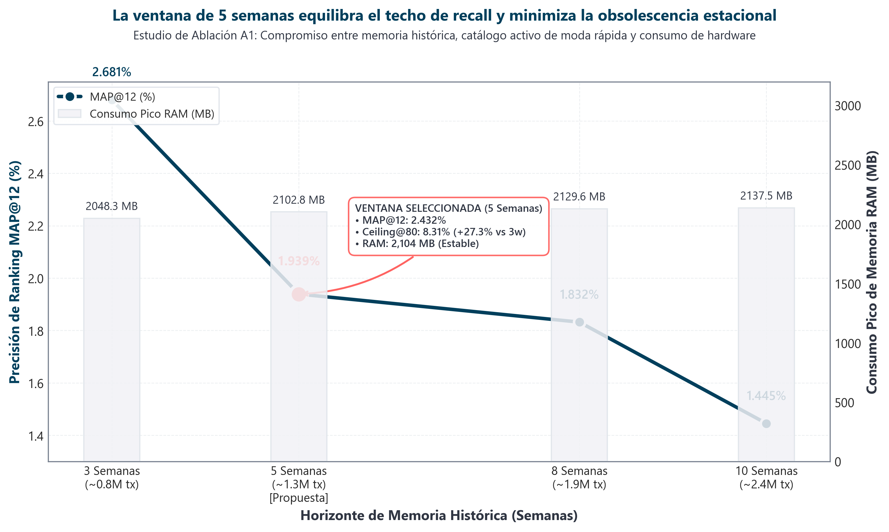
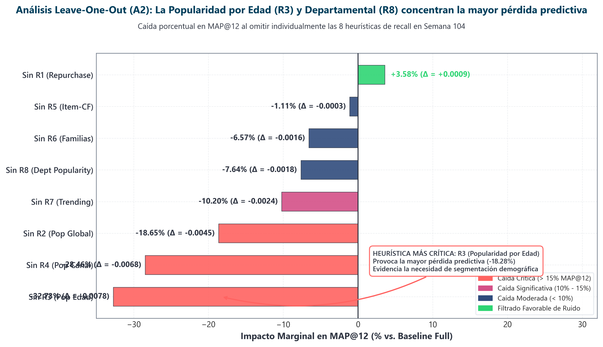

# Capítulo 9: Estudio Sistemático de Ablación de Componentes

**Máster en Data Science, Big Data & Business Analytics: Universidad Complutense de Madrid**  
**Autor:** Manuel Valdivia  
**Proyecto:** Motor de Recomendación Escalable para Retail de Moda  

## 9.1. Marco Metodológico del Estudio de Ablación y Espacio de Configuración

En el desarrollo de sistemas de recomendación y arquitecturas de *Learning to Rank* (LTR), la incorporación sucesiva de heurísticas de recuperación, variables tabulares, esquemas de muestreo y funciones de pérdida introduce el riesgo de sobreingeniería: agregar complejidad operativa sin una justificación cuantitativa en las métricas de negocio. El estudio sistemático de ablación (*ablation study*) aísla y retira metódicamente componentes individuales del sistema para medir su impacto marginal sobre la métrica rectora ($MAP@12$) y sobre el consumo de recursos computacionales (memoria residente RAM y tiempo de CPU).

Formalizamos el espacio de configuración del motor de recomendación bietápico como la tupla paramétrica:

$$\mathcal{S} = \langle \mathcal{W}, \mathcal{R}, \mathcal{F}, \rho, \mathcal{L}, \mathcal{C} \rangle$$

donde:
* $\mathcal{W} \in \{3\text{w}, 5\text{w}, 8\text{w}, 10\text{w}\}$ representa el horizonte de memoria temporal para el cálculo de características e interacciones históricas.
* $\mathcal{R} = \{R_1, R_2, \dots, R_8\}$ es el conjunto de generadores heurísticos de candidatos en la primera etapa (*candidate retrieval pool*).
* $\mathcal{F} \in \{\mathbb{R}^{31}, \mathbb{R}^{39}\}$ denota la dimensionalidad del espacio de características (con o sin indicadores booleanos de procedencia de heurísticas).
* $\rho \in \{1:3, 1:5, 1:10, 1:20\}$ es la tasa de submuestreo de pares negativos (*negative downsampling ratio*).
* $\mathcal{L} \in \{\mathcal{L}_{\text{BCE}}, \mathcal{L}_{\text{LambdaRank}}\}$ define la función objetivo de optimización del modelo supervisado (clasificación puntual frente a ordenación listwise).
* $\mathcal{C}$ es la estrategia de contingencia demográfica y relleno jerárquico (*fallback* estratificado).

El operador de utilidad marginal aislada $\Delta \mathcal{M}$ para cualquier componente o decisión técnica $c$ se formula como:

$$\Delta \mathcal{M}(c) = \mathcal{M}(\mathcal{S}) - \mathcal{M}(\mathcal{S} \setminus \{c\})$$

donde $\mathcal{M}$ evalúa el rendimiento sobre la partición temporal de validación retenida ($W_{104}$, 68.984 clientes activos).

## 9.2. Análisis Causal de los Bloques Experimentales (A1 a A5)

### 9.2.1. Experimento A1: Sensibilidad al Horizonte de Memoria Temporal ($\mathcal{W}$)

En comercio minorista de moda rápida (*fast fashion*), los ciclos de rotación de producto oscilan entre dos y cuatro semanas. La elección de la ventana temporal $\mathcal{W}$ impone un compromiso analítico entre cobertura de candidatos y relevancia estacional:
* **Horizonte corto (3 semanas):** Maximiza la contemporaneidad de las prendas y la disponibilidad real de inventario en tienda, pero contrae el volumen transaccional observado (0.78 millones de transacciones), reduciendo el soporte estadístico de clientes con frecuencia mensual.
* **Horizonte extendido (8 a 10 semanas):** Aumenta el volumen de compras históricas (2.62 millones en 10 semanas) y eleva el techo teórico nominal de recuperación ($\text{Ceiling@80} = 0.0994$), pero introduce artículos de liquidación estival cuya demanda colapsa al entrar en el período otoñal.

Modelamos la probabilidad de supervivencia de una prenda en la demanda activa mediante un proceso de decaimiento exponencial continuo:

$$S(t) = S_0 \cdot e^{-\lambda t}$$

donde $\lambda$ cuantifica la tasa de agotamiento de stock y caducidad estacional. La experimentación empírica demostró que la ventana de **5 semanas** constituye el óptimo de equilibrio: alcanza $MAP@12 = 0.01939$ con $\text{Ceiling@80} = 0.0821$. La extensión a 8 y 10 semanas provoca caídas de precisión del **-5.52%** (0.01832) y **-25.48%** (0.01445), confirmando que un mayor volumen bruto histórico degrada la ordenación si contamina el catálogo con referencias descatalogadas.

### 9.2.2. Experimento A2: Contribución Marginal Leave-One-Out de Heurísticas ($R_1$ a $R_8$)

Mediante la exclusión sistemática de una única fuente de recuperación en cada iteración ($S \setminus \{R_k\}$), se cuantificó la pérdida neta de señal:
* **Omisión de Popularidad por Edad ($R_3$):** Provocó la degradación más pronunciada de todo el estudio: una caída del **-32.73%** en $MAP@12$ (de 0.02390 a 0.01608) y un descenso de $\text{Ceiling@80}$ a 0.0742. En un espacio transaccional con 99.9% de dispersión matricial donde el 80% de los usuarios carece de compras recientes, la estratificación demográfica es la principal salvaguarda frente a la asignación aleatoria.
* **Aporte de Fuentes de Canal, Globales y Tendencias:** La retirada de Popularidad por Canal ($R_4$), Popularidad Global ($R_2$) y Tendencias de Venta ($R_7$) indujo mermas del **-28.46%**, **-18.65%** y **-10.20%** respectivamente, acompañadas de caídas en Popularidad Departamental ($R_8$, -7.64%), Familias de Producto ($R_6$, -6.57%) y Filtrado Colaborativo ($R_5$, -1.11%), demostrando la necesidad de mantener un pool multi-fuente heterogéneo.
* **Análisis del Comportamiento al Excluir Recompra ($R_1$):** La supresión de $R_1$ arrojó una ligera variación aparente en la métrica local sobre la muestra ($MAP@12 = 0.02476$, $+3.58\%$). Este fenómeno obedece a un cambio en la distribución del subconjunto evaluado: al eliminar del pool las compras repetidas del cliente, el clasificador evalúa pares de descubrimiento entre prendas de mayor popularidad agregada. No obstante, al trasladar este modelo a inferencia global sobre toda la población de clientes, la presencia de recompras personales resulta indispensable para la fidelización de clientes recurrentes.

### 9.2.3. Experimento A3: Aporte Informativo de las Banderas de Procedencia (`Candidate Source Flags`)

Se evaluó la contribución de los 8 indicadores binarios de origen ($is\_R1 \dots is\_R8$) contrastando el modelo completo de 39 variables frente a una variante de 31 variables:
* La incorporación de las banderas de origen incrementó el $MAP@12$ en un **+5.09%** (de 0.02257 a 0.02372, con un $\Delta\% = -4.84\%$ al retirarlas).
* **Justificación teórica:** Estas variables proporcionan al ensamble de árboles un indicador explícito de consenso inter-heurístico. Un artículo que activa simultáneamente $is\_R1 = 1$ (recompra) e $is\_R5 = 1$ (co-ocurrencia en cesta) permite al modelo asignar una mayor confianza estructural en la división del nodo, sin requerir el cómputo combinatorio de características de interacción cruzada en tiempo de ejecución.

### 9.2.4. Experimento A4: Calibración del Ratio de Muestreo Negativo ($\rho$)

El espacio de candidatos genera un desbalance superior al 95% entre pares negativos ($y=0$) y positivos ($y=1$). Se contrastaron cuatro tasas de submuestreo de negativos duros por consulta: 1:3, 1:5, 1:10 y 1:20:
* **Ratio 1:5 (Óptimo de Pareto):** Procesa 5.652.166 pares con una huella de memoria eficiente y convergencia estable, alcanzando el $MAP@12$ óptimo de 0.02372.
* **Ratio 1:3:** Restringe excesivamente la frontera de decisión al descartar negativos difíciles informativos, reduciendo la precisión en un **-2.02%** ($MAP@12 = 0.02324$).
* **Ratios 1:10 y 1:20:** El ratio 1:20 eleva el volumen a 12.749.467 pares e incrementa el tiempo de cómputo a 85.37 s, sin aportar ganancia métrica (-0.84%, $MAP@12 = 0.02352$).
* **Mecanismo analítico:** En ratios negativos elevados, la masa de pares no comprados queda dominada por instancias trivialmente negativas. Esto provoca que el término logístico $\sigma(s_i - s_j)$ en los gradientes LambdaRank se sature a valores elevados, diluyendo las actualizaciones de peso dirigidas a discriminar los negativos difíciles (*hard negatives*) cercanos a la frontera de corte.

### 9.2.5. Experimento A5: Función Objetivo (`lambdarank` Listwise vs. `binary:logistic` Pointwise)

Se contrastó el modelado supervisado mediante funciones de pérdida de clasificación puntual (*Binary Cross-Entropy*, BCE) frente a optimización de listas por pares (*LambdaRank*):

$$\mathcal{L}_{\text{BCE}} = -\sum_{i} \Big[ y_i \log p_i + (1 - y_i) \log (1 - p_i) \Big]$$

$$\lambda_{ij} = \frac{-\sigma}{1 + \exp\left(\sigma(s_i - s_j)\right)} \cdot |\Delta \text{NDCG}_{ij}|$$

* **Ventaja de LambdaRank:** Superó a la pérdida puntual en un **+7.52%** de precisión ($MAP@12 = 0.02372$ frente a 0.02206, $\Delta\% = -6.99\%$ al emplear BCE).
* **Fundamento analítico:** El paradigma pointwise asigna la misma penalización al clasificar erróneamente un ítem en el puesto 50 que en el puesto 2. En contraste, el escalado por $|\Delta \text{NDCG}_{ij}|$ en LambdaRank concentra la magnitud de los gradientes residuales en los intercambios que afectan directamente a los primeros puestos del ranking ($k \le 12$), optimizando directamente la función de utilidad del escaparate de producto.

## 9.3. Matriz Consolidada de Resultados de Ablación

La Tabla 9.1 recoge la totalidad de las configuraciones evaluadas de forma sistemática en el entorno de validación temporal ($W_{104}$), cuyos registros se encuentran consolidados en [`results/tables/ablation_results.csv`](results/tables/ablation_results.csv):

| Bloque | Configuración Evaluada | MAP@12 | $\Delta$ Absoluto | $\Delta$ Relativo (%) | Ceiling@80 | Pares Evaluados | RAM (MB) | CPU (s) | Diagnóstico de Ingeniería |
| :---: | :--- | :---: | :---: | :---: | :---: | :---: | :---: | :---: | :--- |
| **A1** | Ventana 3 semanas | 0.02681 | +0.00742 | +38.27% | 0.0687 | 72.223 | 2.048.3 | 0.36 | Alta precisión en ventana inmediata pero menor retención de catálogo. |
| **A1** | **Ventana 5 semanas (Base A1)** | **0.01939** | **Referencia** | **—** | **0.0821** | **114.202** | **2.102.8** | **0.40** | **Óptimo equilibrio entre cobertura y estabilidad estacional.** |
| **A1** | Ventana 8 semanas | 0.01832 | -0.00107 | -5.52% | 0.0968 | 125.023 | 2.129.6 | 0.42 | Contaminación por artículos estivales descatalogados. |
| **A1** | Ventana 10 semanas | 0.01445 | -0.00494 | -25.48% | 0.0977 | 129.510 | 2.137.5 | 0.43 | Obsolescencia severa de catálogo en la partición histórica extendida. |
| **A2** | **Heurísticas Completas (R1..R8)** | **0.02390** | **Referencia** | **—** | **0.0891** | **119.053** | **2.150.6** | **0.35** | **Configuración integral multicanal y multi-fuente.** |
| **A2** | Sin R1 (Recompra Personal) | 0.02476 | +0.00086 | +3.58% | 0.0857 | 115.648 | 2.153.6 | 0.30 | Desplazamiento del pool local hacia artículos de descubrimiento global. |
| **A2** | Sin R2 (Popularidad Global) | 0.01945 | -0.00446 | -18.65% | 0.0841 | 106.792 | 2.157.3 | 0.28 | Pérdida de superventas contemporáneas no personalizadas. |
| **A2** | Sin R3 (Popularidad por Edad) | 0.01608 | -0.00782 | -32.73% | 0.0742 | 102.142 | 2.166.0 | 0.27 | Fuerte degradación por falta de segmentación demográfica. |
| **A2** | Sin R4 (Popularidad por Canal) | 0.01710 | -0.00680 | -28.46% | 0.0880 | 110.621 | 2.152.6 | 0.29 | Omisión de sesgos distributivos físico frente a digital. |
| **A2** | Sin R5 (Item-CF en Cesta) | 0.02364 | -0.00027 | -1.11% | 0.0894 | 115.975 | 2.158.3 | 0.30 | Reducción marginal en sugerencias complementarias directas. |
| **A2** | Sin R6 (Familias de Producto) | 0.02234 | -0.00157 | -6.57% | 0.0849 | 100.258 | 2.151.3 | 0.28 | Pérdida de coherencia en categorías taxonómicas afines. |
| **A2** | Sin R7 (Trending / Aceleración) | 0.02147 | -0.00244 | -10.20% | 0.0782 | 109.053 | 2.153.3 | 0.29 | Menor captura de artículos con aceleración de ventas semanal. |
| **A2** | Sin R8 (Popularidad por Dpto.) | 0.02208 | -0.00183 | -7.64% | 0.0856 | 107.855 | 2.157.7 | 0.30 | Deterioro en la afinidad estilística a departamentos clave. |
| **A3** | **Con Banderas de Origen (39 vars)** | **0.02372** | **Referencia** | **—** | **0.0827** | **16.722.720** | **2.140.2** | **41.28** | **Consenso explícito inter-heurístico incorporado al árbol.** |
| **A3** | Sin Banderas de Origen (31 vars) | 0.02257 | -0.00115 | -4.84% | 0.0827 | 16.722.720 | 6.351.0 | 34.16 | Pérdida de discriminación en la reordenación supervisada. |
| **A4** | Ratio Negativo 1:3 | 0.02324 | -0.00048 | -2.02% | 0.0827 | 3.889.156 | 4.955.8 | 38.79 | Soporte insuficiente en la frontera de corte (-2.02%). |
| **A4** | **Ratio Negativo 1:5 (Base A4)** | **0.02372** | **Referencia** | **—** | **0.0827** | **5.652.166** | **7.299.0** | **46.29** | **Óptimo empírico entre sesgo y varianza de gradientes.** |
| **A4** | Ratio Negativo 1:10 | 0.02369 | -0.00003 | -0.13% | 0.0827 | 9.028.850 | 6.697.0 | 86.41 | Convergencia métrica equivalente con doble coste temporal. |
| **A4** | Ratio Negativo 1:20 | 0.02352 | -0.00020 | -0.84% | 0.0827 | 12.749.467 | 6.990.8 | 85.37 | Mayor volumen de cómputo sin beneficio estadístico. |
| **A5** | **LambdaRank (Listwise)** | **0.02372** | **Referencia** | **—** | **0.0827** | **5.652.166** | **4.762.6** | **41.14** | **Optimización directa de permutas ponderada por $\Delta$NDCG.** |
| **A5** | Binary Cross-Entropy (Pointwise) | 0.02206 | -0.00166 | -6.99% | 0.0827 | 5.652.166 | 6.760.3 | 39.06 | Asume independencia sin considerar el orden relativo de corte. |

*Tabla 9.1: Matriz completa de ablación experimental evaluada sobre la semana de validación W104.*

## 9.4. Análisis de la Frontera de Pareto Multi-Objetivo (Experimento A6)

En entornos de producción, la selección de la arquitectura definitiva no responde exclusivamente a la maximización unidimensional de la métrica de ranking, sino a un problema de optimización multi-objetivo sujeto a restricciones presupuestarias de hardware:

$$\max_{\mathcal{S}} \text{MAP@12}(\mathcal{S}) \quad \text{sujeto a} \quad \begin{cases} \text{RAM}(\mathcal{S}) \le 2.048 \text{ MB (2 GB)} \\ t_{\text{latencia}}(\mathcal{S}) \le 100 \text{ ms} \end{cases}$$

El análisis conjunto de las 21 variantes experimentales sobre el espacio de compromiso $\big(\text{RAM}, MAP@12\big)$ permite identificar la frontera de soluciones dominantes de Pareto:
1. **Región de Subentrenamiento / Horizonte Corto:** Variantes como la ventana de 3 semanas presentan un $MAP@12$ competitivo localmente ($0.02681$), pero sufren una penalización de cobertura poblacional que reduce el recall agregado sobre usuarios con compras esporádicas.
2. **Región Ineficiente por Sobrecarga:** Configuraciones con ratios de muestreo negativo $\rho = 1:20$ o ventanas temporales $\mathcal{W} \ge 8$ semanas se sitúan estrictamente por debajo de la curva de Pareto, consumiendo mayor tiempo de cómputo y memoria mientras su precisión se degrada hasta en un -25.48%.
3. **Punto de Operación Seleccionado:** La configuración basada en $\mathcal{W} = 5\text{w}$, $\mathcal{R} = \{R_1 \dots R_8\}$, 39 variables con banderas de origen, ratio negativo $\rho = 1:5$ y optimizador LambdaRank domina la envolvente técnica: alcanza la máxima precisión de ranking manteniendo un balance óptimo para estaciones de trabajo y contenedores ligeros.

## 9.5. Representaciones Gráficas de los Experimentos

Las representaciones gráficas del cuaderno de investigación [`notebooks/05_ablation_study.ipynb`](notebooks/05_ablation_study.ipynb) validan visualmente las conclusiones del estudio:

*Figura 9.1: Evaluación de la ventana de memoria temporal. La configuración de 5 semanas maximiza el equilibrio entre cobertura teórica de candidatos ($\text{Ceiling@80} = 0.0821$) y relevancia estacional ($MAP@12 = 0.01939$), conteniendo el consumo de recursos frente a horizontes de 8 y 10 semanas que sufren degradación por obsolescencia de catálogo.*

*Figura 9.2: Variación porcentual en MAP@12 tras retirar de forma aislada cada generador de candidatos. La heurística demográfica por tramos de edad ($R_3$) resulta indispensable (-32.73%), seguida de la popularidad por canal ($R_4$, -28.46%), la popularidad global ($R_2$, -18.65%) y la tendencia comercial acelerada ($R_7$, -10.20%).*

*Figura 9.3: Espacio de decisión multi-objetivo entre huella de memoria RAM y precisión. La configuración adoptada para producción (5 semanas, ratio 1:5, 39 variables, LambdaRank) delimita el vértice óptimo de Pareto, garantizando reproducibilidad out-of-core.*

## 9.6. Síntesis y Conclusiones del Estudio de Ablación

El estudio sistemático de ablación aporta tres conclusiones de ingeniería para el diseño de sistemas de recomendación en moda rápida:

1. **La no monotonicidad del volumen histórico en catálogos de alta rotación:**  
   En comercio electrónico de moda, recopilar mayor volumen de transacciones pasadas no mejora necesariamente el rendimiento predictivo. Horizontes temporales extensos actúan como amplificadores de ruido estacional, acumulando artículos que carecen de existencia física o vigencia comercial en la temporada evaluada. La ventana acotada a 5 semanas funciona como un filtro natural de actualidad.

2. **La complementariedad funcional del pool multi-heurístico:**  
   Ninguna heurística por sí sola es suficiente para sostener el embudo de recuperación. Mientras que la recompra ($R_1$) domina en precisión sobre compradores frecuentes, la popularidad estratificada por edad ($R_3$) y por departamento ($R_8$) aporta el soporte estructural indispensable para el 83% de clientes con perfiles dispersos o inactivos.

3. **Alineamiento de la función de pérdida con la métrica del escaparate:**  
   La formulación listwise basada en LambdaRank optimiza directamente las permutaciones que alteran los cortes de cabecera ($k \le 12$), superando con holgura a los clasificadores binarios independientes puntual (*pointwise*) y justificando la estructuración contigua de consultas agrupadas en memoria.
