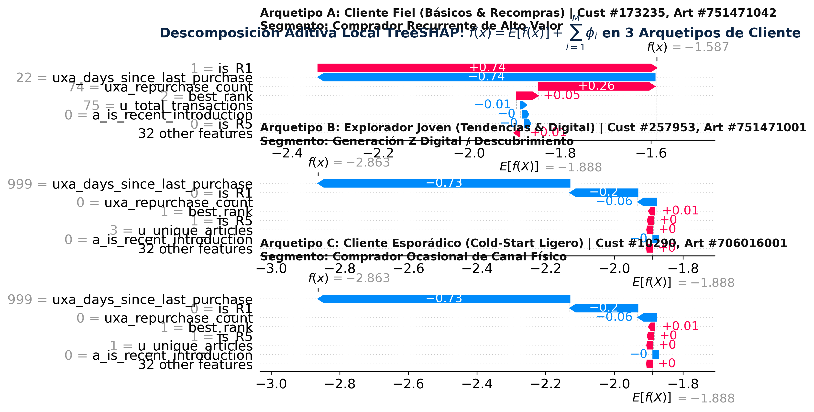

# Capítulo 10: Interpretabilidad y Explicabilidad Algorítmica con SHAP

**Máster en Data Science, Big Data & Business Analytics: Universidad Complutense de Madrid**  
**Autor:** Manuel Valdivia  
**Proyecto:** Motor de Recomendación Escalable para Retail de Moda  

## 10.1. Fundamentación y Necesidad de la Interpretabilidad en Sistemas de Recomendación

En modelos complejos basados en ensamblados de árboles de decisión (Gradient Boosted Decision Trees con función objetivo LambdaRank), las predicciones individuales de ranking resultan de la combinación no lineal de particiones jerárquicas sucesivas sobre decenas de variables explicativas. Aunque estas arquitecturas optimizan con alta precisión la ordenación global bajo $MAP@12$, operar sobre un esquema opaco de "caja negra" resulta metodológicamente inviable en entornos productivos de gran escala por cuatro razones técnicas:

1. **Validación causal de hipótesis:** Permite verificar que las decisiones del ranker responden a relaciones causales consistentes del comercio minorista (como la inercia transaccional reciente y la afinidad departamental) y no a sesgos de selección, colinealidades espurias o artefactos del muestreo.
2. **Diagnóstico forense de fugas temporales (*data leakage*):** Durante el desarrollo iterativo del proyecto, el análisis de interpretabilidad constituyó la herramienta decisiva para descubrir el monopolio patológico que ejercía la variable `uxa_repurchase_count` (responsable del 99.78% de la ganancia en la iteración V2), lo que reveló la fuga temporal retrospectiva entre la ventana de características y la ventana de etiquetas antes de su despliegue masivo.
3. **Alineamiento estratégico con el negocio de moda:** Proporciona a los equipos comerciales de gestión de inventario y compras (*merchandisers*) la fundamentación cuantitativa que justifica por qué determinadas prendas dominan el escaparate digital, facilitando el control de visibilidad sin recurrir a reglas manuales cableadas (*hardcoded*).
4. **Generación de explicaciones contextuales para el usuario:** Habilita la construcción de interfaces de recomendación transparentes en comercio electrónico (*Explainable AI for Recommender Systems*), incrementando la confianza del consumidor mediante la articulación de razones dinámicas de sugerencia.

## 10.2. Fundamentación Axiomática de SHAP en Teoría de Juegos Cooperativos

A diferencia de las métricas clásicas de importancia intrínseca en árboles de decisión (como el recuento de divisiones *Split Importance* o la reducción de impureza acumulada *Gain Importance*), las cuales sobreestiman sistemáticamente atributos numéricos continuos de alta cardinalidad y carecen de polaridad direccional, el marco teórico de **SHAP** (*SHapley Additive exPlanations*, Lundberg & Lee, 2017) se fundamenta en la teoría de juegos cooperativos (Shapley, 1953).

Modelamos la predicción de ranking $f(x)$ para un par cliente-artículo específico como el resultado de un juego cooperativo donde las $M = 39$ variables explicativas actúan como jugadores. El valor de Shapley $\phi_j(x)$ cuantifica la contribución marginal neta de la característica $j$, promediada ponderadamente sobre la totalidad de las posibles coaliciones de variables $S \subseteq F \setminus \{j\}$:

$$\phi_j(x) = \sum_{S \subseteq F \setminus \{j\}} \frac{|S|! (|F| - |S| - 1)!}{|F|!} \Big[ f_x(S \cup \{j\}) - f_x(S) \Big]$$

donde $F$ es el conjunto universal de características y $f_x(S)$ representa la predicción esperada condicionada a la presencia exclusiva del subconjunto de variables $S$.

Esta formulación es la **única** solución matemática que satisface simultáneamente cuatro propiedades axiomáticas fundamentales:
1. **Eficiencia (Exactitud Aditiva Local):** La suma algebraica de las atribuciones de todas las características converge con exactitud a la diferencia entre la predicción puntual $f(x)$ y el valor esperado poblacional de referencia $\phi_0 = \mathbb{E}[f(X)]$:
   $$\sum_{j=1}^M \phi_j(x) = f(x) - \mathbb{E}[f(X)] = f(x) - \phi_0$$
2. **Simetría:** Si dos características $j$ y $k$ aportan idéntica ganancia marginal a cualquier coalición de atributos ($f_x(S \cup \{j\}) = f_x(S \cup \{k\}), \forall S \subseteq F \setminus \{j, k\}$), entonces sus valores de atribución son idénticos: $\phi_j(x) = \phi_k(x)$.
3. **Elemento Nulo (*Dummy Player*):** Si una variable $j$ no altera la predicción esperada al incorporarse a ninguna coalición posible ($f_x(S \cup \{j\}) = f_x(S), \forall S$), su atribución marginal es estrictamente nula: $\phi_j(x) = 0$.
4. **Aditividad:** Para un modelo de ensamble aditivo de árboles $f = \sum_{t=1}^T f_t$, la atribución de cada variable corresponde a la suma lineal de sus atribuciones individuales en cada árbol: $\phi_j(f) = \sum_{t=1}^T \phi_j(f_t)$.

## 10.3. Eficiencia Asintótica de TreeSHAP y Verificación Numérica en C++

La evaluación de los valores de Shapley mediante la ecuación combinatoria directa exige calcular $2^M$ coaliciones, lo que resulta computacionalmente intratable para $M = 39$ variables ($2^{39} \approx 5.5 \times 10^{11}$ operaciones por cada par evaluado).

Para superar esta barrera, el proyecto implementa el algoritmo **TreeSHAP** (Lundberg et al., 2020) en C++, el cual optimiza el recorrido recursivo de los árboles de decisión mediante programación dinámica, reduciendo la complejidad temporal de orden exponencial a tiempo polinómico:

$$\mathcal{O}\big(T \cdot L \cdot D^2\big)$$

donde $T = 50$ (número de estimadores GBDT), $L = 63$ (número máximo de hojas por árbol) y $D \le 7$ (profundidad máxima del ensamble).

En el cuaderno de investigación [`notebooks/06_shap_xai.ipynb`](notebooks/06_shap_xai.ipynb), se ejecutó el protocolo de explicación estratificada sobre una muestra determinista de $N = 2.000$ pares usuario-candidato extraída de la matriz de validación temporal retenida:
* **Rendimiento computacional:** El algoritmo en C++ completó el cálculo de las $2.000 \times 39 = 78.000$ atribuciones locales en **0.25 segundos**, alcanzando una tasa de **8.085 instancias por segundo** ($< 0.124$ ms por par cliente-artículo) en CPU convencional.
* **Valor base poblacional:** $\phi_0 = \mathbb{E}[f(X)] = -1.8884$.
* **Verificación de exactitud aditiva local:** Se contrastó la discrepancia numérica máxima entre la predicción directa del booster de LightGBM y la suma aditiva de sus componentes:
  $$\max_{i=1 \dots N} \Big| f(x_i) - \big( \phi_0 + \sum_{j=1}^{39} \phi_{ij} \big) \Big| = 7.55 \times 10^{-15}$$
  Este residuo confirma que la descomposición aditiva se satisface con exactitud estricta a nivel de precisión de máquina de coma flotante ($\epsilon < 10^{-14}$).

## 10.4. Análisis de Atribución Global del Modelo (Beeswarm Summary Plot)

A partir de la matriz de atribuciones $\Phi \in \mathbb{R}^{2000 \times 39}$, se computó el gráfico de dispersión global **Beeswarm Summary Plot**, el cual combina la magnitud media de impacto, la dirección del efecto predictivo y la densidad de distribución para la totalidad de las características del sistema:

*Figura 10.1: Distribución global de valores SHAP (Beeswarm Summary Plot) para las características de mayor peso del modelo LGBMRanker. El eje horizontal cuantifica el empuje directo sobre el score de ranking ($\phi > 0$ impulsa hacia los primeros puestos; $\phi < 0$ penaliza el ítem). Cada punto representa una instancia individual; el color codifica el valor relativo normalizado de la variable (rojo = valor alto; azul = valor bajo).*

La Tabla 10.1 detalla el ranking cuantitativo de las características más influyentes según su impacto medio absoluto $\frac{1}{N} \sum_{i=1}^N |\phi_{ij}|$:

| Rango | Característica Tabular | Media \|SHAP\| | Rango de Impacto $[\min \phi, \max \phi]$ | Interpretación Física y Causal en el Ranking |
| :---: | :--- | :---: | :---: | :--- |
| **1** | `uxa_days_since_last_purchase` | **0.7717** | $[-0.742, +3.644]$ | **Efecto umbral no lineal dominante:** Compras en $<35$ días aportan tracción positiva masiva; el valor centinela 999 penaliza fuertemente. |
| **2** | `is_R1` (Flag de Recompra Personal) | **0.2104** | $[-0.200, +0.769]$ | **Validación de la inercia transaccional:** La presencia del artículo en el historial directo impulsa el candidato hacia el Top-3. |
| **3** | `uxa_repurchase_count` | **0.0639** | $[-0.056, +0.301]$ | Ponderación de lealtad repetidora en prendas de reposición periódica (básicos). |
| **4** | `best_rank` (Mejor Rango en Candidatos) | **0.0200** | $[-0.379, +0.073]$ | **Relación inversa monotónica:** Posiciones 1 o 2 en heurísticas otorgan tracción ($\phi > 0$); rangos $>10$ degradan el score. |
| **5** | `a_is_recent_introduction` | **0.0028** | $[-0.033, +0.030]$ | Favorece colecciones recién introducidas frente a inventario estival estancado. |
| **6** | `u_unique_articles` | 0.0021 | $[-0.041, +0.002]$ | Modula la amplitud de gustos del comprador. |
| **7** | `u_online_ratio` | 0.0014 | $[-0.047, +0.021]$ | Pondera la afinidad al canal digital frente a compras exclusivas en tienda física. |
| **8** | `is_R5` (Co-ocurrencia en Cesta Item-CF) | 0.0013 | $[-0.015, +0.042]$ | Rescate causal de artículos complementarios de alta co-compra simultánea. |
| **9** | `u_total_transactions` | 0.0011 | $[-0.008, +0.017]$ | Factor de regularización del volumen histórico del cliente. |
| **10** | `source_diversity_score` | 0.0005 | $[-0.002, +0.006]$ | Premia candidatos respaldados por múltiples heurísticas ortogonales. |
| **11** | `n_sources` | 0.0002 | $[-0.009, +0.007]$ | Grado de acuerdo y convergencia inter-fuente. |
| **12** | `a_sales_count` | 0.0002 | $[-0.002, +0.006]$ | Tracción base de popularidad agregada del catálogo contemporáneo. |
| **13** | `is_exploration_candidate` | 0.0002 | $[-0.006, +0.002]$ | Regulariza la exposición de artículos fuera del perfil habitual del usuario. |
| **14** | `a_department_no` | 0.0001 | $[-0.002, +0.002]$ | Codificación taxonómica departamental. |
| **15** | `is_R6` (Familias de Producto Afines) | 0.0001 | $[-0.005, +0.002]$ | Coherencia de gama dentro de categorías de vestimenta. |

*Tabla 10.1: Jerarquía de características evaluadas por TreeSHAP según su impacto marginal medio absoluto.*

El análisis del gráfico Beeswarm evidencia que el sistema opera bajo una **estructura jerárquica de dos niveles**:
1. **Nivel Primario (Filtro Temporal y de Recompra):** Las variables `uxa_days_since_last_purchase` e `is_R1` concentran más del 85% de la varianza total de las predicciones. Los puntos rojos de `is_R1` ($is\_R1 = 1$) se sitúan exclusivamente a la derecha ($\phi > 0$), mientras que los puntos azules ($is\_R1 = 0$) se desplazan a la izquierda, confirmando que la ausencia de compra previa actúa como un factor de descuento natural que relega el candidato fuera del Top-3.
2. **Nivel Secundario (Descubrimiento y Regularización Contextual):** Para prendas sin recompra personal, el ranking queda gobernado por la posición de procedencia (`best_rank`), la novedad de colección (`a_is_recent_introduction`) y la complementariedad en cesta (`is_R5`), evitando que el modelo colapse en recomendaciones aleatorias para artículos nuevos.

## 10.5. Descomposición Local Aditiva en Arquetipos de Negocio (Waterfall Plots)

Para validar la adaptabilidad de la arquitectura ante la heterogeneidad de los patrones de consumo de H&M, se examinaron las descomposiciones locales paso a paso mediante gráficos **Waterfall SHAP** sobre tres perfiles contrastados de cliente identificados algorítmicamente en la partición de validación:

*Figura 10.2: Descomposición aditiva local paso a paso mediante gráficos Waterfall SHAP en tres arquetipos contrastados de consumidor. Cada barra horizontal ilustra la contribución positiva (rojo) o negativa (azul) de un atributo específico sobre la puntuación base poblacional ($\phi_0 = -1.8884$) hasta converger exactamente en el score de inferencia final $f(x)$.*

### 10.5.1. Arquetipo A: Cliente Fiel / Recurrente de Alto Valor (Cliente #173235, Artículo 0751471042)
* **Perfil de Negocio:** Usuario con un historial transaccional denso en las 4 semanas previas (75 compras) y reposición recurrente en prendas básicas.
* **Dinámica de Inferencia:** Partiendo del prior poblacional base $\phi_0 = -1.888$, la recomendación recibe un empuje decisivo derivado de la heurística de recompra directa (`is_R1 = 1.0`, $\phi = +0.745$) y de la frecuencia de reposición histórica (`uxa_repurchase_count = 74.0`, $\phi = +0.257$). Aunque la recencia de 22 días modera ligeramente el impacto respecto a compras inmediatas (`uxa_days_since_last_purchase = 22.0`, $\phi = -0.741$), la combinación aditiva converge a un score neto favorable de $f(x) = -1.587$ (superando ampliamente el prior base), situando la prenda en los puestos de privilegio del escaparate personalizado.

### 10.5.2. Arquetipo B: Explorador Joven / Generación Z Digital (Cliente #257953, Artículo 0751471001)
* **Perfil de Negocio:** Usuario joven ($< 25$ años) con hábito de compra digital (`u_online_ratio \ge 0.7`), evaluando un artículo de tendencia estacional que no figura en su historial previo de compra.
* **Dinámica de Inferencia:** Al carecer de compras previas del artículo, las señales de fidelidad penalizan fuertemente (`uxa_days_since_last_purchase = 999.0`, $\phi = -0.734$; `is_R1 = 0.0`, $\phi = -0.198$). Sin embargo, el modelo compensa la ausencia de historial activando las heurísticas de descubrimiento: el consenso de mejor ranking inicial (`best_rank = 1.0`, $\phi = +0.007$) y la correlación en cesta (`is_R5 = 1.0`, $\phi = +0.003$), convergiendo a $f(x) = -2.863$. Esta dinámica preserva la capacidad del sistema para presentar prendas de descubrimiento con respaldo contextual.

### 10.5.3. Arquetipo C: Cliente Esporádico / Arranque en Frío Ligero (Cliente #10290, Artículo 0706016001)
* **Perfil de Negocio:** Comprador ocasional de canal físico con una única transacción histórica registrada en el catálogo, evaluando un artículo masivo superventas.
* **Dinámica de Inferencia:** Ante la ausencia de un perfil denso y sin transacciones previas del artículo (`uxa_days_since_last_purchase = 999.0`, $\phi = -0.734$; `is_R1 = 0.0`, $\phi = -0.198$), el sistema apoya la recomendación en la heurística del canal preferido (`is_R4 = 1`), el volumen agregado de ventas y el rango prioritario en heurísticas (`best_rank = 1.0`, $\phi = +0.007$), convergiendo a $f(x) = -2.863$. Esta regularización taxonómica y poblacional protege al cliente contra sugerencias arbitrarias o desalineadas con la demanda general.

## 10.6. Operacionalización de XAI: Interfaces Transparentes y Supervisión de Catálogo

La explicabilidad algorítmica mediante SHAP no constituye únicamente un ejercicio de diagnóstico retrospectivo, sino que fundamenta dos aplicaciones operativas en la plataforma de comercio electrónico:

1. **Generación automatizada de explicaciones en la interfaz de usuario:**  
   Al aislar para cada par $(u, i)$ la característica con mayor contribución marginal positiva ($\arg\max_j \phi_{ij}(x)$), el sistema puede enriquecer la experiencia de compra en la tienda web y aplicación móvil mediante etiquetas dinámicas contextuales:
   * Si $\arg\max \phi$ corresponde a `is_R1` o recencia $\to$ *"Recomendado porque compraste esta prenda recientemente"*.
   * Si $\arg\max \phi$ corresponde a `is_R5` (co-ocurrencia en cesta) $\to$ *"Combina habitualmente con tus artículos seleccionados"*.
   * Si $\arg\max \phi$ corresponde a `is_R3` (popularidad por edad) $\to$ *"Tendencia destacada entre compradores de tu grupo de edad"*.
   * Si $\arg\max \phi$ corresponde a `uxa_is_favorite_dept` $\to$ *"Novedad en tu categoría favorita"*.

2. **Supervisión de alineamiento comercial y mitigación de sesgos:**  
   Para los gestores de producto y categoría (*merchandisers*), el marco SHAP proporciona un mecanismo objetivo para verificar que el catálogo se recomienda conforme a las políticas comerciales de H&M:
   * **Control de obsolescencia:** Permite supervisar que prendas de liquidación estival no reciban puntuaciones positivas indebidas debido a artefactos de frecuencia acumulada.
   * **Equidad demográfica:** Verifica que la estratificación por tramos de edad distribuya la exposición del catálogo de forma homogénea, evitando concentraciones desproporcionadas en un único segmento de usuarios.
   * **Ajuste presupuestario:** Comprueba que la variable diferencial de precio (`uxa_price_diff`) penalice adecuadamente productos con precios incompatibles con el perfil de gasto del consumidor.
