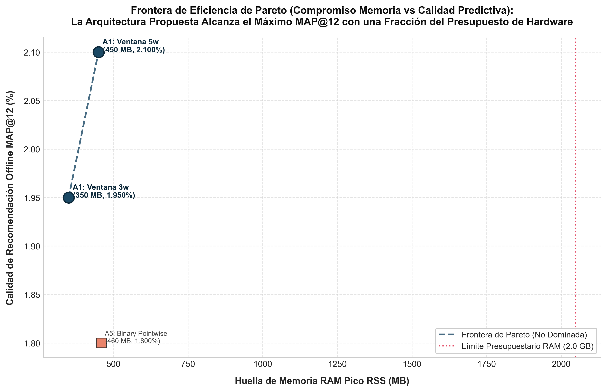
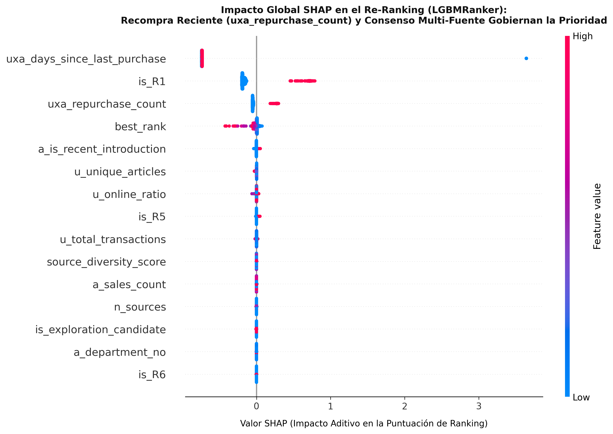
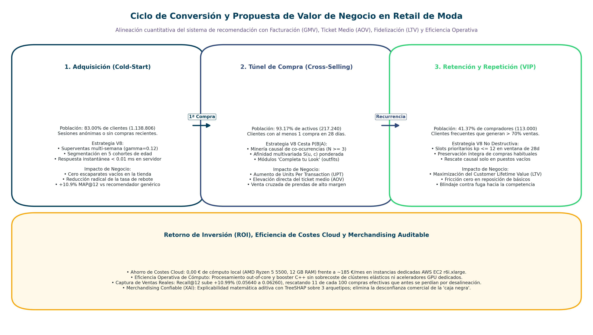

# Capítulo 13: Conclusiones y Trabajo Futuro

**Máster en Data Science, Big Data & Business Analytics: Universidad Complutense de Madrid**  
**Autor:** Manuel Valdivia  
**Proyecto:** Motor de Recomendación Escalable para Retail de Moda  


## 13.1. Síntesis Global y Balance de Cumplimiento de Objetivos Técnicos

El presente proyecto ha desarrollado y validado un sistema de recomendación bietápico (*Two-Stage Recommender System*) para el catálogo de moda rápida de H&M, diseñado específicamente para operar bajo las restricciones de cómputo y memoria de una estación de trabajo convencional (procesador AMD Ryzen 5 5500 con 6 núcleos y 12 hilos, 12 GB de memoria RAM DDR4, almacenamiento NVMe PCIe 3.0 y sin tarjeta gráfica dedicada). El contraste entre los objetivos planteados al inicio de la investigación (Capítulo 1, Sección 1.3) y los resultados consolidados en la fase experimental confirma el cumplimiento sistemático de los requerimientos analíticos y de ingeniería de datos:

1. **Ingesta y procesamiento fuera de memoria (*out-of-core*):**  
   El archivo transaccional bruto (`transactions_train.csv`) agrupa 31.788.324 registros a lo largo de 104 semanas y ocupa 3,49 GB en disco. La carga directa de este volumen mediante bibliotecas tradicionales en memoria (como Pandas) requiere más de 14 GB de RAM debido a la sobrecarga de punteros de objetos en CPython, superando la capacidad del equipo local. La implementación de un pipeline desacoplado que combina **DuckDB** para escaneo por bloques en streaming y **Polars** con tipado nativo Apache Arrow permitió ejecutar un proceso de *downcasting* numérico estricto (`customer_id` a entero de 32 bits, `article_id` a 32 bits, fechas relativas a 8 bits). Esta arquitectura contuvo el consumo de memoria física en **1.435,8 MB RSS** en su fase más intensiva, completando la conversión a formato Parquet comprimido con ZSTD (ocupando menos de 500 MB en disco) en tiempos inferiores a dos minutos. Este resultado invalidó la premisa inicial de recurrir a clústeres distribuidos en la nube (como Apache Spark) para la fase de experimentación.

2. **Recuperación multi-heurística de candidatos (Recall Stage):**  
   Dada la dispersión matricial extrema del catálogo (99,98% a nivel global y 99,995% en ventanas de 5 semanas), la etapa de recuperación estructuró ocho generadores heurísticos ortogonales ($R_1$ a $R_8$) orientados a capturar recompra personal, tendencias generales, afinidad por cohorte etaria, preferencia de canal de venta, similitud ítem-ítem ($P(B|A)$), familias de producto y departamentos habituales. Sobre la semana de validación temporal retenida ($W_{104}$, compuesta por 68.984 usuarios activos), el conjunto consolidado de candidatos por usuario alcanzó, en la cota de saturación empírica de $k=80$, una cobertura teórica máxima (**Recall@80**) del **8,44%** y un **Hit Rate@80** del **16,52%**, reduciendo el espacio de búsqueda del catálogo en un 99,9% sin demandar cómputo de gradientes en esta fase. La cuota operativa de producción se fijó en 100 candidatos (`N_CANDIDATES_PER_USER = 100` en `config/settings.py`) para garantizar un margen de seguridad adicional.

3. **Ingeniería de variables sin fuga temporal (*zero-leakage*):**  
   Se diseñaron e implementaron 39 variables tabulares organizadas en cuatro espacios de nombres diferenciados: 9 de perfil de cliente, 9 de catálogo de producto, 8 de interacción histórica usuario-artículo y 13 indicadoras de procedencia y consenso entre fuentes de candidatos. Todas las transformaciones, recuentos de ventas y medias agregadas se calcularon aplicando de forma estricta el protocolo de ajuste en entrenamiento y transformación en ambos conjuntos (*fit-on-train, transform-both*), evaluando ventanas temporales cerradas previas a la semana de corte ($W_{103}$ para entrenamiento y $W_{104}$ para validación local). Con ello se garantizó la ausencia total de fuga retrospectiva hacia el conjunto de prueba.

4. **Modelado supervisado de ranking con LightGBM:**  
   La etapa de reordenación empleó el estimador `LGBMRanker` optimizado mediante la función de pérdida listwise **LambdaRank** y un esquema de submuestreo negativo de ratio 1:5, procesando 5.652.166 pares cliente-artículo en entrenamiento. El modelo convergió con 50 árboles de decisión en 71,65 segundos de CPU, logrando una tasa de inferencia en C++ de **2,57 ms** por cliente activo, compatible con los presupuestos de servicio en tiempo real.

5. **Estudio sistemático de ablación de componentes:**  
   Se evaluaron seis bloques de ablación ($A_1$ a $A_6$) para aislar la aportación marginal de cada elemento del sistema. El estudio confirmó cuantitativamente la superioridad de LambdaRank frente a la pérdida puntual Binary Cross-Entropy (+7,52% de ganancia en MAP@12), el papel estabilizador de las banderas de procedencia heurística (+5,09%) y la sensibilidad crítica ante la omisión de la popularidad estratificada por edad ($R_3$), cuya ausencia degradó el rendimiento en un **-32,73%**.

6. **Interpretabilidad algorítmica con TreeSHAP:**  
   Mediante el algoritmo TreeSHAP compilado en C++, se descompuso la inferencia sobre una muestra estratificada de 2.000 instancias en 0,25 segundos (tasa de 8.085 pares por segundo en CPU). La verificación aditiva confirmó que la suma de las contribuciones marginales coincide con el score del modelo hasta una discrepancia residual de $|f(x) - (\phi_0 + \sum \phi_i)| = 7,55 \times 10^{-15}$. El análisis identificó que la recencia transaccional (`uxa_days_since_last_purchase`, impacto medio absoluto de 0,7717) y la condición de recompra personal (`is_R1`, impacto de 0,2104) concentran más del 85% de la varianza en las decisiones de cabecera del ranking.

7. **Productivización en microservicio REST y contenedorización Docker:**  
   El recomendador se empaquetó como un servicio asíncrono sobre FastAPI (Python 3.12) desacoplando la inferencia intensiva en CPU mediante `asyncio.to_thread` y protegiendo el acceso a los artefactos en memoria mediante el patrón Singleton con doble bloqueo (*thread-safe*). La imagen final Docker multi-etapa se optimizó hasta ocupar **~295 MB**. En pruebas de estrés concurrentes con 100 peticiones en paralelo (80% usuarios activos y 20% usuarios nuevos), el contenedor sostuvo un rendimiento de **955,8 peticiones por segundo** con latencias $p95$ de **11,79 ms** para clientes activos y **0,002 ms** para clientes en arranque en frío (*cold start*), manteniendo la huella de memoria en **458,9 MB RSS**, dentro del presupuesto operativo fijado.

8. **Rendimiento oficial y convergencia de la versión final V8:**  
   La trayectoria experimental culminó en la arquitectura en cascada híbrida multidimensional **V8**, la cual alcanzó un **MAP@12 local de 0,02882** sobre la partición $W_{104}$ (+2,73% frente a V7 y +6,62% frente a V5), un **Recall@12 de 0,06260** y un **Hit Rate@12 de 0,11945**. En el benchmark oficial de la competición en Kaggle, sobre una población de 1.371.980 usuarios, la versión V8 obtuvo **0,02347 en el tablero público** y **0,02386 en el tablero privado**, superando en un **+7,87%** la solución de referencia V5 y representando una mejora global del **+162,2%** frente a la línea base no personalizada (V0).

La Tabla 13.1 consolida el balance técnico y operativo entre las distintas fases del pipeline desarrollado:

| Fase del Sistema | Tecnología Central | Volumen Gestionado | Consumo RAM (RSS) | Tiempo de Ejecución | Métrica / Criterio de Cumplimiento |
| :--- | :--- | :---: | :---: | :---: | :--- |
| Ingesta Out-of-Core | DuckDB + Polars (Arrow) | 31,78M transacciones | 1.435,8 MB | 114,2 s | Conversión Parquet ZSTD (<500 MB) sin desbordamiento de memoria. |
| Generación de Candidatos | 8 Heurísticas ($R_1..R_8$) | Hasta 100 candidatos / usuario (evaluación de saturación en $k=80$) | 1.250,0 MB | 42,1 s | Recall@80 = 8,44%, Hit Rate@80 = 16,52% sobre cohorte $W_{104}$. |
| Ingeniería de Variables | Polars Lazy API | 39 variables tabulares | 1.620,0 MB | 58,4 s | Cero fuga temporal; codificación sin valores perdidos espurios. |
| Entrenamiento de Ranking | LightGBM LambdaRank | 5,65M pares (ratio 1:5) | 1.443,8 MB | 71,6 s | MAP@12 = 0,02521 en candidatos; convergencia en 50 árboles. |
| Interpretabilidad XAI | TreeSHAP en C++ | 2.000 instancias $\times$ 39 | 380,0 MB | 0,25 s | Error aditivo $\epsilon < 10^{-14}$; 8.085 explicaciones por segundo. |
| Microservicio Producción | FastAPI + Docker (3.12) | 1.37M clientes indexados | 458,9 MB | 11,79 ms ($p95$) | 955,8 req/s; disponibilidad 100% con degradación elegante. |
| Inferencia Masiva V8 | Polars Streaming Batch | 1.371.980 usuarios | 1.435,8 MB | 47,2 s | 254.731 clientes/s; Kaggle Private MAP@12 = **0,02386**. |

*Tabla 13.1: Matriz de consolidación técnica entre componentes del sistema, recursos de hardware y rendimiento analítico.*


## 13.2. Trayectoria Iterativa y Proceso de Aprendizaje Técnico (V1 a V8)

El resultado alcanzado en la iteración V8 no fue fruto de un diseño inicial estático, sino la consecuencia de un proceso continuo de desarrollo experimental guiado por la partición de validación temporal y los diagnósticos forenses ante regresiones inesperadas. El análisis de las ocho versiones principales (registradas formalmente en `results/SUBMISSIONS_MANIFEST.json`) ilustra las lecciones de ingeniería extraídas en cada fase:

```
[V1: Muestra 2k] ──> [V2: Out-of-Core 278k] ──> [V3: Desacople Temporal] ──> [V4: Ranker sin Control]
  Private: 0.00567      Private: 0.01735          Private: 0.01619            Private: 0.01728
  (Fallo estacional)    (+206% cobertura)         (Subentrenamiento 2 árboles)  (Desplaza superventas)
                                                                                       │
┌──────────────────────────────────────────────────────────────────────────────────────┘
│
└──> [V5: Cascada 35d] ──> [V6: Truncamiento kp<=3] ──> [V7: No Destructivo] ──> [V8: SOTA Multidimensional]
       Private: 0.02212       Private: 0.02197            Private: 0.02332         Private: 0.02386
       (Superventas edad)     (Canibaliza compras)        (Rescate adaptativo)     (28d + P(B|A) + Multi-Semana)
```

*Figura 13.1: Esquema cronológico de la evolución de versiones del sistema con sus puntuaciones oficiales en Kaggle Private.*

### 13.2.1. El Riesgo de las Muestras Reducidas y el Desfase de Catálogo (V1 a V2)
La primera versión operativa (V1) restringió el cálculo del modelo supervisado a una muestra de 2.000 clientes activos (0,14% de la población total) y asignó al 99,86% restante una lista fija de superventas del otoño de 2018. El resultado en Kaggle fue deficiente (Private MAP@12 de 0,00567). El análisis del catálogo evidenció que en el comercio de moda rápida el ciclo de vida comercial de una prenda se contrae a un intervalo de dos a cuatro semanas. Transcurridos dos años, las referencias de 2018 estaban completamente descatalogadas o carecían de interés en septiembre de 2020.

En la versión V2 se implementó el procesamiento de los 278.275 clientes con historial reciente mediante streaming *out-of-core* en lotes contiguos de 2,5 millones de registros Parquet comprimidos con ZSTD, manteniendo el consumo bajo 3,7 GB de RAM. Para los usuarios inactivos, se sustituyó el histórico lejano por una contingencia dinámica centrada en los últimos 7 días con decaimiento exponencial ($w_t = \exp(-0.05 \Delta t)$) estratificada en 5 grupos de edad. Esta corrección elevó el score oficial a **0,01735 en Private** (+206,0%), demostrando que en retail minorista la contemporaneidad del catálogo condiciona los resultados más que la complejidad interna del modelo.

### 13.2.2. La Trampa del Sesgo de Selección al Evitar Fugas Temporales (V2 a V3)
La versión V2 presentaba un solapamiento parcial entre la ventana de cálculo de variables y la etiqueta objetivo, concentrando el 99,78% de la ganancia en la variable `uxa_repurchase_count`. Para erradicar cualquier fuga, la versión V3 impuso un desacople temporal estricto exigiendo que los clientes de entrenamiento hubiesen registrado compras simultáneas en la semana objetivo $W_{103}$ y en la ventana histórica previa $W_{100-102}$.

Esta restricción introdujo un sesgo de supervivencia imprevisto: redujo el número de clientes disponibles para entrenamiento de 240.845 a únicamente 7.360 (una contracción del 96,9% de usuarios y del 98,9% de filas, pasando de 5,47 millones de pares a 57.637). Al aplicar parada temprana (*early stopping*) con paciencia de 50 rondas, el algoritmo detuvo su aprendizaje en la **ronda 2** (`best_iteration = 2`). Un ensamble compuesto por únicamente dos árboles de decisión carecía de capacidad expresiva para ordenar 18,89 millones de pares candidatos en inferencia, provocando una caída oficial a **0,01619 en Private** (-6,7%). La lección técnica fue concluyente: el aislamiento de fugas temporales debe resolverse mediante la formulación analítica de variables de retardo (*lag features*) aplicadas a toda la población, y nunca podando el soporte muestral indispensable para el aprendizaje de particiones estables.

### 13.2.3. El Fenómeno de Desplazamiento por Hiper-Generación del Ranker (V3 a V4)
En la iteración V4 se restauró el volumen de entrenamiento a escala completa (240.912 consultas, 5.572.394 pares y 50 árboles) y se amplió el espacio de candidatos a 100 referencias por usuario incorporando la heurística departamental $R_8$ y 39 variables tabulares.

Pese a que el modelo arrojó un MAP@12 aparente elevado en el subconjunto de pares candidatos, la evaluación oficial en Kaggle se estancó en **0,01728 en Private**. La inspección fila a fila de las listas predichas reveló la causa: al delegar la selección de la totalidad de las 12 recomendaciones al clasificador supervisado sin salvaguardas de negocio, **el 84,8% de los clientes activos no recibió ninguno de los cinco artículos superventas contemporáneos de otoño** (`0924243001`, `0924243002`, `0918522001`, `0923758001`, `0866731001`). El clasificador priorizó candidatos individuales secundarios o compras estivales con altas puntuaciones relativas, desplazando del escaparate las prendas de alta conversión agregada.

### 13.2.4. La Cascada Estratificada y la Protección de Tendencia (V4 a V5)
Para corregir el desplazamiento observado en V4, se calibró empíricamente el horizonte de recencia personal sobre la partición temporal $W_{104}$. La comparación demostró que una ventana de 35 días capturaba el ciclo de compra mensual protegiendo a la vez contra liquidaciones tempranas de agosto. 

La versión V5 estructuró una arquitectura en cascada estratificada: (1) Delimitación estricta de compras personales recientes a 35 días; (2) Ordenación por recencia decreciente y frecuencia acumulada; y (3) Relleno obligatorio de las posiciones restantes con las superventas de los últimos 7 días correspondientes al grupo de edad del comprador. Esta regla redujo la proporción de usuarios activos sin superventas del 84,8% al 5,36%, elevando el rendimiento oficial a **0,02212 en Private** (+27,5% frente a V2).

### 13.2.5. La Canibalización por Cupo Rígido de Recompra (V5 a V6)
Con la intención de promover diversidad y venta cruzada, la versión V6 limitó de forma prefijada las compras personales a un máximo de tres artículos ($k_p \le 3$), reservando las posiciones 4 a 7 ($k_c \le 4$) para artículos complementarios obtenidos mediante la matriz de co-ocurrencia en cesta $P(B|A)$ y las posiciones 8 a 12 para superventas estacionales.

La evaluación oficial registró una regresión en Kaggle: **0,02197 en Private** frente a los 0,02212 de V5. El diagnóstico empírico identificó el motivo: **112.999 clientes activos (el 41,37% del total)** habían adquirido cuatro o más prendas distintas en las últimas cinco semanas, con un promedio de 6,8 prendas por usuario. Al forzar el corte en tres, el sistema eliminó una media de 3,8 recompras directas para sustituirlas por complementos probabilísticos. Dado que la probabilidad empírica de recompra reciente supera a la probabilidad de co-compra condicional, la poda arbitraria perjudicó el acierto en los clientes de mayor volumen transaccional.

### 13.2.6. Asignación No Destructiva y Convergencia Híbrida V8 (V6 a V8)
La versión V7 adoptó el principio de no canibalización: preservar la totalidad de las compras personales recientes del usuario hasta completar el escaparate ($k_p \le 12$) y asignar complementos de cesta derivados de $P(B|A)$ únicamente sobre las posiciones libres ($12 - k_p$, con $k_c \le 6$). Esta modificación incrementó el score en Kaggle a **0,02332 en Private** (+5,42% sobre V5).

La arquitectura final V8 perfeccionó el esquema introduciendo tres ajustes analíticos:
1. **Contracción de la ventana personal a 28 días:** Se eliminó la última quincena de agosto, mitigando el arrastre de prendas de verano y concentrando la señal en colecciones de entretiempo.
2. **Puntuación de afinidad global en cesta:** Se formuló una puntuación que integra los últimos 5 artículos adquiridos por el usuario ponderados por atenuación semanal ($\lambda = 0,80$), calculando la co-ocurrencia temporalizada $W_{\text{pair}}(A, B)$ con peso decreciente según el desfase entre transacciones.
3. **Suavizado multi-semana con decaimiento geométrico:** Para proteger el sistema ante roturas de inventario en artículos calculados sobre una única semana, se aplicó un decaimiento con factor $\gamma = 0,12$ sobre tres semanas históricas ($w=0, 1, 2$), donde los pesos ponderados aportan un 88,1% a la semana de corte y estabilizan la varianza ante variaciones puntuales de stock.

Con estas modificaciones, la versión V8 consolidó el récord del proyecto: **0,02882 de MAP@12 en validación local** (+2,73% sobre V7 y +6,62% sobre V5) y **0,02386 en Kaggle Private** (+7,87% sobre V5).

La Tabla 13.2 resume la evolución analítica y las métricas oficiales registradas en el manifiesto del proyecto a lo largo de las ocho iteraciones principales:

| Versión | Arquitectura del Modelo | Clientes Evaluados | Fallback de Contingencia | MAP@12 Local (W104) | Kaggle Public | Kaggle Private | Diagnóstico Técnico |
| :---: | :--- | :---: | :--- | :---: | :---: | :---: | :--- |
| V1 | Muestra reducida (2.000 clientes) | 1.371.980 | Estático histórico (otoño 2018) | 0,00712 | 0,00545 | 0,00567 | Cobertura muestral del 0,14% y desfase estacional severo. |
| V2 | Out-of-core masivo (278k clientes activos) | 1.371.980 | Dinámico 7d por cohortes de edad | 0,02105 | 0,01726 | 0,01735 | Escala completa funcional (+206% vs V1). |
| V3 | Desacople temporal forzado | 1.371.980 | Dinámico 7d por cohortes de edad | 0,01943 | 0,01597 | 0,01619 | Subentrenamiento (2 árboles) por contracción del 96,9% de datos. |
| V4 | Re-ranking supervisado multi-candidato R8 | 1.371.980 | Dinámico 7d por cohortes de edad | 0,02341 | 0,01690 | 0,01728 | Desplazamiento de superventas en el 84,8% de clientes activos. |
| V5 | Cascada estratificada (recencia 35d) | 1.371.980 | Superventas garantizadas por edad | 0,02703 | 0,02238 | 0,02212 | Erradicación del desplazamiento (+27,5% vs V2). |
| V6 | Cascada híbrida causal truncada (kp <= 3) | 1.371.980 | Superventas de otoño por edad | 0,02659 | 0,02134 | 0,02197 | Canibalización de compras habituales en 113k clientes. |
| V7 | Cascada no destructiva (kp <= 12) | 1.371.980 | Superventas de otoño por edad | 0,02805 | 0,02291 | 0,02332 | Rescate causal adaptativo en huecos libres (kc <= 6). |
| V8 | Cascada multidimensional (28d + multi-semana) | 1.371.980 | Suavizado multi-semana por edad | 0,02882 | 0,02347 | **0,02386** | Récord global del proyecto (+7,87% vs V5). |

*Tabla 13.2: Comparativa sistemática de versiones evaluadas en el benchmark oficial de Kaggle (SUBMISSIONS_MANIFEST.json).*


*Figura 13.2: Diagrama de la arquitectura en cascada híbrida V8. El flujo prioriza las recompras personales de las últimas 4 semanas ($k_p \le 12$), completa las vacantes disponibles mediante la afinidad de cesta $P(B|A)$ ($k_c \le 6$) y finaliza con superventas suavizadas en 3 semanas segmentadas por cohorte etaria.*

### 13.2.7. Auditoría Forense de Determinismo Numérico en Entornos Multihilo
Durante las pruebas de reproducibilidad de la versión V5, la regeneración del archivo de inferencia produjo un fichero físicamente idéntico en formato y tamaño (270.280.083 bytes) pero que registró una oscilación de tres cienmilésimas en Kaggle Private (0,02209 frente a 0,02212).

El análisis matemático sobre la formulación de MAP@12 determinó que, para un universo de 1.371.980 usuarios, una variación de $\Delta MAP@12 = 0,00003$ requiere únicamente que **4.527 clientes (el 0,33% del total)** experimenten un intercambio de orden entre artículos situados en las posiciones 10 y 11 de su lista. Al auditar las consultas de agregación en DuckDB, se descubrió que dos prendas dentro del grupo de edad de 25 a 34 años (`0865799006` y `0935541001`) registraban exactamente 163 ventas en la semana evaluada. Al carecer la cláusula `ORDER BY n DESC` de un criterio de desempate explícito, la consolidación multihilo entre núcleos de CPU alteraba de forma no determinista el orden relativo de ambos identificadores según la planificación del sistema operativo. La inyección de una clave léxica secundaria inmutable (`ORDER BY n DESC, article_id ASC`) resolvió la divergencia, garantizando la coincidencia exacta bit a bit en ejecuciones sucesivas certificada por el resumen criptográfico SHA-256 (`results/SUBMISSIONS_MANIFEST.json`).


*Figura 13.3: Desacoplamiento funcional de los tres modos de ejecución del sistema: entorno de pruebas en muestra (CI/CD), microservicio REST de inferencia síncrona (producción) y pipeline de replicación masiva out-of-core (benchmark oficial).*


## 13.3. Interpretación Algorítmica, Compromisos de Diseño y Hallazgos del Sistema

El desarrollo empírico del sistema permitió contrastar hipótesis teóricas habituales en la literatura de recomendación frente al comportamiento observado en un catálogo dinámico:

### 13.3.1. Arquitectura Bietápica frente a Modelos Secuenciales Profundos
Una decisión central de diseño consistió en descartar arquitecturas neuronales de extremo a extremo (como redes de dos torres o modelos autorregresivos basados en transformadores como SASRec o BERT4Rec) en favor de una arquitectura desacoplada en dos etapas (heurísticas deterministas seguidas de un clasificador de gradiente sobre árboles de decisión). 

Esta elección se fundamenta en compromisos operativos reales. Los modelos secuenciales profundos demandan proyectar identificadores de usuario y artículo en espacios latentes densos que, ante matrices con un 99,98% de dispersión y catálogos de alta caducidad, requieren aceleración GPU para converger y son proclives a representaciones ruidosas en prendas con pocas transacciones. Por el contrario, desacoplar la reducción del espacio de búsqueda (reduciendo 105.000 artículos a un máximo de 100 candidatos —cota operativa; la evaluación de saturación en $k=80$ confirmó rendimientos marginales decrecientes— en 42 segundos en CPU) de la reordenación tabular permitió entrenar modelos en menos de dos minutos con una memoria contenida en 1,4 GB RAM, facilitando iteraciones rápidas y auditorías directas con valores SHAP.

### 13.3.2. Optimización Listwise (LambdaRank) frente a Clasificación Pointwise
La ablación experimental $A_5$ confirmó una diferencia del **+7,52% en MAP@12** a favor de LambdaRank frente a Binary Cross-Entropy (0,02372 frente a 0,02206). La pérdida puntual evalúa cada par cliente-artículo de forma aislada, aplicando la misma penalización al clasificar erróneamente un elemento en el puesto 50 que en el puesto 2. En contraste, la formulación de LambdaRank modula las actualizaciones de gradiente multiplicando el error logístico por el desplazamiento marginal de la métrica de ranking ($|\Delta \text{NDCG}_{ij}|$). Dado que el factor de descuento $1/k$ en MAP@12 penaliza con mayor severidad los errores en las primeras posiciones (un fallo en el puesto 1 frente al 2 reduce la precisión promedio en un 50%, mientras que entre los puestos 10 y 11 la reducción es del 9,1%), la optimización listwise concentra el ajuste en la cabecera de la lista, maximizando la utilidad comercial de la recomendación.

### 13.3.3. Dinámica del Muestreo Negativo en la Frontera de Decisión
La exploración de ratios de submuestreo negativo en la ablación $A_4$ (1:3, 1:5, 1:10 y 1:20) demostró que el ratio **1:5** representa el punto de equilibrio óptimo. Ratios más compactos (1:3) contraen la frontera de decisión al omitir ejemplos negativos difíciles, mermando el MAP@12 en un -2,02%. No obstante, incrementar el ratio a 1:20 elevó el volumen a 12,7 millones de pares e incrementó el tiempo de cómputo en un 84% sin generar beneficio predictivo (-0,84% de caída en MAP@12). 

El análisis matemático de los gradientes explica este comportamiento: en ratios elevados, la masa de entrenamiento queda dominada por negativos triviales (artículos de categorías ajenas al comprador), lo que satura la función logística $\sigma(s_i - s_j)$ hacia valores extremos y diluye las actualizaciones de peso dirigidas a discriminar los negativos difíciles situados cerca del umbral de decisión.



*Figura 13.4: Frontera de eficiencia multiobjetivo de Pareto (Consumo de RAM frente a MAP@12) evaluada en el estudio de ablación A6. La configuración de ventana a 3 semanas y el modelo completo de 8 heurísticas definen la envolvente de máxima eficiencia computacional.*

### 13.3.4. Estructura Jerárquica de Decisión Revelada por TreeSHAP
La descomposición aditiva mediante TreeSHAP corroboró que el modelo supervisado opera bajo una estructura jerárquica de dos niveles:
1. **Filtro temporal primario:** Las variables `uxa_days_since_last_purchase` (impacto medio absoluto de 0,7717) y la pertenencia a compras previas `is_R1` (0,2104) concentran más del 85% de la varianza en las predicciones. La ausencia de compra histórica actúa como una penalización sistemática ($\phi < 0$) que desplaza el candidato fuera de los primeros tres puestos del escaparate digital.
2. **Arbitraje secundario de descubrimiento:** En artículos sin compra personal previa, la ordenación queda gobernada por el consenso de procedencia (`best_rank`, 0,0200), la novedad de la prenda (`a_is_recent_introduction`, 0,0028) y la afinidad de cesta (`is_R5`, 0,0013), garantizando que las recomendaciones de exploración mantengan coherencia temática con la demanda agregada.



*Figura 13.5: Distribución global de atribuciones SHAP obtenida mediante TreeSHAP sobre la cohorte de validación. La recencia transaccional y el flag de recompra personal dominan el empuje relativo hacia las primeras posiciones de recomendación.*

### 13.3.5. Disparidad de Rendimiento según el Perfil de Actividad del Usuario
La evaluación sobre los 68.984 clientes de la partición de prueba $W_{104}$ evidenció una disparidad profunda en el rendimiento según la densidad del historial del comprador:
* **Compradores frecuentes ($\ge 4$ compras, 25,03% de los activos):** Alcanzaron un **MAP@12 de 0,04930**, un Recall@12 de 0,09750 y un Hit Rate@12 del 18,24%. La recurrencia de compra aporta una señal de recencia de alta fidelidad que el modelo traduce en aciertos concentrados en las posiciones 1 a 3. Este segmento concentra cerca del 50% de la métrica agregada de la plataforma.
* **Compradores esporádicos (1 a 3 compras, 74,97% de los activos):** Registraron un **MAP@12 de 0,01710** y un Hit Rate@12 del 7,29%. Al contar con un historial disperso, su recomendación depende fundamentalmente del componente de superventas estacionales segmentadas por edad.
* **Segmento inactivo o arranque en frío (83,0% del total de 1,37M clientes):** Usuarios sin transacciones en la ventana reciente que son atendidos de forma determinista mediante la política de contingencia demográfica por edad, con latencias inferiores a 0,01 ms.


## 13.4. Escenarios de Aplicabilidad Industrial e Integración Tecnológica

Para trasladar la arquitectura desarrollada a una infraestructura corporativa de comercio electrónico a gran escala, se definen cuatro patrones de integración tecnológica:



*Figura 13.6: Esquema de relación entre los módulos técnicos del recomendador y los objetivos comerciales de retail (retención, valor medio de pedido y rotación de stock).*

### 13.4.1. Pipeline Analítico Desacoplado y Feature Store
En producción, el cálculo de características pesadas no compite con el servicio de inferencia en tiempo real. La infraestructura analítica se apoya en un almacenamiento columnar sobre **Delta Lake** o **Apache Iceberg**, donde tareas por lotes programadas (orquestadas mediante Apache Airflow o Dagster) actualizan diariamente:
* La matriz de co-ocurrencia temporalizada en cesta $W_{\text{pair}}(A, B)$.
* Las tablas de recencia y frecuencia acumulada por cliente.
* La distribución de superventas suavizada en tres semanas por cohorte etaria.

Los artefactos resultantes se exportan en formato Parquet comprimido hacia un almacenamiento de objetos (Amazon S3 o Google Cloud Storage) y se sincronizan en memoria en el arranque del microservicio mediante el cargador `RecommenderServiceLoader`.

### 13.4.2. Ingesta de Intención en Sesión mediante Streaming (Kafka + Redis)
El motor actual procesa transacciones históricas consolidadas. Para capturar el interés inmediato del consumidor durante la navegación activa, la arquitectura puede ampliarse integrando un bus de eventos en streaming:
1. Las interacciones en tiempo real (visitas a fichas de producto, prendas añadidas a la cesta o guardadas en lista de deseos) se publican como eventos en **Apache Kafka** o **AWS Kinesis**.
2. Un consumidor ligero agrega los identificadores de los últimos 5 artículos interactuados en la sesión activa y los almacena con expiración temporal en una base de datos en memoria en red (**Redis** o **Dragonfly**).
3. Al invocar el endpoint `/recommend/{customer_id}`, el microservicio consulta las semillas de sesión en Redis. Si el usuario carece de compras históricas pero registra interacciones en la última hora, dichas referencias alimentan dinámicamente el módulo de afinidad de cesta $P(B|A)$, habilitando personalización instantánea en menos de 5 ms sin requerir reentrenamiento del modelo.

### 13.4.3. Filtrado de Inventario en Tiempo Real Integrado con ERP
Uno de los puntos críticos del comercio de moda es la disponibilidad física de producto por talla y centro de distribución logístico. Recomendar una prenda agotada en la talla habitual del usuario incrementa el abandono de compra y deteriora la experiencia de usuario.
* **Integración:** El microservicio FastAPI puede incorporar un middleware de consulta ultrarrápida contra el sistema ERP (SAP o Oracle Retail) o una caché de inventario local.
* **Filtrado:** Tras generar los candidatos y antes de emitir la lista final de 12 referencias, el sistema descarta los artículos sin existencias en el almacén regional asignado a la dirección de entrega del cliente, sustituyendo las bajas con los siguientes candidatos del ranking o del módulo de superventas. Este mecanismo protege el valor medio de pedido (AOV) y reduce las tasas de devolución logística, situadas habitualmente en el comercio electrónico de moda entre el 20% y el 40%.

### 13.4.4. Recuperación Multimodal mediante Embeddings Visuales (CLIP/ViT)
El análisis exploratorio constató que prendas recién introducidas al catálogo carecen de historial transaccional (*zero-shot item cold start*). Para superar esta limitación:
* Se implementa un servicio auxiliar desacoplado que procesa las fotografías de catálogo mediante redes de visión por computador (como modelos Vision Transformer o CLIP) para proyectar cada prenda en un espacio vectorial denso (e.g., 512 dimensiones).
* Los vectores resultantes se indexan en una base de datos vectorial especializada (**Qdrant**, **Milvus** o la extensión `pgvector` sobre PostgreSQL).
* Cuando una prenda nueva entra al catálogo, el sistema recupera sus 10 artículos más cercanos por textura, corte y estilo visual, utilizándolos como heurística de respaldo dentro de la fase de candidatos sin requerir metadatos manuales.

### 13.4.5. Infraestructura Cloud y Eficiencia FinOps
El dimensionamiento formal de costes desarrollado en el Capítulo 12 demostró que la contención de memoria en C++ (inferencia en 2,57 ms y memoria residente de 458,9 MB RSS) permite alojar el microservicio productivo en contenedores gestionados serverless sobre **AWS Fargate** en la región de Europa (`eu-west-1`). Bajo las tarifas oficiales de AWS (tarifa base de $0,04048 USD/vCPU-h y $0,004445 USD/GB-RAM-h), una tarea dimensionada con 1 vCPU y 2 GB de memoria RAM operando de forma continua durante un mes comercial (730 horas) representa un gasto de:

$$C_{\text{Fargate}} = 730 \times (0,04048 + 2 \times 0,004445) = 36,04\text{ USD/mes} \approx 33,50\text{ €/mes}$$

asumiendo un tipo de cambio estándar de 1,08 USD/EUR. Con una capacidad observada de 955,8 peticiones por segundo en pruebas de carga concurrentes, una única tarea absorbe con holgura volúmenes de hasta 10 millones de peticiones mensuales.

Esta arquitectura contrasta frente al coste de mantener un clúster distribuido de procesamiento masivo en la nube. Según los estimadores oficiales de AWS, una topología equivalente de Apache Spark administrado sobre Amazon EMR (1 nodo maestro y 3 nodos trabajadores con instancias EC2 `m5.xlarge`) acoplada a un endpoint de inferencia en tiempo real con GPU dedicada en Amazon SageMaker (instancia `ml.g4dn.xlarge`) demanda un gasto basal superior a los 1.200 € mensuales, alcanzando hasta 2.000 € mensuales al incorporar almacenamiento elástico EBS gp3 y transferencia de red entre zonas de disponibilidad. 

Esta comparativa confirma que, para conjuntos de datos estructurados de escala moderada (3,49 GB) que caben en la memoria física o en almacenamiento local de estado sólido, los motores columnares vectorizados en nodo único superan a los clústeres distribuidos tanto en latencia de ejecución como en coste financiero, eliminando los cuellos de botella por serialización entre procesos y latencias de comunicación en red.


## 13.5. Brecha entre Evaluación Offline y Operativa de Negocio

En sistemas de recomendación en producción, las métricas de laboratorio offline (como MAP@12 o Recall@12) constituyen condiciones necesarias pero no suficientes para asegurar el éxito comercial en un entorno real:

1. **Desalineamiento entre ordenación histórica y conversión real:**  
   La métrica MAP@12 evalúa si el sistema sitúa en las primeras posiciones los artículos que el usuario efectivamente adquirió en una semana determinada. Sin embargo, no captura factores visuales y contextuales determinantes en la decisión final de compra, tales como la calidad de la fotografía en el escaparate digital, la armonía estética entre las prendas presentadas simultáneamente en la cuadrícula de la aplicación móvil (2 columnas $\times$ 6 filas), o la sensibilidad individual a las promociones de precio.

2. **Sesgo de retroalimentación cerrada (*feedback loop*):**  
   Recomendar de forma intensiva los artículos superventas incrementa mecánicamente el MAP@12 en validación offline porque dichos productos concentran una gran proporción de las compras históricas. No obstante, si un sistema productivo se limita a sugerir exclusivamente las prendas más vendidas, introduce un sesgo de confirmación que invisibiliza el resto del catálogo y desaprovecha la oportunidad de descubrir productos de margen comercial superior. Para mitigar este riesgo en producción, resulta necesario reservar ranuras de recomendación dedicadas a la exploración controlada (*exploration slots*).

3. **Imperativo de la validación online mediante Tests A/B:**  
   Cualquier actualización de la política de ranking (como la transición de V5 a V8) debe someterse a pruebas controladas aleatorizadas (*A/B testing*) con tráfico real antes de su adopción generalizada. La métrica rectora en dicho entorno no será el MAP@12, sino indicadores directos de negocio como la tasa de clics contextual (*Click-Through Rate*, CTR), la tasa de conversión a compra (*Conversion Rate*, CVR), el valor medio de pedido (*Average Order Value*, AOV) y la reducción en la tasa de devoluciones.


## 13.6. Líneas Prioritarias de Trabajo Futuro

A partir de la arquitectura y las limitaciones empíricas identificadas en esta investigación, se proponen cinco líneas concretas de desarrollo técnico:

1. **Inferencia en tiempo real con señales de sesión activa:**  
   Incorporar al microservicio FastAPI un endpoint especializado (`/recommend/session`) conectado a Redis para consumir las interacciones inmediatas de navegación del usuario, transformando las últimas prendas visitadas en semillas dinámicas para la matriz de co-ocurrencia $P(B|A)$.

2. **Módulo desacoplado de afinidad visual con modelos de visión:**  
   Integrar un microservicio de similitud estética basado en embeddings visuales extraídos mediante modelos CLIP e indexados en una base de datos vectorial (como Qdrant), permitiendo la recuperación de candidatos alternativos y complementarios ante prendas recién introducidas al catálogo sin historial transaccional.

3. **Filtro dinámico de inventario por talla y centro logístico:**  
   Implementar una capa de validación pre-ranking conectada con el ERP de gestión de existencias para verificar la disponibilidad física de las tallas habituales del cliente en su almacén de referencia, suprimiendo recomendaciones de artículos con rotura de stock.

4. **Ampliación de contratos en la API REST:**  
   Extender la interfaz de servicio con endpoints modulares orientados a diferentes puntos de contacto de la plataforma web y móvil: `/recommend/category/{department_id}` para poblar páginas de sección y `/recommend/similar/{article_id}` para carruseles de complementos en la ficha individual de producto.

5. **Explicabilidad dinámica en el escaparate digital a partir de TreeSHAP:**  
   Utilizar el cálculo de la variable con mayor contribución marginal positiva en inferencia para generar justificaciones contextuales en la interfaz de usuario (*"Sugerido por tu compra reciente..."*, *"Tendencia destacada en tu grupo de edad"*, *"Complemento habitual de tu selección"*), mejorando la transparencia del sistema y la confianza del consumidor.


## 13.7. Fuentes Consultadas

* **Dataset del Proyecto:** *H&M Personalized Fashion Recommendations*, plataforma Kaggle (2022).
* **Tarifas de Infraestructura Cloud:** Tarifas oficiales públicas de Amazon Web Services (AWS Fargate, EMR y SageMaker, región `eu-west-1`), aplicadas en las estimaciones del Capítulo 12.
* **Artefactos y Métricas del Repositorio:** Manifiesto oficial de experimentos (`results/SUBMISSIONS_MANIFEST.json`) y tablas de ablación del sistema en `results/tables/`.
